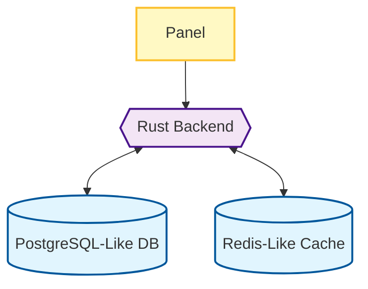
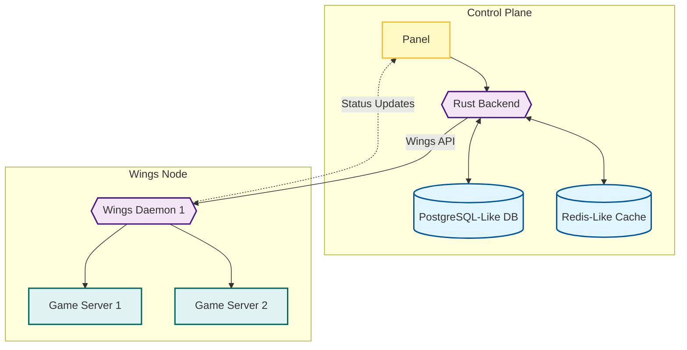
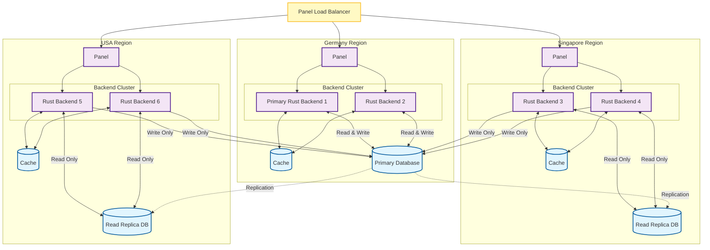

# Architecture

## Database

The Calagopus Panel uses a relational database to store all of its persistent data. Any PostgreSQL-compatible database should work, but in most deployments we recommend using plain PostgreSQL for the best experience. The database is responsible for storing user accounts, server configurations, settings, and other essential data required for the panel to function.

## Cache

To improve performance and reduce database load, the Calagopus Panel utilizes 2 caching layers:

1. **In-Memory Cache**: A local in-memory cache is used for frequently accessed data with very short ttl (e.g., session data, db object cache). This is specific to each backend and can be disabled.
2. **Redis Cache**: A Redis-like distributed cache is used for data that needs to be shared across multiple backend instances or has a longer ttl (e.g., login-related data, rate limiting). This cache is forced and cannot be disabled, even with a single backend instance. While not required, enabling persistent storage is beneficial for retaining rate limiting data across redis restarts, though not strictly necessary.

The Panel will also cache decrypted secrets in both caching layers when enabled, while this improves performance it does come with security trade-offs, so make sure to choose the right option for your use case.

## Wings Daemon

The Wings Daemon is a lightweight agent that runs on remote servers to manage game server instances. It communicates with the Calagopus Panel via an API, allowing the panel to control and monitor game servers remotely. Each Wings Daemon can manage multiple game servers, and multiple Wings Daemons can be connected to a single panel.

[More about Wings ›](../wings/overview.md)

## Basic Architecture

The Calagopus Panel is built using a modular architecture that allows for easy scalability and maintainability. It consists of 3 main components:

Once Wings and some Game servers are introduced, the architecture expands as follows:

This means that the Panel communicates with multiple Wings daemons, each managing its own set of game servers. The architecture is designed to handle a large number of game servers efficiently while maintaining performance and reliability. But the Wings Daemons also equire a route back to the panel for tasks such as authentication and status updates.

## Scalability

The architecture of Calagopus is designed to be highly scalable. As the number of game servers increases, additional Wings daemons can be deployed to distribute the load. Each Wings daemon operates independently, allowing for horizontal scaling. The panel backend can also be scaled horizontally by replacing the database and cache with managed services or clustering solutions. (e.g. [YugabyteDB](https://www.yugabyte.com/) for the database and a [Redis Sentinel Cluster](https://redis.io/docs/latest/operate/oss_and_stack/management/sentinel/) for the cache).

Something worth noting is that the backend can use different database urls for reading and writing, allowing for read replicas to be used to offload read traffic from the primary database in a simpler setup. It's also important to delegate one backend to be the "primary", in this case that only means its responsible for running background jobs like cleanup, so it's recommended to have it close to the primary database for performance reasons.

### Read-Offloading Architecture Example

Here is an example of a more complex panel architecture with multiple backend instances using a load balancer and a database cluster with read replicas:

In this architecture, we have 3 regions: Germany, Singapore, and the USA. Each region has its own panel instance, cache, and backend cluster. The Germany region contains the primary database since it is essentially in the middle of the other two, while the Singapore and USA regions have read replicas. The load balancer distributes incoming requests to the appropriate panel instance based on factors such as geographic location or server load.

In a real-world scenario, having more than 2 backends per region is not needed as the backend is already multi-threaded and can handle many requests simultaneously. The reason why 2 is a good number is that one can be used for maintenance or updates while the other continues to serve requests, though this can be avoided by having sticky sessions at the load balancer level.

**Important Note**: Within the same region, the backends should share the same redis cache to avoid login issues and session inconsistencies.

Once you introduce Wings daemons and game servers into this architecture, each panel instance will communicate with the Wings daemons that need to be, directly, no passive connections are made unless an extension or feature requires it.
