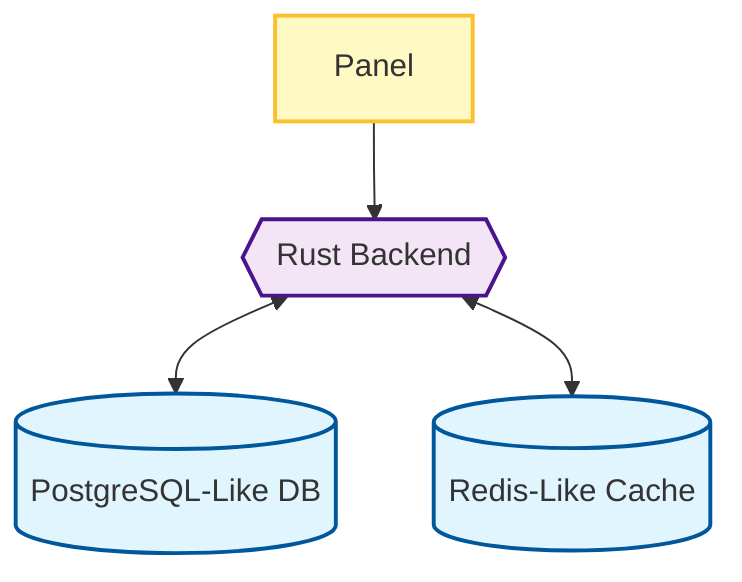
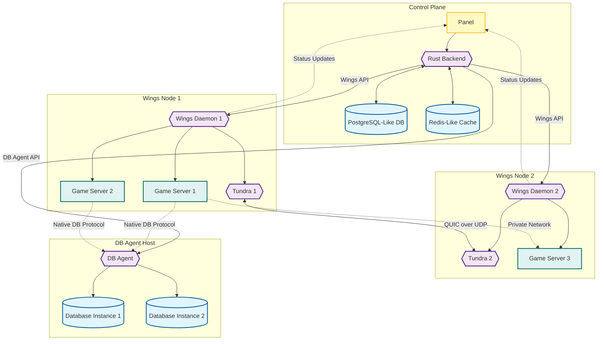
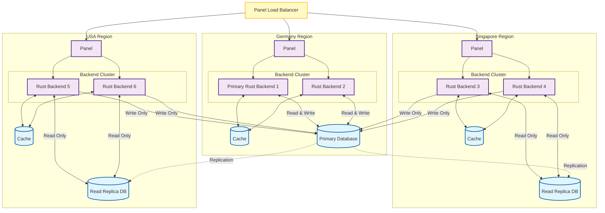

# Architecture

## Database

The Calagopus Panel stores all of its persistent data (user accounts, server configurations, settings) in a relational database. Any PostgreSQL-compatible database should work, but plain PostgreSQL is recommended for most deployments.

## Cache

To improve performance and reduce database load, the Calagopus Panel uses 2 caching layers:

1. **In-Memory Cache**: A local in-memory cache is used for frequently accessed data with a very short TTL (e.g., session data, db object cache). This is specific to each backend and can be disabled.
2. **Redis Cache**: A Redis-like distributed cache is used for data that needs to be shared across multiple backend instances or has a longer TTL (e.g., login-related data, rate limiting). This cache is required and cannot be disabled, even with a single backend instance. Enabling persistent storage is optional but retains rate limiting data across Redis restarts.

When enabled, the Panel also caches decrypted secrets in both caching layers. This improves performance but comes with security trade-offs; choose the option that fits your use case.

## Wings Daemon

The Wings Daemon is a lightweight agent that runs on remote servers to manage game server instances. It communicates with the Calagopus Panel via an API, allowing the panel to control and monitor game servers remotely. Each Wings Daemon can manage multiple game servers, and multiple Wings Daemons can be connected to a single panel.

[More about Wings ›](../wings/overview.md)

## DB Agent

DB Agent is a database proxy and provisioning agent that runs PostgreSQL, MariaDB/MySQL, MongoDB, and Redis databases in their own Docker containers on a host. Unlike Wings, the Panel does not proxy database traffic through its own backend, instead each DB Agent host exposes the native protocol ports directly (e.g. `5433` for Postgres, `3307` for MariaDB, `27018` for MongoDB, `6380` for Redis), and clients connect straight to the DB Agent host.

DB Agent authenticates and routes connections itself: the username sent by the client encodes a structured identifier (`u<short-uuid>_<label>`) that DB Agent looks up to find which container to route the connection to, independent of which database engine backs it. Once authenticated, DB Agent relays the connection to the matching container over a Unix socket. A separate REST API (secured with a bearer token, distinct from the database ports) is used by the Panel to provision instances, databases, and users, and to collect stats.

[More about DB Agent ›](../db-agent/overview.md)

## Tundra

Tundra is the daemon behind the [private network](../wings/advanced/private-network.md), the encrypted tunnel that lets servers on different nodes reach each other without going over the public internet. It is a separate Rust daemon that Wings runs in a privileged container (`calagopus-wings-tundra`) on every Linux node where it is enabled. Wings extracts the binary from a pinned image, writes its configuration and keeps it running, so there is nothing to install by hand. It is off by default.

Every pair of nodes on the network shares one QUIC connection over a single UDP port per node (`7100` by default), which only has to be reachable between nodes. Both sides authenticate with mutual TLS and pin each other's certificate by the SHA-256 fingerprint the Panel publishes, so no certificate authority is involved. TCP between servers travels as QUIC streams, UDP as QUIC datagrams.

The Panel decides which nodes are on the network and which server may reach which, but it never sees the traffic. Wings relays the Panel's state to the daemon over a Unix socket in the tundra data directory, and the daemon turns that state into connections to the peers it needs. For every server container and every peer server that container is allowed to reach, the daemon binds a loopback address (`127.0.x.y`) inside the source container's network namespace on the peer's service ports and writes a `<name>.tunnel` hostname for it into the container's `/etc/hosts`. Those bound addresses are the access list: a server that has not been granted a connection has nothing to connect to. The receiving node checks every incoming stream against its own copy of the state as well, so a peer cannot claim access it was not given.

Because the Panel is not in the data path, established tunnels keep carrying traffic while the Panel is unreachable. Only changes wait until it is back. A planned restart of the daemon, for an update or a configuration change, hands its open sockets and flows to the new process in place, so upgrading a node does not disconnect anything.

[More about the Private Network ›](../wings/advanced/private-network.md)

## Basic Architecture

The Calagopus Panel consists of 3 main components:

```mermaid
graph TD
  classDef storage fill:#e1f5fe,stroke:#01579b,stroke-width:2px;
  classDef logic fill:#f3e5f5,stroke:#4a148c,stroke-width:2px;
  classDef front fill:#fff9c4,stroke:#fbc02d,stroke-width:2px;

  %% Nodes
  A[Panel]:::front
  B{{Rust Backend}}:::logic
  C[(PostgreSQL-Like DB)]:::storage
  D[(Redis-Like Cache)]:::storage

  %% Connections
  A --> B
  B <--> C
  B <--> D
```

Once Wings, DB Agent and some game servers are introduced, the architecture expands as follows:

```mermaid
graph TD
  classDef storage fill:#e1f5fe,stroke:#01579b,stroke-width:2px;
  classDef logic fill:#f3e5f5,stroke:#4a148c,stroke-width:2px;
  classDef front fill:#fff9c4,stroke:#fbc02d,stroke-width:2px;
  classDef server fill:#e0f2f1,stroke:#00695c,stroke-width:2px;

  %% Core System Subgraph
  subgraph Core [Control Plane]
    direction TB
    Panel[Panel]:::front
    Backend{{Rust Backend}}:::logic
    DB[(PostgreSQL-Like DB)]:::storage
    Cache[(Redis-Like Cache)]:::storage

    Panel --> Backend
    Backend <--> DB
    Backend <--> Cache
  end

  %% Remote Node Subgraphs
  subgraph Node1 [Wings Node 1]
    direction TB
    Wings{{Wings Daemon 1}}:::logic
    Tundra1{{Tundra 1}}:::logic
    GS1[Game Server 1]:::server
    GS2[Game Server 2]:::server

    Wings --> GS1 & GS2
    Wings --> Tundra1
  end

  subgraph Node3 [Wings Node 2]
    direction TB
    Wings2{{Wings Daemon 2}}:::logic
    Tundra2{{Tundra 2}}:::logic
    GS3[Game Server 3]:::server

    Wings2 --> GS3
    Wings2 --> Tundra2
  end

  %% DB Agent Host Subgraph
  subgraph Node2 [DB Agent Host]
    direction TB
    DBAgent{{DB Agent}}:::logic
    DBI1[(Database Instance 1)]:::storage
    DBI2[(Database Instance 2)]:::storage

    DBAgent --> DBI1 & DBI2
  end

  %% Cross-System Connections
  Backend -->|Wings API| Wings & Wings2
  Wings & Wings2 -.->|Status Updates| Panel
  Backend -->|DB Agent API| DBAgent
  GS1 & GS2 -.->|Native DB Protocol| DBAgent
  Tundra1 <-->|QUIC over UDP| Tundra2
  GS1 -.->|Private Network| GS3
```

The Panel communicates with multiple Wings daemons, each managing its own set of game servers. The Wings daemons also require a route back to the panel for tasks such as authentication and status updates.

Nodes on the private network run Tundra next to Wings. Wings feeds it the Panel's view of the network, and the daemons on two nodes hold one encrypted QUIC connection between them over UDP. A server that has been connected to a server on another node reaches it through a private address inside its own container, and that traffic goes node to node without passing through the Panel or Wings.

DB Agent hosts are managed the same way: the Rust Backend uses the DB Agent REST API to provision and monitor database instances, but game servers connect to those databases directly over the native database protocol, DB Agent routes the connection to the right container itself rather than the traffic passing through the Panel or Wings.

## Scalability

As the number of game servers increases, additional Wings daemons can be deployed to distribute the load. Each Wings daemon operates independently, allowing for horizontal scaling. The panel backend can also be scaled horizontally by replacing the database and cache with managed services or clustering solutions. (e.g. [YugabyteDB](https://www.yugabyte.com/) for the database and a [Redis Sentinel Cluster](https://redis.io/docs/latest/operate/oss_and_stack/management/sentinel/) for the cache).

The backend can use different database urls for reading and writing, allowing read replicas to offload read traffic from the primary database in a simpler setup. Delegate one backend to be the "primary", meaning only that it runs background jobs like cleanup, and keep it close to the primary database for performance.

### Read-Offloading Architecture Example

Here is an example of a more complex panel architecture with multiple backend instances using a load balancer and a database cluster with read replicas:

```mermaid
graph TD
  classDef database fill:#e1f5fe,stroke:#01579b,stroke-width:2px;
  classDef service fill:#f3e5f5,stroke:#4a148c,stroke-width:2px;
  classDef lb fill:#fff9c4,stroke:#fbc02d,stroke-width:2px;

  %% Load Balancer
  LB[Panel Load Balancer]:::lb

  %% Germany Cluster
  subgraph DE [Germany Region]
    direction TB
    PanelDE[Panel]:::service
    CacheDE[(Cache)]:::database
    PrimaryDB[(Primary Database)]:::database

    subgraph BackendDE [Backend Cluster]
      RB1[Primary Rust Backend 1]:::service
      RB2[Rust Backend 2]:::service
    end
  end

  %% Singapore Cluster
  subgraph SG [Singapore Region]
    direction TB
    PanelSG[Panel]:::service
    CacheSG[(Cache)]:::database
    ReplicaDBSG[(Read Replica DB)]:::database

    subgraph BackendSG [Backend Cluster]
      RB3[Rust Backend 3]:::service
      RB4[Rust Backend 4]:::service
    end
  end

  %% USA Cluster
  subgraph US [USA Region]
    direction TB
    PanelUS[Panel]:::service
    CacheUS[(Cache)]:::database
    ReplicaDBUS[(Read Replica DB)]:::database

    subgraph BackendUS [Backend Cluster]
      RB5[Rust Backend 5]:::service
      RB6[Rust Backend 6]:::service
    end
  end

  %% Global Connections
  LB --> PanelDE
  LB --> PanelSG
  LB --> PanelUS

  %% Germany Internal Wiring
  PanelDE --> RB1 & RB2
  RB1 & RB2 <--> CacheDE
  RB1 & RB2 <-->|Read & Write| PrimaryDB

  %% Singapore Internal Wiring
  PanelSG --> RB3 & RB4
  RB3 & RB4 <--> CacheSG
  RB3 & RB4 <-->|Read Only| ReplicaDBSG

  %% USA Internal Wiring
  PanelUS --> RB5 & RB6
  RB5 & RB6 <--> CacheUS
  RB5 & RB6 <-->|Read Only| ReplicaDBUS

  %% Cross-Region Wiring
  RB3 & RB4 -->|Write Only| PrimaryDB
  PrimaryDB -.->|Replication| ReplicaDBSG
  RB5 & RB6 -->|Write Only| PrimaryDB
  PrimaryDB -.->|Replication| ReplicaDBUS
```

In this architecture, we have 3 regions: Germany, Singapore, and the USA. Each region has its own panel instance, cache, and backend cluster. The Germany region contains the primary database since it is essentially in the middle of the other two, while the Singapore and USA regions have read replicas. The load balancer distributes incoming requests to the appropriate panel instance based on factors such as geographic location or server load. This is the same setup that [MCJars](https://mcjars.app) uses to distribute load globally.

In a real-world scenario, having more than 2 backends per region is not needed as the backend is already multi-threaded and can handle many requests simultaneously. Two is a good number because one can handle maintenance or updates while the other continues to serve requests, though this can be avoided by having sticky sessions at the load balancer level.

::: warning
Within the same region, the backends should share the same redis cache to avoid login issues and session inconsistencies.
:::

Once Wings daemons and game servers are introduced into this architecture, each panel instance communicates directly with the relevant Wings daemons. No passive connections are made unless an extension or feature requires it.

## Software Bill of Materials (SBOM)

Calagopus publishes a Software Bill of Materials (SBOM) for every release. An SBOM is a machine-readable inventory that lists the software components, libraries, dependencies, and packages included in a build.

The latest SBOMs are published at [packages.calagopus.com/sbom](https://packages.calagopus.com/sbom/).

### Why We Publish SBOMs

Publishing an SBOM allows administrators and security teams to:

* Audit the third-party dependencies included in a release.
* Identify whether a known vulnerability affects a deployed version of Calagopus.
* Meet compliance, governance, or regulatory requirements.
* Track dependency changes between releases.
* Integrate Calagopus into existing Software Composition Analysis (SCA) and vulnerability management workflows.

### Supported Formats

SBOMs are provided in [CycloneDX](https://cyclonedx.org), a standard format compatible with common security and compliance tooling.
