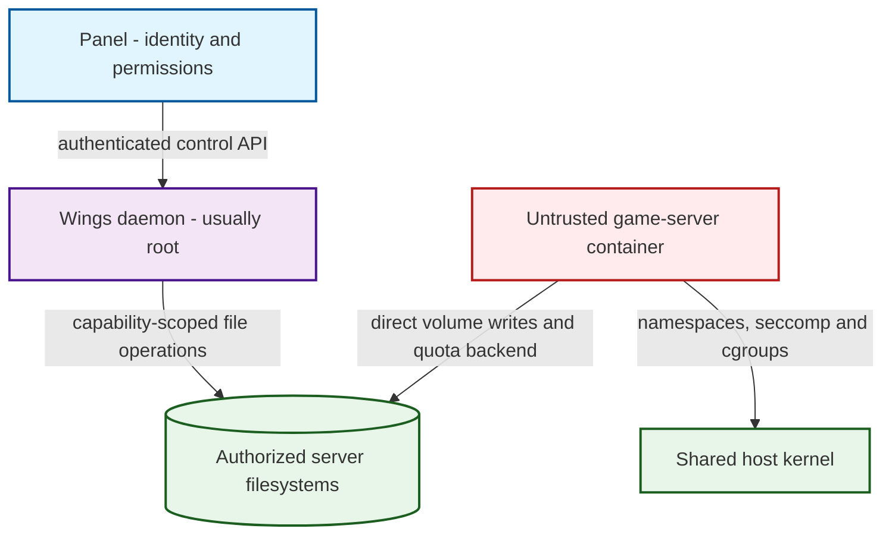
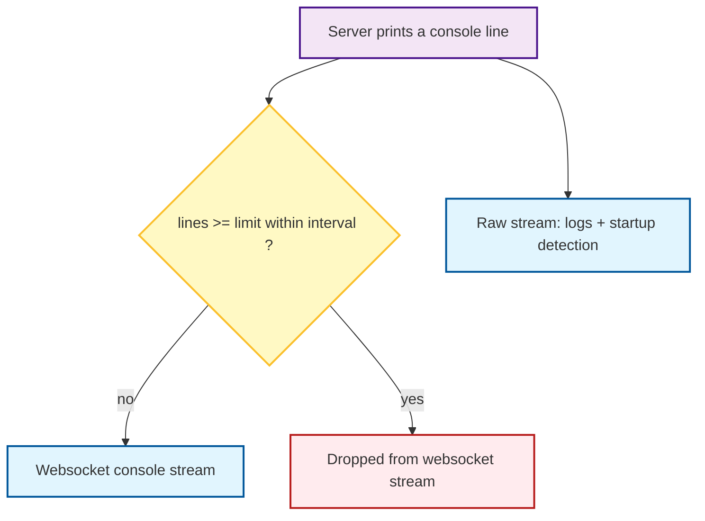
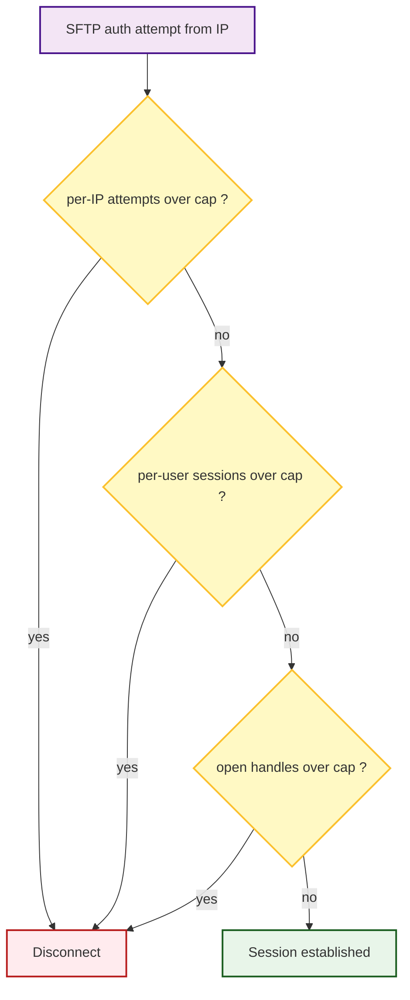

# Security

This page describes how Calagopus defends its trust boundaries: what isolates an
untrusted game server from the host, how the daemon avoids being coerced into
unwanted actions despite usually running as root, how credentials are handled,
and how abuse and denial-of-service are contained.

Calagopus is written in Rust, which removes whole classes of memory-safety
bugs, but memory safety on its own does not protect a multi-tenant panel. That
protection comes from isolation, authorization, credential handling, and
resource bounding, which the rest of this page covers.

The source links below pin the implementations checked for this page. They describe
current development code; older supported releases may not include every control.

## Reporting a vulnerability

Do **not** report security issues through public GitHub issues or Discord.

- **GitHub private advisory:** use the Security Advisories tab on
  [`calagopus/panel`](https://github.com/calagopus/panel/security/advisories/new)
  or [`calagopus/wings`](https://github.com/calagopus/wings/security/advisories/new).
- **Email:** `security@calagopus.com`. For sensitive reports, encrypt with our
  [PGP key](https://github.com/calagopus/branding/blob/main/SECURITY-PGP.md).

Please give us a reasonable window to fix an issue before public disclosure, do
not access or modify data that is not yours, and act in good faith.

## Supported versions

See the [Panel security policy](https://github.com/calagopus/panel/blob/main/SECURITY.md)
and [Wings security policy](https://github.com/calagopus/wings/blob/main/SECURITY.md)
for the versions receiving security updates.

## Threat model

The core assumption: **a game server is untrusted code.** Anything a tenant runs
inside their container is treated as potentially hostile, and everyone else's
safety on the node depends on that container not gaining unauthorized access to
the host or other tenants. The daemon (Wings) typically runs as root, so a second assumption
follows: **the daemon must never be tricked into acting outside a server's own
directory or privileges**, even when the request originates from an authenticated
but malicious user.

Attacker goals defended against: container escape to the host, cross-tenant
access, coercing the root daemon into touching paths outside a server root,
privilege escalation inside the panel, credential exfiltration, and
denial-of-service against the node or panel.

Containers share the host kernel. These controls reduce what a tenant can do;
they do not turn a container into a virtual machine or protect it from a
compromised host. Administrators, the Panel, Wings, and their configuration are
trusted. Container network access is a separate boundary, covered below.

## Daemon isolation (Wings)

Each game-server process runs in its own container. Wings applies the following
controls to these runtime containers:

- **No privilege escalation:** `no-new-privileges` is always set.
- **Dropped capabilities:** `setpcap`, `mknod`, `audit_write`, `net_raw`,
  `dac_override`, `fowner`, `fsetid`, `net_bind_service`, `sys_chroot`,
  `setfcap`, and `sys_ptrace`.
- **Seccomp** profile applied by default (configurable per installation).
- **Read-only root filesystem**, with a size-limited `/tmp` mounted `nosuid`.
- **AppArmor** profile selectable when it is installed on the host.
- **User-namespace remapping** supported and configurable.
- **Rootless mode** supported: the daemon and container engine can run without
  host root. The configured uid/gid inside the container may still be `0` in its
  user namespace; container root and host root are different in that setup.
- **cgroup resource limits:** memory (plus reservation/swap), CPU
  (quota/period/shares/cpuset), PID limit, block-IO weight, and OOM controls.

The enabled isolation and resource controls are enforced by the kernel. Wings
sets them up; it does not need to inspect each syscall for them to work.
`no-new-privileges` prevents gaining privileges through a setuid executable,
seccomp filters syscalls, and cgroups constrain the resources configured for the
server. These controls still depend on host support: for example, an I/O weight
has no effect without a supporting scheduler or I/O cost model.

Defaults (see the [Wings configuration reference](../wings/configuration)):
`no-new-privileges`, the dropped-capability set, and the read-only rootfs are
always applied. `docker.container_apply_seccomp` defaults to `true` (it can need
disabling under Podman). `docker.userns_mode` is empty by default (remapping off
until configured), and rootless mode (`system.user.rootless.enabled`) is opt-in.

::: tip Production setup
Keep seccomp enabled and use a host dedicated to untrusted workloads. Choose
rootless mode or user-namespace remapping to suit the container engine. Check
feature compatibility first: Wings server firewalls are not supported with a
rootless container engine.
:::

These settings describe runtime containers. Installer images and scripts use a
separate container configuration and are trusted administrator-supplied code.
Administrator-approved host mounts and device passthrough also widen the resources
available to a container; review them as part of the server's privileges.

Sources: [runtime container configuration](https://github.com/calagopus/wings/blob/f79492ea5ad89c8e7c844fbd77dac32933eb5ef2/application/src/server/executor/docker/mod.rs#L532-L644), [installer configuration](https://github.com/calagopus/wings/blob/f79492ea5ad89c8e7c844fbd77dac32933eb5ef2/application/src/server/executor/docker/mod.rs#L2884-L2943), [device passthrough](https://github.com/calagopus/wings/blob/f79492ea5ad89c8e7c844fbd77dac32933eb5ef2/application/src/server/executor/docker/mod.rs#L323-L354).

## Filesystem safety: keeping a root daemon in its lane

Because the daemon usually runs as root, path handling is a critical boundary.
Ordinary server file operations use capability-scoped directory handles
(`cap-std`), so traversal and symlink resolution are confined to the filesystem
root the daemon opened. Client-supplied paths are resolved relative to that root.
The protection comes from filesystem operations through that handle, not a
blocklist of suspicious path strings.

Wings also supports mounted and virtual filesystems. The boundary is the set of
filesystems authorized for that server, not a promise that every operation touches
one physical directory. This confinement applies to Wings file operations;
container access to bind mounts is controlled by the container and host.

Sources: [capability root and path handling](https://github.com/calagopus/wings/blob/f79492ea5ad89c8e7c844fbd77dac32933eb5ef2/application/src/server/filesystem/cap/mod.rs#L27-L118), [filesystem implementation](https://github.com/calagopus/wings/blob/f79492ea5ad89c8e7c844fbd77dac32933eb5ef2/application/src/server/filesystem/virtualfs/cap.rs).

## Disk quota enforcement

Wings tracks file growth in its own write paths and checks it against cached disk
usage. Uploads, SFTP writes, extraction, and remote pulls can be stopped when that
accounting rejects further growth. Uploads can also use a supplied total size for
an early space check; that check is not a reservation.

**The write-time limit comes from the disk backend.** A game server writes to its
volume directly, without passing through Wings' file writer. Choose a backend
that covers those writes:

| Mode | Mechanism |
| ---- | --- |
| `zfs_dataset` | Per-server ZFS dataset quota. |
| `btrfs_subvolume` | Per-server Btrfs subvolume quota. |
| `xfs_quota` | XFS project quota. |
| `fuse_quota` | A separate FUSE process in the filesystem write path. |
| `none` (default) | Wings accounting and usage checks, without a write-time backend. |

ZFS, Btrfs, and XFS enforce their configured quota in the filesystem. FUSE routes
writes through its quota process. These cover writes from the game server as well
as Wings. The in-process counter is supplementary accounting, not a hard bound on
physical disk usage.

::: danger Choose a quota backend for untrusted tenants
The default `none` backend does not stop a game server's writes at the quota.
Periodic usage checks are reactive, and a process can fill disk between checks.
Use ZFS, Btrfs, or XFS where supported, or `fuse_quota` otherwise.
:::

Sources: [quota backends and default](https://github.com/calagopus/wings/blob/f79492ea5ad89c8e7c844fbd77dac32933eb5ef2/application/src/server/filesystem/limiter/mod.rs), [file accounting](https://github.com/calagopus/wings/blob/f79492ea5ad89c8e7c844fbd77dac32933eb5ef2/application/src/server/filesystem/file.rs#L129-L179), [upload preflight](https://github.com/calagopus/wings/blob/f79492ea5ad89c8e7c844fbd77dac32933eb5ef2/application/src/routes/upload/file.rs#L134-L162).

## Backups of a running server

A file can grow or shrink while a backup reads it. Wings' fixed-length reader
limits the output to the size captured for that file: growth is clipped, and early
EOF is padded with zeroes. This prevents that length change from shifting later
entries in an archive. Other I/O errors can still fail the operation.

That is a stream-format safeguard, not an application-consistent snapshot. A live
backup can contain files from different moments, and a clipped or padded file may
be unusable to the game. Quiesce the application or stop it when consistency
matters, and test restores.

Sources: [fixed-length readers](https://github.com/calagopus/wings/blob/f79492ea5ad89c8e7c844fbd77dac32933eb5ef2/application/src/io/fixed_reader.rs#L25-L101).

## Daemon authentication and direct access

The Panel controls Wings with a node bearer token. Treat that token as a
privileged node credential and protect the connection with HTTPS. Browser file
transfers and console access use signed, scoped tokens instead of exposing this
administrative credential.

Wings checks token expiry, issue time, and the required operation scope.
File-download tokens identify a server and file; WebSocket tokens carry server
permissions, which are checked for actions such as sending commands or changing
power state. Download-token reuse is limited by `api.max_jwt_uses` (default five);
these are not single-use links.

Tokens issued before the current Wings process started are rejected, so users may
need fresh direct-access links after a daemon restart. Anyone holding a valid
bearer token can use its authority until it expires or is invalidated; token
scope limits that authority, but does not make a leaked token harmless.

Sources: [node API authentication](https://github.com/calagopus/wings/blob/f79492ea5ad89c8e7c844fbd77dac32933eb5ef2/application/src/routes/api/mod.rs#L22-L53), [JWT validation and reuse](https://github.com/calagopus/wings/blob/f79492ea5ad89c8e7c844fbd77dac32933eb5ef2/application/src/remote/jwt.rs#L49-L201), [file-download claims](https://github.com/calagopus/wings/blob/f79492ea5ad89c8e7c844fbd77dac32933eb5ef2/application/src/routes/download/file.rs#L25-L94), [WebSocket action permissions](https://github.com/calagopus/wings/blob/f79492ea5ad89c8e7c844fbd77dac32933eb5ef2/application/src/server/websocket/message_handler.rs#L120-L134).

## Network boundaries

### Outbound requests made by Wings

Remote file pulls and scheduled HTTP requests filter DNS answers through the
resolver used for the connection. They also check literal IP addresses, including
IPv4-mapped IPv6 addresses, against configured blocked CIDRs. Defaults cover
private, loopback, link-local, and other special-use ranges. Both clients disable
environment proxy settings.

Pulls check redirect targets and allow at most ten redirects. Scheduled HTTP
requests do not follow redirects. Scheduled requests also have per-server request
limits, timeouts, and a cap on captured response bodies.

These checks cover those Wings HTTP features. Tenant code can still make its own
network connections. Add your own internal networks to the blocked CIDRs,
especially services reachable through public IP addresses, and use host/network
controls for restrictions that must also apply to containers.

Sources: [address filtering](https://github.com/calagopus/wings/blob/f79492ea5ad89c8e7c844fbd77dac32933eb5ef2/application/src/net.rs#L19-L103), [remote-pull client](https://github.com/calagopus/wings/blob/f79492ea5ad89c8e7c844fbd77dac32933eb5ef2/application/src/server/filesystem/pull/mod.rs#L19-L96), [scheduled HTTP requests](https://github.com/calagopus/wings/blob/f79492ea5ad89c8e7c844fbd77dac32933eb5ef2/application/src/server/schedule/http.rs#L33-L205), [blocked-range defaults](https://github.com/calagopus/wings/blob/f79492ea5ad89c8e7c844fbd77dac32933eb5ef2/application/src/config.rs#L37-L94).

### Server firewalls

Wings can apply source-address, protocol, and destination-port rules with nftables
or iptables, including through a helper container. If no usable backend is
available, creating a runtime container with configured firewall rules fails.
Explicitly setting `docker.firewall.backend` to `disabled` permits it to start
with a warning and leaves those rules unapplied.

These rules filter traffic to server destinations. They are not a general host
firewall or an outbound network sandbox. Established connections are retained, so
changing a rule does not necessarily disconnect an existing client. Traffic
between bridged containers also depends on the host's bridge netfilter settings.
Server firewalls require Linux and are unsupported with rootless container
engines. See the [Wings configuration reference](../wings/configuration).

Sources: [backend selection](https://github.com/calagopus/wings/blob/f79492ea5ad89c8e7c844fbd77dac32933eb5ef2/application/src/server/firewall/mod.rs#L304-L473), [unavailable-backend behavior](https://github.com/calagopus/wings/blob/f79492ea5ad89c8e7c844fbd77dac32933eb5ef2/application/src/server/firewall/noop.rs#L19-L35), [startup failure handling](https://github.com/calagopus/wings/blob/f79492ea5ad89c8e7c844fbd77dac32933eb5ef2/application/src/server/executor/docker/mod.rs#L2677-L2690), [stateful filtering](https://github.com/calagopus/wings/blob/f79492ea5ad89c8e7c844fbd77dac32933eb5ef2/application/src/server/firewall/nftables.rs#L413-L429), [bridge netfilter check](https://github.com/calagopus/wings/blob/f79492ea5ad89c8e7c844fbd77dac32933eb5ef2/application/src/server/firewall/mod.rs#L547-L562).

## Denial-of-service protections

A multi-tenant node has many amplification points: a server can spam its console,
an attacker can hammer SFTP or the login endpoint, and a client can request a
huge file or listing. The following controls bound specific parts of that work.
They run in **userspace**, where Wings accepts SFTP connections and reads console output, and
where the Panel handles API requests. They do not provide protection against
network traffic that saturates the host or its upstream connection.

### Console output throttling

A game server that floods stdout could otherwise exhaust memory, saturate the
websocket, and lock up every viewer's browser. Wings counts output lines and,
once a configurable line count is exceeded within a reset interval, stops
forwarding to the rate-limited console stream and emits a single "throttling"
notice (`config.throttles.{enabled,lines,line_reset_interval}`; throttling is on
by default, at 2000 lines per 100 ms). The unthrottled internal stream is preserved
separately for logging and startup detection, so throttling never breaks state
detection.

Sources: [console throttling](https://github.com/calagopus/wings/blob/f79492ea5ad89c8e7c844fbd77dac32933eb5ef2/application/src/server/executor/docker/mod.rs#L1445-L1500), [console defaults](https://github.com/calagopus/wings/blob/f79492ea5ad89c8e7c844fbd77dac32933eb5ef2/application/src/config.rs#L605-L613).

### SFTP / SSH limits

The SSH/SFTP server (built on `russh`) applies layered limits
(`application/src/ssh/limiter.rs`):

- **Per-IP authentication attempts**, counted separately for password (default 3)
  and public key (default 20). Exceeding the cap disconnects the connection;
  counters decay after `authentication_cooldown` (default 60s).
- **Per-user concurrent connections** capped by `max_connections_per_user`
  (default 10).
- **Open SFTP handle caps**, both per channel (`max_handles_per_channel`,
  default 32) and global (`max_handles_total`, default 1024), the latter enforced
  with an atomic guard, bounding how many file handles a client can hold open.

Defaults are in the [Wings configuration reference](../wings/configuration).

Sources: [SSH and SFTP limits](https://github.com/calagopus/wings/blob/f79492ea5ad89c8e7c844fbd77dac32933eb5ef2/application/src/ssh/limiter.rs).

### WebSocket limits

Wings defaults to a 1 MiB maximum message and frame size, a 60-second deadline to
authenticate, and at most 32 unauthenticated connections per client IP. These
limits cover stalled handshakes and oversized messages.

The per-IP slot is released after authentication. The separate global connection
cap, `system.websocket.max_connections_total`, defaults to `0` (unlimited); set
it for the capacity of the node.

Sources: [WebSocket defaults](https://github.com/calagopus/wings/blob/f79492ea5ad89c8e7c844fbd77dac32933eb5ef2/application/src/config.rs#L367-L383), [connection accounting](https://github.com/calagopus/wings/blob/f79492ea5ad89c8e7c844fbd77dac32933eb5ef2/application/src/server/websocket/limiter.rs#L40-L117), [message and frame limits](https://github.com/calagopus/wings/blob/f79492ea5ad89c8e7c844fbd77dac32933eb5ef2/application/src/server/websocket/handler.rs#L43-L58).

### Panel rate limiting

The panel applies **per-endpoint, per-client rate limits** backed by the shared
cache (Redis-like), keyed as `ratelimit::<endpoint>::<client-ip>` over a fixed
window of `hits` per `window_seconds`. Limits are configurable per endpoint, and
sensitive endpoints are covered individually rather than by one blanket limit:

- Auth: `auth_register`, `auth_login`, `auth_login_checkpoint`,
  `auth_login_security_key`, `auth_password_forgot`, `auth_password_reset`, and
  OAuth flows.
- Client: a general `client` limit plus dedicated limits for expensive actions
  such as `client_servers_backups_create`, `client_servers_files_pull`, and
  `client_servers_files_pull_query`.
- Node/daemon: `remote` and `remote_sftp_auth`.

Dedicated limits for expensive actions supplement the general client budget.
Those requests still count toward the shared client limit. Limits are keyed by
client IP, so configure trusted proxies and the real client address correctly
(see [Reverse proxies](../additional/reverse-proxies)).

Redis/Valkey coordinates limits across Panel instances. When Redis is unavailable or returns an error, the local fallback keeps
counters in one process; it cannot provide a shared budget across replicas.
Fixed windows also allow a burst around a window boundary, so these limits are
abuse controls rather than exact traffic shaping.

Sources: [client middleware](https://github.com/calagopus/panel/blob/7e5c1b2ec4b050c9b078548f7557abee9843ce74/backend/src/routes/api/client/mod.rs#L174-L225), [cache and rate-limit implementation](https://github.com/calagopus/panel/blob/7e5c1b2ec4b050c9b078548f7557abee9843ce74/shared/src/cache.rs), [endpoint settings](https://github.com/calagopus/panel/blob/7e5c1b2ec4b050c9b078548f7557abee9843ce74/shared/src/settings/ratelimits.rs).

### File reads and uploads

File-content reads accept a byte limit. Server uploads stream into the file
writer instead of buffering the whole upload, and can use a total size for early
rejection when one is supplied. Neither a declared length nor an early free-space
check replaces quota enforcement during the transfer.

Sources: [file-content reads](https://github.com/calagopus/wings/blob/f79492ea5ad89c8e7c844fbd77dac32933eb5ef2/application/src/routes/api/servers/_server_/files/contents.rs), [streaming upload route](https://github.com/calagopus/wings/blob/f79492ea5ad89c8e7c844fbd77dac32933eb5ef2/application/src/routes/upload/file.rs).

### Compile-time panic resistance (lints)

In a root daemon that parses untrusted input (paths, archive contents, wire
protocols), a panic is a denial-of-service: it takes down the task or the daemon.
Wings denies several common panic patterns when Clippy is run. Both the
application crate and `pbs-client` set these Clippy lints to `deny`:

- `unwrap_used`, `panic`, `unreachable`, `todo`, `unimplemented`
- `indexing_slicing` and `string_slice`, so a bad index or a non-char-boundary
  slice is caught by linting; code can use checked access (`.get()`) instead
- `unwrap_in_result` and `panic_in_result_fn`, keeping fallible paths returning
  errors instead of panicking

`missing_panics_doc` is a warning, and the full `clippy::all` group runs at warn.
This does not make the daemon panic-proof in an absolute sense (it does not cover,
for example, arithmetic overflow or allocation failure). Dependencies and explicit
lint exceptions also need review.

Sources: [application lints](https://github.com/calagopus/wings/blob/f79492ea5ad89c8e7c844fbd77dac32933eb5ef2/application/Cargo.toml), [PBS client lints](https://github.com/calagopus/wings/blob/f79492ea5ad89c8e7c844fbd77dac32933eb5ef2/pbs-client/Cargo.toml).

## Panel authentication and secrets

### Passwords, sessions, and MFA

Passwords use bcrypt at cost 12. Hashing and verification run in a blocking pool
with a bounded number of concurrent bcrypt jobs. Session tokens and API keys are
stored as hashes; credential resolution and model records are cached, so this is
not a fresh database hash verification on every request.

Session cookies are `HttpOnly` and `SameSite=Lax`. The `Secure` flag is set when
the configured Panel URL uses HTTPS. Set that URL correctly and serve the Panel
over HTTPS, including when TLS terminates at a reverse proxy.

The Panel supports TOTP, email codes, and WebAuthn/security keys. MFA requirements
can be configured for all users or administrators; role-specific requirements
override the global policy. TOTP and security keys count by default. Email codes
are opt-in and are not in the default accepted-method list. Email authentication
also depends on the security of the user's mailbox.

Discoverable passkeys can be used to sign in. With WebAuthn enabled and a security
key registered, users can disable password login after confirming their password.
CAPTCHA can also gate login. These are configurable account and operator choices;
having an MFA feature does not mean every account has enabled it.

Sources: [password hashing](https://github.com/calagopus/panel/blob/7e5c1b2ec4b050c9b078548f7557abee9843ce74/shared/src/crypt.rs#L4-L48), [credential cache](https://github.com/calagopus/panel/blob/7e5c1b2ec4b050c9b078548f7557abee9843ce74/shared/src/models/mod.rs#L961-L1016), [session cookie](https://github.com/calagopus/panel/blob/7e5c1b2ec4b050c9b078548f7557abee9843ce74/shared/src/models/user_session.rs#L355-L376), [MFA policy](https://github.com/calagopus/panel/blob/7e5c1b2ec4b050c9b078548f7557abee9843ce74/shared/src/models/user/mod.rs#L714-L767), [MFA defaults](https://github.com/calagopus/panel/blob/7e5c1b2ec4b050c9b078548f7557abee9843ce74/shared/src/settings/app.rs#L19-L34), [discoverable passkeys](https://github.com/calagopus/panel/blob/7e5c1b2ec4b050c9b078548f7557abee9843ce74/backend/src/routes/api/auth/login/security_key/discoverable.rs), [password-login control](https://github.com/calagopus/panel/blob/7e5c1b2ec4b050c9b078548f7557abee9843ce74/backend/src/routes/api/client/account/password_login.rs#L58-L76).

### Scoped permissions and API keys

User, administrator, and server permissions are checked separately. An API key's
scopes cap the permissions available through that key: they are intersected with
the user's effective grants, rather than granting access the user does not have.
Keys can also have an expiry, be disabled, and restrict source IPs/CIDRs.
For an integration with a fixed job, choose the smallest permissions it needs.

Sources: [effective permissions and scope intersection](https://github.com/calagopus/panel/blob/7e5c1b2ec4b050c9b078548f7557abee9843ce74/shared/src/models/user/auth.rs#L49-L202), [key expiry](https://github.com/calagopus/panel/blob/7e5c1b2ec4b050c9b078548f7557abee9843ce74/shared/src/models/user/mod.rs#L283-L301), [key disablement](https://github.com/calagopus/panel/blob/7e5c1b2ec4b050c9b078548f7557abee9843ce74/backend/src/routes/api/client/mod.rs#L84-L89), [key address restrictions](https://github.com/calagopus/panel/blob/7e5c1b2ec4b050c9b078548f7557abee9843ce74/backend/src/routes/api/client/mod.rs#L340-L351).

### Encryption and cache trust

Node tokens, backup credentials, and database passwords use the Panel's encrypted
secret storage, keyed by `APP_ENCRYPTION_KEY`. The running Panel must be able to
decrypt these values to use them. Encryption therefore does not protect them
from a compromised Panel process or an attacker who also obtains its key.

::: warning Optional decrypted-secret cache
`APP_USE_DECRYPTION_CACHE` is off by default. Enabling it allows the encrypted-secret
helper to cache decrypted values for 30 seconds. Treat Redis/Valkey as trusted
infrastructure, including when this option is off: the Panel also uses it for
application and authentication state.
:::

Keep the encryption key secret and backed up separately. Losing it makes the
stored encrypted values unusable; changing it requires re-encrypting those
values. See the [Panel environment reference](../panel/environment).

Sources: [encrypted value type](https://github.com/calagopus/panel/blob/7e5c1b2ec4b050c9b078548f7557abee9843ce74/shared/src/crypt.rs#L63-L115), [encryption and decrypted cache](https://github.com/calagopus/panel/blob/7e5c1b2ec4b050c9b078548f7557abee9843ce74/shared/src/database.rs#L123-L258), [cache option default](https://github.com/calagopus/panel/blob/7e5c1b2ec4b050c9b078548f7557abee9843ce74/shared/src/env.rs#L287-L290).

## Supply chain and build integrity

The Panel and Wings CI image workflows configure:

- **CycloneDX SBOMs** generated from source per build.
- **Signed container images** using cosign / sigstore (GHCR and Docker Hub).
- **Build provenance** and **SBOM attestations** attached to the images, so a
  consumer can verify what was built and from what.

Signatures and provenance establish where an artifact came from; they do not
prove its code or dependencies are free of vulnerabilities. Verification is a
consumer step, not something implied by pulling an image tag.

Backend extensions are trusted code in the Panel process. Their entrypoints
receive application state, including database, cache, and environment access.
Installing one extends the trusted codebase; the tenant permission model does not
sandbox it.

Sources: [Panel image workflow](https://github.com/calagopus/panel/blob/7e5c1b2ec4b050c9b078548f7557abee9843ce74/.github/workflows/build.yml#L148-L274), [Wings image workflow](https://github.com/calagopus/wings/blob/f79492ea5ad89c8e7c844fbd77dac32933eb5ef2/.github/workflows/build.yml#L81-L171), [extension entrypoints](https://github.com/calagopus/panel/blob/7e5c1b2ec4b050c9b078548f7557abee9843ce74/shared/src/extensions/mod.rs#L294-L331), [application state](https://github.com/calagopus/panel/blob/7e5c1b2ec4b050c9b078548f7557abee9843ce74/shared/src/lib.rs#L155-L166).

## Known residual risks

The residual risks, listed directly:

- **Shared kernel and trusted control plane.** A host, Panel, or privileged node
  credential compromise reaches beyond a single game server. Runtime container
  restrictions do not sandbox administrators, installer code, or Panel extensions.
- **Operator-dependent isolation.** Rootless execution, user namespaces, AppArmor,
  mounts, and device access depend on configuration and host support. Rootless
  engines cannot use Wings' server firewall feature.
- **Disk and connection defaults.** The default `none` quota backend supplies no
  write-time bound. The global WebSocket connection cap is also off by default.
  Choose both limits for the workload before accepting untrusted tenants.
- **Network reachability.** HTTP destination checks cover the specific daemon
  features above. They do not stop a game server from opening its own connections.
  Server firewall changes also retain established connections.
- **Live-backup consistency.** A structurally readable backup can still contain
  inconsistent application data. Restore testing and application quiescing matter.
- **Secret and cache access.** The running Panel has decryption authority. The
  optional decrypted-secret cache increases where those plaintext values live.
