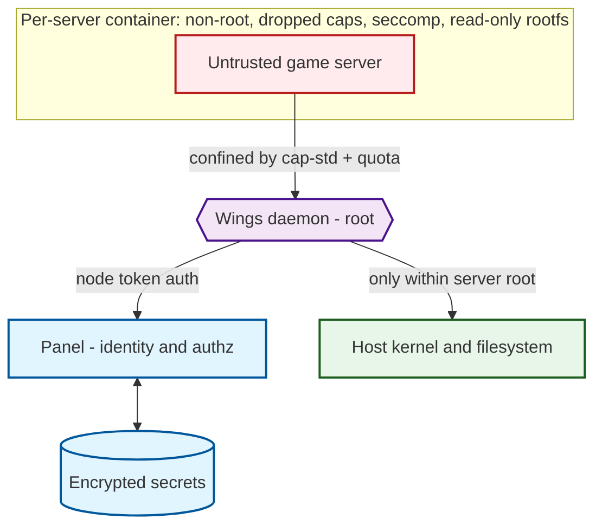
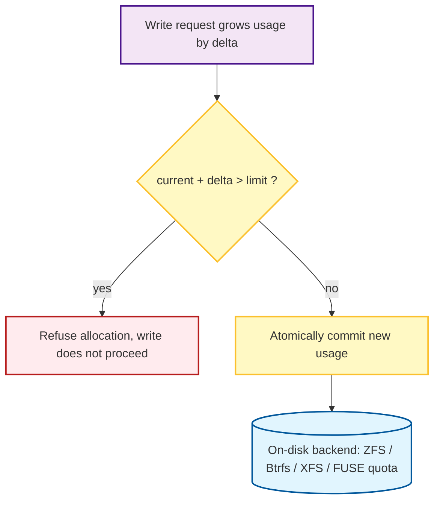
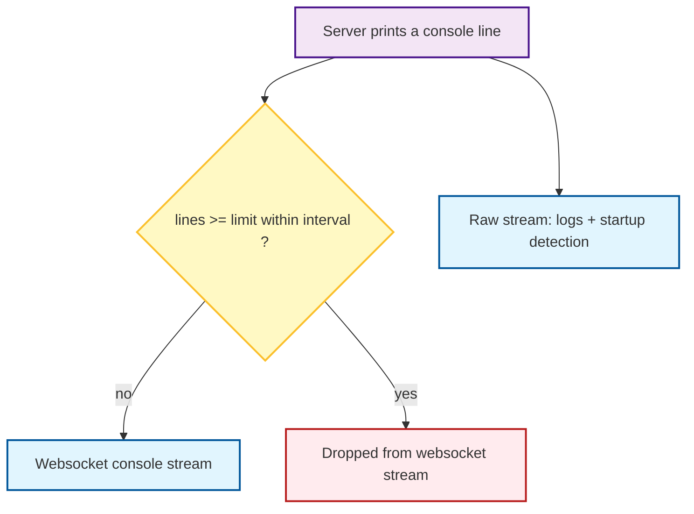
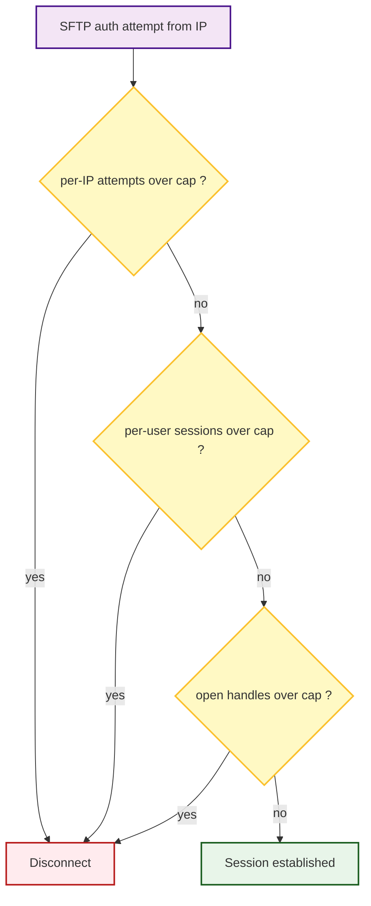

# Security

This page describes how Calagopus defends its trust boundaries: what isolates an
untrusted game server from the host, how the daemon avoids being coerced into
unwanted actions despite usually running as root, how credentials are handled,
and how abuse and denial-of-service are contained.

Calagopus is written in Rust, which removes whole classes of memory-safety
bugs, but memory safety on its own does not protect a multi-tenant panel. That
protection comes from isolation, authorization, credential handling, and
resource bounding, which the rest of this page covers.

## Reporting a vulnerability

Do **not** report security issues through public GitHub issues or Discord.

- **GitHub private advisory:** use the Security Advisories tab on
  [`calagopus/panel`](https://github.com/calagopus/panel/security/advisories/new)
  or [`calagopus/wings`](https://github.com/calagopus/wings/security/advisories/new).
- **Email:** `security@calagopus.com`. For sensitive reports, encrypt with our
  [PGP key](https://github.com/calagopus/branding/blob/main/SECURITY-PGP.md).

Please give us a reasonable window to fix an issue before public disclosure, do
not access or modify data that is not yours, and act in good faith.

## Supported versions

| Version | Supported |
| --- | --- |
| 1.0.x | Yes |
| 1.1.x | Yes |
| < 1.0.0 | No |

## Threat model

The core assumption: **a game server is untrusted code.** Anything a tenant runs
inside their container is treated as potentially hostile, and everyone else's
safety on the node depends on that container not reaching the host or other
tenants. The daemon (Wings) typically runs as root, so a second assumption
follows: **the daemon must never be tricked into acting outside a server's own
directory or privileges**, even when the request originates from an authenticated
but malicious user.

Attacker goals defended against: container escape to the host, cross-tenant
access, coercing the root daemon into touching paths outside a server root,
privilege escalation inside the panel, credential exfiltration, and
denial-of-service against the node or panel.

## Daemon isolation (Wings)

Each server runs in its own container. Wings sets the following by default when
creating a container (`application/src/server/executor/docker.rs`):

- **No privilege escalation:** `no-new-privileges` is always set.
- **Dropped capabilities:** `setpcap`, `mknod`, `audit_write`, `net_raw`,
  `dac_override`, `fowner`, `fsetid`, `net_bind_service`, `sys_chroot`,
  `setfcap`, and `sys_ptrace`.
- **Seccomp** profile applied by default (configurable per installation).
- **Read-only root filesystem**, with a size-limited `/tmp` mounted `nosuid`.
- **User-namespace remapping** supported and configurable.
- **Rootless mode** supported: daemon and containers can run as a non-root user.
  Otherwise containers still run as a configured non-root uid/gid, never as root.
- **cgroup resource limits:** memory (plus reservation/swap), CPU
  (quota/period/shares/cpuset), PID limit, block-IO weight, and OOM controls.

All of the above are enforced by the **kernel**, not by Wings, which matters
because they hold even against a fully compromised game server. A dropped
capability makes the corresponding privileged syscall fail with `EPERM` (for
example `mknod()` without `CAP_MKNOD`, or `ptrace()` without `CAP_SYS_PTRACE`);
`no-new-privileges` is the `prctl(PR_SET_NO_NEW_PRIVS)` flag that stops a setuid
binary from gaining privileges at `execve()`; the seccomp profile filters
syscalls in-kernel; the PID cgroup makes `fork()`/`clone()` return `EAGAIN` past
the limit while the memory cgroup hands runaway processes to the OOM killer; and
the read-only rootfs makes writes outside the mounted volumes fail with `EROFS`.
Wings sets these up, but it is not in the loop when they fire.

Defaults (see the [Wings configuration reference](../wings/configuration)):
`no-new-privileges`, the dropped-capability set, and the read-only rootfs are
always applied. `docker.container_apply_seccomp` defaults to `true` (it can need
disabling under Podman). `docker.userns_mode` is empty by default (remapping off
until configured), and rootless mode (`system.user.rootless.enabled`) is opt-in.

::: tip Recommended production baseline
Enable rootless mode and user-namespace remapping, keep seccomp on, and run the
daemon on a host dedicated to untrusted workloads.
:::

## Filesystem safety: keeping a root daemon in its lane

Because the daemon runs as root, path handling is the highest-risk area: a naive
implementation could be tricked (via `..`, absolute paths, or symlinks) into
reading or writing anywhere on the host. Calagopus mitigates this structurally
rather than by string-checking paths.

- **Capability-based confinement (`cap-std`).** Every server filesystem is opened
  as a capability-scoped directory (`Dir::open_ambient_dir` on the server root).
  All subsequent operations go through that handle, so a path that resolves
  outside the server root is rejected by construction, not by a blocklist. On
  Linux kernels that support it (5.6+), cap-std resolves paths with the kernel's
  `openat2()` using `RESOLVE_BENEATH`, so the **kernel itself** refuses to walk
  out of the root (returning `EXDEV`) rather than Wings string-checking for `..`.
  This is the primary defense against path traversal and symlink escape, and it
  holds even though the process is root.
- **Relative-path resolution.** Incoming paths are resolved relative to the
  capability root before use, so client-supplied absolute paths cannot redirect
  an operation.
- **Symlinks cannot escape.** Because operations go through the capability root,
  a symlink pointing outside the server root cannot be followed out of it. The
  filesystem watcher is also configured not to follow symlinks
  (`with_follow_symlinks(false)`), and metadata lookups use `symlink_metadata`
  (the link itself, not its target).
- **Ownership.** Files created inside a server root are `chown`ed to the server's
  user, not left owned by root, so the container cannot inherit root-owned files.

## Disk quota enforcement

Quota is enforced in two complementary layers: an in-process accounting gate that
refuses an allocation *before* it happens, and an on-disk quota backend that
enforces at the kernel or filesystem level.

**1. In-process allocation gate.** Before a write that grows usage, Wings
atomically checks projected usage against the limit using a compare-and-update
(`fetch_update`) on the cached usage counter. If `current + delta > limit`, the
allocation is refused and the write does not proceed. Being a single atomic
update, this is race-free under concurrent writes (no check-then-write window).
Note its scope: this gate governs writes **Wings itself performs** (SFTP, panel
file writes, archive extraction, remote pulls). The game server process writes
directly to its bind-mounted volume through the kernel and never passes through
this accounting, which is why the on-disk backend below matters.

**Allocation is incremental, not pre-allocated.** Uploads, archive extraction,
and remote pulls have no length reliably known in advance, and Calagopus
deliberately does not try to guess one. Rather than reserving quota up front, the
server file writer (`ServerFile` / `AsyncServerFile`) charges quota as data is
written:

- Each write advances a high-water mark and counts only **newly grown** bytes
  (`current_position - highest_position`). Overwriting existing content within a
  file costs no additional quota.
- Growth is accumulated and charged in batches once it crosses
  `ALLOCATION_THRESHOLD` (1 MiB), instead of taking the atomic quota lock on
  every small write, which keeps the write path cheap.
- Each batch passes through the same atomic gate above. If a batch would exceed
  the limit, the write fails mid-stream with `StorageFull` and stops, rather than
  being rejected up front (impossible without a known length) or allowed to run
  past the quota.
- Leftover accumulated bytes are charged on flush, on seek, and on close/drop, so
  accounting always reconciles even if the writer is dropped early.

One honest consequence: because charging happens at 1 MiB batch boundaries, a
server can overshoot its quota by at most roughly one threshold (plus any
in-flight async batch) before the next check refuses further growth. That is a
deliberate accuracy-for-throughput trade-off, not an unbounded overshoot.

**2. On-disk backend.** One of several limiters enforces the quota at rest:

| Mode | Mechanism |
| ---- | --- |
| `zfs_dataset` | Per-server ZFS dataset with a dataset quota. |
| `btrfs_subvolume` | Per-server Btrfs subvolume with a quota. |
| `xfs_quota` | XFS project quota. |
| `fuse_quota` | Userspace FUSE quota daemon (see below). |
| `none` | No enforcement (in-process accounting only). |

The **FUSE quota** backend runs as a **separate subprocess** that Wings talks to
over a Unix socket, keeping that enforcement path isolated from the main daemon.
Usage deltas are synced to it, and it answers usage queries and enforces the
configured limit.

The cached in-process usage is periodically reconciled against real disk usage on
an interval (`system.disk_check_interval`, default 150s), with a heavier full
recount every few passes (`full_disk_check_every`) and inotify-driven updates in
between, so drift between the fast accounting path and actual on-disk usage is
corrected.

### Real limiters vs `none`: who actually enforces

Which backend you choose decides where enforcement actually happens. The **real
limiters** (`zfs_dataset`, `btrfs_subvolume`, `xfs_quota`) push it into the
**kernel filesystem layer**: when a server hits its quota, the offending `write()`
syscall itself returns `EDQUOT` (or `ENOSPC`), synchronously, no matter who is
writing or how fast. The game server's own direct writes are bound the same way,
because the kernel enforces the quota on the mount, not Wings. The `fuse_quota`
backend is a middle ground: enforcement lives in a userspace FUSE daemon, but the
kernel VFS routes every write to that mount through it, so it is still in the
write path and rejects overruns at write time rather than after the fact.

::: danger The `none` limiter is not real enforcement
With `none`, there is no on-disk backend, so a game server writing directly to
its volume is only ever caught by the periodic usage scan
(`disk_check_interval`, default 150s). That check is **reactive**: a process that
writes faster than the interval can exceed its quota by a large margin before the
next scan even notices, and nothing at write time stops it. `none` is therefore
suitable only where the workload is trusted or disk is not a real constraint. For
untrusted tenants, use one of the kernel-enforced limiters (ZFS, Btrfs, or XFS)
where the filesystem supports it, or `fuse_quota` otherwise.
:::

## Checks are advisory, operations are authoritative

Wings and the panel operate on live, concurrently-mutated state. A game server can
create, grow, truncate, or delete a file at any instant, including the instant
between Wings observing it and Wings acting on it. The codebase treats an initial
check as a **fast-path hint, not a fact**: the check picks an efficient path, but
correctness comes from the operation that consumes the data staying valid even if
the data changed underneath it. This is time-of-check to time-of-use (TOCTOU)
resilience, and it recurs by design:

- **Archive and backup streaming (`FixedReader`).** Archives are built by
  streaming files off disk, and each format (tar, pxar, itaf, 7z, zip) writes a
  per-file header declaring the file's length, then expects exactly that many
  content bytes. If the file's size changes between header and body, the stream
  desynchronizes and every following entry is corrupted.
  `FixedReader` (`application/src/io/fixed_reader.rs`) pins the body to exactly the
  size captured at header time: it never yields more than the declared size (a
  file that **grows** cannot inject extra bytes), and it zero-fills the remainder
  if the file hits EOF early because it was **truncated**. The archive always
  receives the promised byte count and stays structurally valid and extractable.
  The trade-off is confined to that one file's contents (it may be zero-padded or
  clipped), never the archive as a whole. The same reader backs the PBS, restic,
  and ddup_bak backup adapters, so a live server cannot produce a structurally
  broken backup.

- **Disk usage scanning.** The scanner reads a path's type once to choose a fast
  path (rescan just the modified directory, or walk up to the nearest existing
  ancestor if the path has already vanished). It does not assume the tree stays
  still during the walk: every per-entry metadata read is guarded, and an entry
  that disappeared or changed type since the initial check is skipped
  (`Err(_) => continue`) rather than aborting the whole scan or lazily
  propagating the error upward. Hardlinks are de-duplicated by inode so a file
  linked many times is counted once.

- **Quota enforcement.** The in-process accounting check is advisory; the
  authoritative bound is applied at write time by the kernel or the on-disk
  limiter (see above). Under `none` there is no authoritative layer, only later
  reconciliation, which is precisely why `none` is weak.

- **Session and key validation (panel).** A fetched session token or API key is
  not trusted by mere presence; it is re-verified against its stored hash on
  every request.

The common thread: an earlier read of mutable state is never the thing keeping the
system correct. Where a naive implementation would check once and then trust that
result, Wings checks for the fast path and then handles the real outcome
defensively.

## Denial-of-service protections

A multi-tenant node has many amplification points: a server can spam its console,
an attacker can hammer SFTP or the login endpoint, and a client can request a
huge file or listing. These are bounded explicitly. Unlike the isolation controls
above, these are enforced in **userspace** by Wings and the panel, which is
sound here because Wings owns the SFTP server and reads the container's stdout,
and the panel fronts every API request, so each is genuinely in the path it
limits.

### Console output throttling

A game server that floods stdout could otherwise exhaust memory, saturate the
websocket, and lock up every viewer's browser. Wings counts output lines and,
once a configurable line count is exceeded within a reset interval, stops
forwarding to the rate-limited console stream and emits a single "throttling"
notice (`config.throttles.{enabled,lines,line_reset_interval}`; throttling is on
by default, at 2000 lines per 100s). The unthrottled internal stream is preserved
separately for logging and startup detection, so throttling never breaks state
detection.

### SFTP / SSH limits

The SSH/SFTP server (built on `russh`) applies layered limits
(`application/src/ssh/limiter.rs`):

- **Per-IP authentication attempts**, counted separately for password (default 3)
  and public key (default 20). Exceeding the cap disconnects the connection;
  counters decay after `authentication_cooldown` (default 60s).
- **Per-user concurrent connections** capped by `max_connections_per_user`
  (default 10).
- **Open SFTP handle caps**, both per channel (`max_handles_per_channel`,
  default 32) and global (`max_handles_total`, default 1024), the latter enforced
  with an atomic guard, bounding how many file handles a client can hold open.

Defaults are in the [Wings configuration reference](../wings/configuration).

### Panel rate limiting

The panel applies **per-endpoint, per-client rate limits** backed by the shared
cache (Redis-like), keyed as `ratelimit::<endpoint>::<client-ip>` over a fixed
window of `hits` per `window_seconds`. Limits are configurable per endpoint, and
sensitive endpoints are covered individually rather than by one blanket limit:

- Auth: `auth_register`, `auth_login`, `auth_login_checkpoint`,
  `auth_login_security_key`, `auth_password_forgot`, `auth_password_reset`, and
  OAuth flows.
- Client: a general `client` limit plus dedicated limits for expensive actions
  such as `client_servers_backups_create`, `client_servers_files_pull`, and
  `client_servers_files_pull_query`.
- Node/daemon: `remote` and `remote_sftp_auth`.

Separating these means a flood against, say, backup creation cannot exhaust the
budget for ordinary client requests. Limits are keyed by client IP, so behind a
reverse proxy the panel must receive the real client address (see
[Reverse proxies](../additional/reverse-proxies)). Rate limiting relies on
Redis/Valkey; running without it falls back to in-memory and is not recommended
in production for this reason.

::: info Fixed-window behavior
Limits are counted over a fixed window (`hits` per `window_seconds`). A fixed
window permits a short burst across a window boundary (up to roughly twice the
limit in a brief span). This is expected and fine for abuse mitigation.
:::

### Bounded reads and pagination

Unbounded reads are avoided throughout:

- **File reads take an explicit byte limit** and truncate at it, so opening a file
  (for example in the editor) cannot read an arbitrarily large file into memory.
- **Directory and archive listings are paginated** (`skip(start).take(per_page)`)
  rather than materializing an entire tree.
- **inotify path accumulation is capped** and deduplicated past a threshold,
  bounding watcher memory under rapid filesystem churn.
- **Server file uploads are streamed, not buffered,** and bounded by the disk
  quota through the incremental allocation described above, so there is no need
  to hold a whole upload in memory or to trust a client-declared length. The
  body-size limit is deliberately disabled only on the trusted admin asset-upload
  route.

### Compile-time panic resistance (lints)

In a root daemon that parses untrusted input (paths, archive contents, wire
protocols), a panic is a denial-of-service: it takes down the task or the daemon.
Wings pushes the most common panic sources out at **compile time** rather than
relying on review. Both the application crate and `pbs-client` set these clippy
lints to `deny`:

- `unwrap_used`, `panic`, `unreachable`, `todo`, `unimplemented`
- `indexing_slicing` and `string_slice`, so a bad index or a non-char-boundary
  slice on attacker-influenced data cannot panic; bounds-checked access
  (`.get()`) is required instead
- `unwrap_in_result` and `panic_in_result_fn`, keeping fallible paths returning
  errors instead of panicking

`missing_panics_doc` is a warning, and the full `clippy::all` group runs at warn.
This does not make the daemon panic-proof in an absolute sense (it does not cover,
for example, arithmetic overflow or allocation failure), but it removes the panic
vectors most reachable from malformed input.

## Panel authentication and secrets

- **Passwords:** bcrypt via pgcrypto, cost factor 12. Plaintext is never stored.
- **Session tokens and API keys:** stored hashed, verified against the hash on
  each request, not kept in plaintext.
- **MFA:** TOTP and WebAuthn / security keys. Login can be gated by a configurable
  CAPTCHA (Turnstile, reCAPTCHA, hCaptcha, or FriendlyCaptcha).
- **Stored secrets** (node tokens, backup credentials, database passwords):
  encrypted at rest with authenticated encryption keyed by the panel's
  configured encryption key.

::: warning Known trade-off: decrypted-secret cache
The panel can briefly cache decrypted secrets in Redis (short TTL, ~30s) to avoid
repeated decryption. This is **off by default** (`APP_USE_DECRYPTION_CACHE`) and
should be weighed against your threat model before enabling, since it places
decrypted values in the cache.
:::

The panel encryption key is set via `APP_ENCRYPTION_KEY` (the panel will not start
without it). It must be kept secret and not lost; rotating it requires
re-encrypting all stored secrets. See the
[Panel environment reference](../panel/environment).

## Supply chain and build integrity

Both the panel and Wings builds produce, in CI:

- **CycloneDX SBOMs** generated from source per build.
- **Signed container images** using cosign / sigstore (GHCR and Docker Hub).
- **Build provenance** and **SBOM attestations** attached to the images, so a
  consumer can verify what was built and from what.

## Known residual risks

The residual risks, listed directly:

- **Quota overshoot bound.** Incremental allocation can exceed a quota by up to
  roughly one 1 MiB batch (plus any in-flight async batch) before refusing
  further growth. Deliberate throughput trade-off.
- **Decrypted-secret cache.** When explicitly enabled, decrypted secrets sit in
  Redis for a short TTL. Off by default.
- **Operator-dependent hardening.** User-namespace remapping and rootless mode
  are opt-in; the strongest isolation posture requires enabling them. The `none`
  disk limiter provides no write-time enforcement (see above) and should not be
  used for untrusted tenants.
