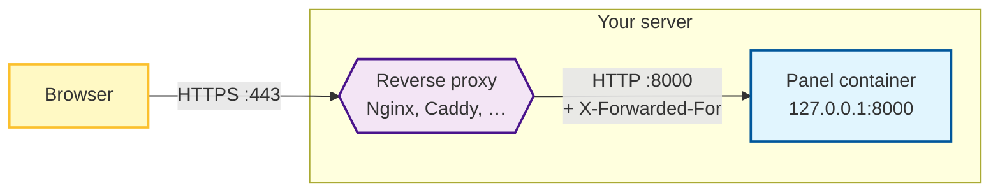

# Setting up a Reverse Proxy

A reverse proxy is a web server that sits between the internet and the Panel. Visitors talk to the proxy on the standard HTTPS port (443), and the proxy forwards each request to the Panel, which keeps listening on its own port (8000) where nobody else can reach it.

You want one because it:

- Serves the Panel at `https://panel.example.com` instead of `http://1.2.3.4:8000`.
- Terminates TLS in one place, so the Panel itself never has to handle certificates.
- Lets one machine host the Panel next to other websites on the same ports.
- Enables features that need a secure origin, such as [passkeys](../panel/features/dashboard/security-keys.md).

This guide covers the Panel first, then [Wings](#putting-wings-behind-a-reverse-proxy) for standalone nodes.

## How It Fits Together



Three things happen at the proxy on every request:

1. It decrypts the HTTPS connection using your certificate.
2. It adds headers that tell the Panel who the real visitor is (`X-Forwarded-For`, `X-Real-IP`).
3. It forwards the request over plain HTTP to the Panel on the loopback address, and streams the response back.

Because every request now reaches the Panel *from the proxy*, the Panel has to be told which address the proxy uses. Otherwise every visitor looks like they come from the same IP, which breaks per-IP rate limiting and fills the activity log with the proxy's address. Telling the Panel about the proxy is the only Panel-side change in this guide.

::: info All-in-One image
If you run the [All-in-One image](../panel/installation/docker.md#option-a-all-in-one-recommended-for-single-node-setups), the bundled Wings is reached through the Panel, so this single proxy configuration covers both. Only SFTP (port `2022`) stays direct, because it is not HTTP.
:::

## Prerequisites

Have these ready before you start:

- The Panel is [installed with Docker](../panel/installation/docker.md) and reachable at `http://<server-ip>:8000`.
- A domain name with an `A` record (and `AAAA` if you use IPv6) pointing at the server's public IP. This guide uses `<domain>` as a placeholder; replace it everywhere it appears.
- Ports `80` and `443` open in your firewall and forwarded on your router if the server is at home.
- A TLS certificate for the domain, unless you pick Caddy (which issues one by itself). See [Generating SSL Certificates](ssl-certificates.md). The examples below use the paths certbot creates under `/etc/letsencrypt/live/<domain>/`.
- The proxy software installed on the same machine as the Panel: `apt install nginx`, `apt install apache2`, or the [Caddy install guide](https://caddyserver.com/docs/install). For a proxy that runs in Docker, see [Traefik and Nginx Proxy Manager](#proxies-running-in-docker) first.

::: warning
A broken proxy configuration makes the Panel unreachable until it is fixed, so keep a terminal open and know how to roll back. Nothing in this guide touches the Panel's data.
:::

## Step 1: Prepare the Panel

All of the changes in this step happen in the `compose.yml` you created during installation.

### Stop Exposing Port 8000

The compose file publishes the Panel on every interface of the host:

```yaml
    ports:
      - 8000:8000
```

Once the proxy is in place, nobody but the proxy should be able to reach that port. Restrict it to the loopback interface:

```yaml
    ports:
      - 127.0.0.1:8000:8000
```

Leave any other port mappings alone. On the All-in-One image, `2022:2022` (SFTP) must stay reachable from outside.

::: tip Proxy in Docker?
If your proxy runs as a container (Traefik, Nginx Proxy Manager), it reaches the Panel over a Docker network instead of a published port. Follow [Proxies running in Docker](#proxies-running-in-docker) for this step rather than the loopback binding.
:::

### Trust the Proxy's Address

Connections that arrive at the Panel from the proxy come from the gateway of the Panel's Docker network. Run this inside the Panel's compose directory to print that address:

```bash
docker inspect -f '{{range .NetworkSettings.Networks}}{{println .Gateway}}{{end}}' $(docker compose ps -q web)
```

It prints something like `172.18.0.1` (one line per network the container is on; use the one that belongs to the compose network). Set [`APP_TRUSTED_PROXIES`](../panel/environment.md#app-trusted-proxies) to that value on the `web` service:

```yaml
services:
  web:
    environment:
      # ...existing variables...
      - APP_TRUSTED_PROXIES=172.18.0.1
```

The variable takes a comma-separated list of IPs or CIDR ranges. Only list addresses you control. When a request arrives from a trusted address, the Panel believes the `X-Forwarded-For` and `X-Real-IP` headers on it; when it arrives from anywhere else, those headers are ignored and the connecting address is used. Trusting too much lets a visitor spoof their IP by sending the header themselves.

### Apply the Changes

```bash
docker compose up -d
```

The Panel is now only reachable from the machine itself. Confirm that with:

```bash
curl -s -o /dev/null -w '%{http_code}\n' http://127.0.0.1:8000
```

A `200` (or a redirect status) means the Panel answers on the loopback address and the proxy will be able to reach it.

## Step 2: Configure the Proxy

Every configuration below does the same four things. If you use a proxy that isn't listed, these are the settings to replicate:

| Setting | Why the Panel needs it |
| --- | --- |
| Forward to `http://127.0.0.1:8000` | The address the Panel listens on after Step 1 |
| Pass `Upgrade` and `Connection` headers through | The server console, live statistics and file manager use WebSockets, which start as an HTTP upgrade |
| Raise the request body limit (default in the examples: `100 MB`) | File uploads through the file manager go through the proxy; anything larger than the limit fails with `413` |
| Set `X-Forwarded-For` and `X-Real-IP` | Real client IPs for logs and rate limiting. The Panel reads these two; `X-Forwarded-Proto` and `Host` are set for completeness and are what most other applications expect |

Pick the proxy you use:

::::tabs
=== Nginx

**1. Add the WebSocket map.** Open `/etc/nginx/nginx.conf` and add this block inside `http { ... }`, next to the other `include` lines. It must not be inside a `server { ... }` block.

```nginx
map $http_upgrade $connection_upgrade {
    default upgrade;
    ''      "";
}
```

This sends `Connection: upgrade` only on requests that actually ask for a WebSocket. Without it Nginx sends the header on every request, and multipart uploads and other ordinary traffic break.

**2. Create the site.** Save the configuration as `/etc/nginx/sites-available/calagopus.conf` on Debian and Ubuntu, or `/etc/nginx/conf.d/calagopus.conf` on RHEL-based systems. Replace `<domain>` in the `server_name` and certificate lines.

::: code-group
```nginx [With SSL]
server {
    listen 80;
    listen [::]:80;
    server_name <domain>;
    return 301 https://$server_name$request_uri;
}

server {
    listen 443 ssl http2;
    listen [::]:443 ssl http2;
    server_name <domain>;

    access_log /var/log/nginx/calagopus.app-access.log;
    error_log  /var/log/nginx/calagopus.app-error.log error;

    sendfile off;
    # Largest request body the proxy accepts. Uploads through the
    # file manager bigger than this fail with HTTP 413.
    client_max_body_size 100M;

    ssl_certificate     /etc/letsencrypt/live/<domain>/fullchain.pem;
    ssl_certificate_key /etc/letsencrypt/live/<domain>/privkey.pem;
    ssl_protocols       TLSv1.2 TLSv1.3;
    ssl_ciphers         HIGH:!aNULL:!MD5;
    ssl_prefer_server_ciphers on;
    ssl_session_cache   shared:SSL:30m;
    ssl_session_timeout 10m;
    ssl_session_tickets on;

    # See https://hstspreload.org/ before uncommenting the line below.
    # add_header Strict-Transport-Security "max-age=15768000; preload;";
    add_header X-XSS-Protection          "1; mode=block";
    add_header X-Robots-Tag              "noindex, nofollow" always;
    add_header Permissions-Policy        "camera=(), microphone=(), geolocation=(), fullscreen=(self), clipboard-read=(self)" always;
    add_header Referrer-Policy           "same-origin";

    location / {
        proxy_http_version 1.1;
        # WebSocket support (uses the map from step 1)
        proxy_set_header Upgrade          $http_upgrade;
        proxy_set_header Connection       $connection_upgrade;
        # Tell the Panel who the visitor is
        proxy_set_header Host             $host;
        proxy_set_header X-Real-IP        $remote_addr;
        proxy_set_header X-Forwarded-For  $proxy_add_x_forwarded_for;
        proxy_set_header X-Forwarded-Proto $scheme;
        proxy_redirect off;
        proxy_buffering on;
        proxy_request_buffering on;
        proxy_pass http://127.0.0.1:8000;
        proxy_pass_header Content-Security-Policy;
    }

    location ~ /\.ht {
        deny all;
    }
}
```
```nginx [Without SSL]
server {
    listen 80;
    listen [::]:80;
    server_name <domain>;

    access_log /var/log/nginx/calagopus.app-access.log;
    error_log  /var/log/nginx/calagopus.app-error.log error;

    sendfile off;
    # Largest request body the proxy accepts. Uploads through the
    # file manager bigger than this fail with HTTP 413.
    client_max_body_size 100M;

    add_header X-XSS-Protection   "1; mode=block";
    add_header X-Robots-Tag       "noindex, nofollow" always;
    add_header Permissions-Policy "camera=(), microphone=(), geolocation=(), fullscreen=(self), clipboard-read=(self)" always;
    add_header Referrer-Policy    "same-origin";

    location / {
        proxy_http_version 1.1;
        # WebSocket support (uses the map from step 1)
        proxy_set_header Upgrade          $http_upgrade;
        proxy_set_header Connection       $connection_upgrade;
        # Tell the Panel who the visitor is
        proxy_set_header Host             $host;
        proxy_set_header X-Real-IP        $remote_addr;
        proxy_set_header X-Forwarded-For  $proxy_add_x_forwarded_for;
        proxy_set_header X-Forwarded-Proto $scheme;
        proxy_redirect off;
        proxy_buffering on;
        proxy_request_buffering on;
        proxy_pass http://127.0.0.1:8000;
        proxy_pass_header Content-Security-Policy;
    }

    location ~ /\.ht {
        deny all;
    }
}
```
:::

::: details Why is there a "Without SSL" variant at all?
Only for testing on a network you trust, or when TLS is terminated somewhere in front of Nginx (a load balancer or Cloudflare with "Flexible" mode). Passkeys, secure cookies and the browser's clipboard access all need HTTPS, so do not run a real installation this way.
:::

**3. Enable it and reload.** On Debian and Ubuntu, link the site into `sites-enabled`. On RHEL-based systems the file in `conf.d/` is already active.

```bash
sudo ln -s /etc/nginx/sites-available/calagopus.conf /etc/nginx/sites-enabled/calagopus.conf
sudo nginx -t
sudo systemctl reload nginx
```

`nginx -t` checks the configuration before anything is reloaded. If it reports an error, fix the file first; the running Nginx keeps its old configuration until the reload succeeds.

=== Apache

**1. Enable the modules and disable the default site.** The default site catches every request that doesn't match another `ServerName`, which gets in the way while testing.

```bash
sudo a2enmod rewrite headers proxy proxy_http proxy_wstunnel ssl http2
sudo a2dissite 000-default.conf
```

On RHEL-based systems the modules are compiled in or loaded already; you can skip this step.

**2. Create the site.** Save the configuration as `/etc/apache2/sites-available/calagopus.conf` on Debian and Ubuntu, or `/etc/httpd/conf.d/calagopus.conf` on RHEL-based systems. Replace `<domain>` in the `ServerName` and certificate lines.

::: code-group
```apache [With SSL]
<VirtualHost *:80>
    ServerName <domain>
    RewriteEngine On
    RewriteRule ^ https://%{SERVER_NAME}%{REQUEST_URI} [R=301,L]
</VirtualHost>

<VirtualHost *:443>
    ServerName <domain>

    AllowEncodedSlashes NoDecode
    Protocols h2 http/1.1

    ErrorLog  /var/log/apache2/calagopus.app-error.log
    CustomLog /var/log/apache2/calagopus.app-access.log combined

    EnableSendfile Off
    # Largest request body the proxy accepts, in bytes.
    # Uploads through the file manager bigger than this fail with HTTP 413.
    LimitRequestBody 104857600

    SSLEngine on
    SSLCertificateFile    /etc/letsencrypt/live/<domain>/fullchain.pem
    SSLCertificateKeyFile /etc/letsencrypt/live/<domain>/privkey.pem
    SSLProtocol           -all +TLSv1.2 +TLSv1.3
    SSLCipherSuite        HIGH:!aNULL:!MD5
    SSLHonorCipherOrder   on
    SSLSessionTickets     on

    # See https://hstspreload.org/ before uncommenting the line below.
    # Header always set Strict-Transport-Security "max-age=15768000; preload;"
    Header always set X-XSS-Protection   "1; mode=block"
    Header always set X-Robots-Tag       "noindex, nofollow"
    Header always set Permissions-Policy "camera=(), microphone=(), geolocation=(), fullscreen=(self), clipboard-read=(self)"
    Header always set Referrer-Policy    "same-origin"

    ProxyPreserveHost On
    ProxyRequests Off

    <Proxy *>
        Require all granted
    </Proxy>

    # upgrade=websocket needs Apache 2.4.47 or newer; see the note below for older releases.
    ProxyPass        / http://127.0.0.1:8000/ retry=0 upgrade=websocket
    ProxyPassReverse / http://127.0.0.1:8000/

    # Tell the Panel who the visitor is. mod_proxy adds X-Forwarded-For on its own.
    RequestHeader set X-Real-IP        %{REMOTE_ADDR}s
    RequestHeader set X-Forwarded-Proto "https"

    <FilesMatch "^\.ht">
        Require all denied
    </FilesMatch>
</VirtualHost>
```
```apache [Without SSL]
<VirtualHost *:80>
    ServerName <domain>

    AllowEncodedSlashes NoDecode

    ErrorLog  /var/log/apache2/calagopus.app-error.log
    CustomLog /var/log/apache2/calagopus.app-access.log combined

    EnableSendfile Off
    # Largest request body the proxy accepts, in bytes.
    # Uploads through the file manager bigger than this fail with HTTP 413.
    LimitRequestBody 104857600

    Header always set X-XSS-Protection   "1; mode=block"
    Header always set X-Robots-Tag       "noindex, nofollow"
    Header always set Permissions-Policy "camera=(), microphone=(), geolocation=(), fullscreen=(self), clipboard-read=(self)"
    Header always set Referrer-Policy    "same-origin"

    ProxyPreserveHost On
    ProxyRequests Off

    <Proxy *>
        Require all granted
    </Proxy>

    # upgrade=websocket needs Apache 2.4.47 or newer; see the note below for older releases.
    ProxyPass        / http://127.0.0.1:8000/ retry=0 upgrade=websocket
    ProxyPassReverse / http://127.0.0.1:8000/

    # Tell the Panel who the visitor is. mod_proxy adds X-Forwarded-For on its own.
    RequestHeader set X-Real-IP        %{REMOTE_ADDR}s
    RequestHeader set X-Forwarded-Proto "http"

    <FilesMatch "^\.ht">
        Require all denied
    </FilesMatch>
</VirtualHost>
```
:::

::: details Apache older than 2.4.47
Check with `apache2 -v` (or `httpd -v`). Older releases don't understand the `upgrade=websocket` parameter and reject the configuration. Remove `upgrade=websocket` from the `ProxyPass` line and add these lines above it to route WebSocket requests through `mod_proxy_wstunnel` instead:

```apache
RewriteEngine On
RewriteCond %{HTTP:Upgrade} =websocket [NC]
RewriteRule /(.*) ws://127.0.0.1:8000/$1 [P,L]
```
:::

**3. Enable it and reload.**

```bash
sudo a2ensite calagopus.conf
sudo apachectl configtest
sudo systemctl reload apache2
```

On RHEL-based systems the file in `conf.d/` is already active; run `apachectl configtest` and `systemctl reload httpd`.

=== Caddy

Caddy obtains and renews the certificate on its own, sets the forwarding headers, and passes WebSockets through without extra configuration. The site block is a few lines. Make sure ports `80` and `443` are reachable from the internet before starting it, because that is how Caddy proves it owns the domain.

Replace the contents of `/etc/caddy/Caddyfile` (or add this block to it if Caddy already serves other sites):

```text
<domain> {
    # Largest request body the proxy accepts. Uploads through the
    # file manager bigger than this fail with HTTP 413.
    request_body {
        max_size 100MB
    }

    reverse_proxy 127.0.0.1:8000
}
```

Then validate and reload:

```bash
sudo caddy validate --config /etc/caddy/Caddyfile
sudo systemctl reload caddy
```

The first reload takes a few seconds longer while Caddy requests the certificate. `journalctl -u caddy -f` shows the progress if the site does not come up right away.

=== Traefik

This assumes Traefik already runs in Docker with the Docker provider enabled, a `websecure` entrypoint on port 443, and a certificate resolver named `letsencrypt`. Adjust those three names to match your Traefik setup. Traefik connects to the Panel over a shared Docker network, so complete [Proxies running in Docker](#proxies-running-in-docker) first; the network below is called `proxy`.

Add the labels and network to the `web` service in the Panel's `compose.yml`, and remove the `8000:8000` port mapping:

```yaml
services:
  web:
    # ...existing configuration...
    networks:
      - default
      - proxy
    labels:
      - traefik.enable=true
      - traefik.docker.network=proxy
      - traefik.http.routers.calagopus.rule=Host(`<domain>`)
      - traefik.http.routers.calagopus.entrypoints=websecure
      - traefik.http.routers.calagopus.tls.certresolver=letsencrypt
      - traefik.http.services.calagopus.loadbalancer.server.port=8000

networks:
  proxy:
    external: true
```

Traefik forwards WebSockets, sets `X-Forwarded-For` and `X-Forwarded-Proto`, and does not limit request bodies by default, so nothing else is needed. Apply with `docker compose up -d`; Traefik picks the container up within a few seconds.

=== Nginx Proxy Manager

Nginx Proxy Manager runs as a container, so it reaches the Panel over a shared Docker network rather than `127.0.0.1`. Complete [Proxies running in Docker](#proxies-running-in-docker) first, then add a proxy host in the web UI:

1. Open **Hosts → Proxy Hosts → Add Proxy Host**.
2. On the **Details** tab set **Domain Names** to your domain, **Scheme** to `http`, **Forward Hostname / IP** to `web` (the Panel's service name on the shared network) and **Forward Port** to `8000`. Turn on **Websockets Support**.
3. On the **SSL** tab pick **Request a new SSL Certificate**, and enable **Force SSL** and **HTTP/2 Support**.
4. Save.

Nginx Proxy Manager already allows request bodies up to 2000 MB, so no upload limit needs changing. To pick a different limit, put `client_max_body_size 100M;` into **Custom Nginx Configuration** on the **Advanced** tab.

Nginx Proxy Manager sets the `X-Forwarded-For`, `X-Real-IP` and `X-Forwarded-Proto` headers on its own.

::::

## Step 3: Verify

1. Open `https://<domain>` in a browser. You should see the Panel's login page with a valid padlock. If the page doesn't load, check the [troubleshooting section](#troubleshooting).
2. Log in, then open **Account → Activity**. The login entry's IP column must show your own public IP. If it shows the proxy's address (something like `172.18.0.1`), `APP_TRUSTED_PROXIES` is wrong; go back to [Step 1](#trust-the-proxy-s-address).
3. Open a server and check that the console connects and shows live output. If it stays on "connecting", the WebSocket headers aren't reaching the Panel.
4. Confirm the old address no longer works from another machine: `http://<server-ip>:8000` should time out or be refused.

## Step 4: Set the Panel URL

The Panel builds links from a URL you configure, not from the address a visitor happened to use. Go to **Admin → Settings → Application**, set **URL** to `https://<domain>`, and save. Email links, OAuth callbacks, node connections and the generated Wings configuration all use this value, so it has to match the address the proxy serves.


## Proxies Running in Docker

Traefik, Nginx Proxy Manager and similar tools run as containers themselves. Two things change compared to a proxy installed on the host:

**The proxy reaches the Panel over a Docker network, not a published port.** Create a network the proxy container is already attached to (or attach it to one), add the Panel's `web` service to that same network, and remove the `8000:8000` port mapping entirely. The proxy then forwards to `web:8000`, using the service name as the hostname.

```bash
docker network create proxy
docker network connect proxy <proxy-container-name>
```

```yaml
services:
  web:
    # ...existing configuration, with the 8000:8000 ports entry removed...
    networks:
      - default
      - proxy

networks:
  proxy:
    external: true
```

The `default` entry keeps the Panel connected to its database and cache. On the All-in-One image, keep the `2022:2022` SFTP port mapping.

**The trusted proxy address is the proxy container's, not the gateway's.** Trust the whole shared network so the value survives container restarts:

```bash
docker network inspect proxy -f '{{range .IPAM.Config}}{{.Subnet}}{{end}}'
```

```yaml
services:
  web:
    environment:
      - APP_TRUSTED_PROXIES=172.19.0.0/16
```

Only containers on that network can reach the Panel, so trusting the subnet is safe as long as you control everything attached to it.

## Cloudflare

If your domain is proxied through Cloudflare (orange cloud), the proxy chain becomes `Browser → Cloudflare → your proxy → Panel`. Three adjustments:

- **Trust Cloudflare's addresses too.** Cloudflare puts the visitor's IP in `X-Forwarded-For`, and your proxy appends Cloudflare's edge address behind it. The Panel walks that list from the right and skips every trusted address, so it only reports the real visitor if Cloudflare's ranges are trusted as well. Build the list with:

  ```bash
  echo "172.18.0.1,$( (curl -s https://www.cloudflare.com/ips-v4; echo; curl -s https://www.cloudflare.com/ips-v6) | grep . | paste -sd,)"
  ```

  Replace `172.18.0.1` with your own gateway address from Step 1 and put the whole output in `APP_TRUSTED_PROXIES`. Cloudflare updates its ranges rarely; the list is published at [cloudflare.com/ips](https://www.cloudflare.com/ips/).

  This works as written with Nginx and Nginx Proxy Manager, which append to the `X-Forwarded-For` header Cloudflare sends. Caddy and Traefik replace that header unless Cloudflare's ranges are also trusted in the proxy itself: Caddy through `trusted_proxies` inside the `reverse_proxy` block, Traefik through `forwardedHeaders.trustedIPs` on the entrypoint.
- **Set the SSL/TLS mode to Full (strict)** in the Cloudflare dashboard, so Cloudflare verifies your certificate instead of connecting over plain HTTP.
- **Keep non-HTTP hostnames DNS-only (grey cloud).** Cloudflare's proxy only carries HTTP and WebSocket traffic. SFTP (port `2022`), game server ports and the [private network](../wings/advanced/private-network.md) tunnel do not pass through it. Give Wings nodes a hostname that resolves directly to the machine, or turn the proxy off for those records.

Cloudflare also caps the size of a single request per plan (100 MB on Free), and that cap applies before your own body size limit. Server file uploads through the file manager are sent in chunks of at most 95 MiB, so they pass through Cloudflare on any plan. Admin asset uploads are not chunked and stay subject to the cap.

## Putting Wings Behind a Reverse Proxy

This section applies to standalone Wings nodes installed with the [Wings guides](../wings/installation/index.md). The All-in-One image is already covered by the Panel configuration above.

You have three ways to secure a standalone node, and most setups only need the first:

| Approach | When to use it |
| --- | --- |
| [Wings' built-in SSL](../wings/configuration.md#ssl-configuration) | The node runs nothing else on ports 443/8080. Point Wings at the certificate files and you're done. No proxy involved. |
| Reverse proxy in front of Wings (this section) | A proxy already runs on the node, you want Wings on port 443, or you want one place to manage certificates. |
| [Wings Proxy Mode](../wings/advanced/exposing-wings-in-a-homelab.md) | The node can't be reached from the internet at all. The Panel relays browser traffic to it. |

With the first two options, browsers connect to Wings directly for the console, file uploads and downloads, so the node's public URL must be reachable from your users' machines. Only Wings Proxy Mode routes that traffic through the Panel instead.

### 1. Trust the Proxy in Wings

Like the Panel, Wings needs to know which address the proxy connects from before it believes the forwarded IP headers. It uses them for its [per-IP WebSocket connection limits](../wings/configuration.md#system-websocket-unauthenticated-connections-per-ip) and for the IP recorded on file-upload activity, so without this every user shares one budget.

Edit the node's `config.yml` (`/etc/calagopus-wings/config.yml`, or `config/config.yml` in the Wings compose directory) and set [`api.trusted_proxies`](../wings/configuration.md#api-trusted-proxies):

::: code-group
```yaml [Wings as a binary or package]
api:
  trusted_proxies:
    - 127.0.0.1
```
```yaml [Wings in Docker]
# Print the gateway address inside the Wings compose directory:
#   docker inspect -f '{{range .NetworkSettings.Networks}}{{println .Gateway}}{{end}}' $(docker compose ps -q wings)
api:
  trusted_proxies:
    - 172.20.0.1
```
:::

This key is deliberately excluded from configuration updates pushed by the Panel, so it has to be edited on the node itself. Restart Wings afterwards:

::: code-group
```bash [Binary or package]
sudo systemctl restart wings
```
```bash [Docker]
docker compose restart wings
```
:::

You don't need to trust the Panel here. When the Panel relays a request in proxy mode, it authenticates the forwarded IP with the node token instead.

### 2. Configure the Proxy

The configuration is the same shape as the Panel's, forwarding to port `8080` instead, with two differences:

- **Uploads and downloads can be large.** The body limit should match [`api.upload_limit`](../wings/configuration.md#api-upload-limit) in `config.yml` (in MiB, default `100`). The file manager splits larger files into requests of at most 95 MiB, so a limit below that breaks every big upload, and one at the default never gets in the way. Buffering is turned off so a multi-gigabyte backup streams through the proxy instead of being written to the proxy's disk first.
- **Only HTTP goes through the proxy.** SFTP (port `2022`) connects to the node directly, and so does the private network tunnel. That works on its own as long as the node's hostname resolves to the node's real IP.

Replace `<node-domain>` with the node's hostname.

::::tabs
=== Nginx

Uses the same `map` block from the [Panel configuration](#step-2-configure-the-proxy); add it to `nginx.conf` if this node doesn't have it yet.

```nginx
server {
    listen 80;
    listen [::]:80;
    server_name <node-domain>;
    return 301 https://$server_name$request_uri;
}

server {
    listen 443 ssl http2;
    listen [::]:443 ssl http2;
    server_name <node-domain>;

    access_log /var/log/nginx/calagopus-wings.access.log;
    error_log  /var/log/nginx/calagopus-wings.error.log error;

    ssl_certificate     /etc/letsencrypt/live/<node-domain>/fullchain.pem;
    ssl_certificate_key /etc/letsencrypt/live/<node-domain>/privkey.pem;
    ssl_protocols       TLSv1.2 TLSv1.3;
    ssl_ciphers         HIGH:!aNULL:!MD5;
    ssl_prefer_server_ciphers on;

    # Match api.upload_limit in config.yml (MiB)
    client_max_body_size 100M;

    location / {
        proxy_http_version 1.1;
        proxy_set_header Upgrade          $http_upgrade;
        proxy_set_header Connection       $connection_upgrade;
        proxy_set_header Host             $host;
        proxy_set_header X-Real-IP        $remote_addr;
        proxy_set_header X-Forwarded-For  $proxy_add_x_forwarded_for;
        proxy_set_header X-Forwarded-Proto $scheme;
        # Stream uploads and downloads instead of spooling them to disk
        proxy_buffering off;
        proxy_request_buffering off;
        proxy_pass http://127.0.0.1:8080;
    }
}
```

Save it as `/etc/nginx/sites-available/calagopus-wings.conf`, then enable and reload as in the Panel section.

=== Apache

```apache
<VirtualHost *:80>
    ServerName <node-domain>
    RewriteEngine On
    RewriteRule ^ https://%{SERVER_NAME}%{REQUEST_URI} [R=301,L]
</VirtualHost>

<VirtualHost *:443>
    ServerName <node-domain>

    AllowEncodedSlashes NoDecode
    Protocols h2 http/1.1

    ErrorLog  /var/log/apache2/calagopus-wings.error.log
    CustomLog /var/log/apache2/calagopus-wings.access.log combined

    EnableSendfile Off
    # Match api.upload_limit in config.yml (bytes; 104857600 = 100 MiB)
    LimitRequestBody 104857600

    SSLEngine on
    SSLCertificateFile    /etc/letsencrypt/live/<node-domain>/fullchain.pem
    SSLCertificateKeyFile /etc/letsencrypt/live/<node-domain>/privkey.pem
    SSLProtocol           -all +TLSv1.2 +TLSv1.3

    ProxyPreserveHost On
    ProxyRequests Off

    <Proxy *>
        Require all granted
    </Proxy>

    # upgrade=websocket needs Apache 2.4.47 or newer
    ProxyPass        / http://127.0.0.1:8080/ retry=0 upgrade=websocket
    ProxyPassReverse / http://127.0.0.1:8080/

    RequestHeader set X-Real-IP        %{REMOTE_ADDR}s
    RequestHeader set X-Forwarded-Proto "https"
</VirtualHost>
```

Save it as `/etc/apache2/sites-available/calagopus-wings.conf`, then enable and reload as in the Panel section. The same [note about Apache older than 2.4.47](#step-2-configure-the-proxy) applies.

=== Caddy

```text
<node-domain> {
    # Match api.upload_limit in config.yml
    request_body {
        max_size 100MB
    }

    reverse_proxy 127.0.0.1:8080
}
```

Caddy streams request bodies by default. Validate and reload as in the Panel section.

::::

### 3. Point the Panel at the Proxied URL

In **Admin → Nodes → (your node) → General**, set **URL** to `https://<node-domain>` **without a port**. The proxy listens on `443`, which is what the URL implies. The form warns that no port was given and offers to add `:8080`; ignore it here, since `:8080` would bypass the proxy. Leave **Public URL** empty unless you want browsers to use a different address than the Panel does.

Keep `api.port` in `config.yml` at `8080`. The Panel's warning about the URL port not matching the API port only matters when Wings is reached directly.

Then open the node's **Configuration** tab and run **Verify Connection**. Both checks have to pass: **Backend to Wings** proves the Panel reaches the node through the proxy, and **Frontend to Wings** proves your browser does, which the console, uploads and downloads depend on.

## Troubleshooting

**502 Bad Gateway, or the proxy's own error page.** The proxy can't reach the Panel. Check that the container is running with `docker compose ps`, and that `curl -I http://127.0.0.1:8000` answers on the host. If the proxy runs in Docker, make sure both containers are on the same network and the forward target is the service name, not `127.0.0.1`.

**The page loads, but the console stays on "connecting" and statistics never appear.** WebSocket upgrades aren't getting through. On Nginx, confirm the `map` block exists in `nginx.conf` and both `Upgrade` and `Connection` headers are set. On Apache, check the version note above. On Nginx Proxy Manager, enable **Websockets Support**.

**Uploads fail with `413 Request Entity Too Large`.** Raise the body limit in the proxy configuration (`client_max_body_size`, `LimitRequestBody`, `max_size`). For uploads to a server, the limit on the Wings proxy and `api.upload_limit` in Wings both apply.

**Activity shows `172.x.x.x` or `127.0.0.1` for every user, or rate limits trigger for everyone at once.** `APP_TRUSTED_PROXIES` (or `api.trusted_proxies` on Wings) doesn't contain the address the proxy connects from. Re-run the `docker inspect` command from Step 1; the gateway can change if the compose network was recreated.

**Links in emails or OAuth callbacks point at `http://` or the wrong host.** The Panel builds links from the URL in **Admin → Settings → Application**, not from the request. Make sure it starts with `https://` and matches the domain the proxy serves.

**The Panel is still reachable at `http://<server-ip>:8000`.** The port mapping wasn't restricted to `127.0.0.1`, or the change wasn't applied. Edit `compose.yml` and run `docker compose up -d` again.

**"Frontend to Wings" fails while "Backend to Wings" passes.** The Panel can reach the node but your browser can't. Usually the node's certificate isn't valid for the hostname, the hostname doesn't resolve publicly, or port 443 is blocked between you and the node.

**Browser shows a certificate warning.** The certificate has expired or was issued for a different name. See [Generating SSL Certificates](ssl-certificates.md#troubleshooting) for renewal problems.
