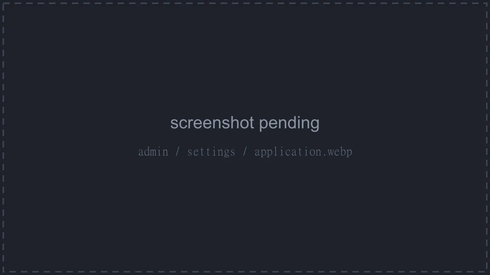

# Putting the Panel Behind a Reverse Proxy

This guide covers the Panel, including the Wings bundled with the All-in-One image. For a standalone node, see [Putting Wings Behind a Reverse Proxy](./wings.md). For how a proxy fits into the request path, see [Setting up a Reverse Proxy](./index.md).

::: info
These configurations target current releases of each proxy and of the Panel. After updating the Panel, compare your configuration with this page again; see [Keeping the Configuration Current](./index.md#keeping-the-configuration-current).
:::

## Prerequisites

- The Panel [installed with Docker](../../panel/installation/docker.md), reachable at `http://<server-ip>:8000`.
- A domain (`<domain>` below) with an `A` record, plus `AAAA` for IPv6 pointing at the server.
- Ports `80` and `443` open, and forwarded on your router if the server is at home.
- A [TLS certificate](../ssl-certificates.md) for the domain. Caddy, Traefik and Nginx Proxy Manager issue their own.
- The proxy installed on the same machine, or running in Docker (see [Proxies Running in Docker](#proxies-running-in-docker)).

::: warning
A broken proxy configuration makes the Panel unreachable until it's fixed, so keep a terminal open. Nothing in this guide touches the Panel's data.
:::

## Step 1: Prepare the Panel

All of the changes in this step happen in the `compose.yml` you created during installation.

### Stop Exposing Port 8000

The compose file publishes the Panel on every interface of the host:

```yaml
    ports:
      - 8000:8000
```

Once the proxy is in place, nobody but the proxy should be able to reach that port. Restrict it to the loopback interface:

```yaml
    ports:
      - 127.0.0.1:8000:8000
```

Leave any other port mappings alone. On the All-in-One image, `2022:2022` (SFTP) must stay reachable from outside.

::: tip Proxy in Docker?
If your proxy runs as a container (Traefik, Nginx Proxy Manager), it reaches the Panel over a Docker network instead of a published port. Follow [Proxies running in Docker](#proxies-running-in-docker) for this step rather than the loopback binding.
:::

### Trust the Proxy's Address

Connections that arrive at the Panel from the proxy come from the gateway of the Panel's Docker network. Run this inside the Panel's compose directory to print that address:

```bash
docker inspect -f '{{range .NetworkSettings.Networks}}{{println .Gateway}}{{end}}' $(docker compose ps -q web)
```

It prints something like `172.18.0.1` (one line per network the container is on; use the one that belongs to the compose network). Set [`APP_TRUSTED_PROXIES`](../../panel/environment.md#app-trusted-proxies) to that value on the `web` service:

```yaml
services:
  web:
    environment:
      # ...existing variables...
      - APP_TRUSTED_PROXIES=172.18.0.1
```

The variable takes a comma-separated list of IPs or CIDR ranges. Only list addresses you control. When a request arrives from a trusted address, the Panel believes three headers on it:

| Header | What the Panel does with it |
| --- | --- |
| `X-Forwarded-For` | Reads the visitor's IP, walking the list from the right and skipping every address that is itself trusted |
| `X-Real-IP` | Same, used as a fallback when `X-Forwarded-For` yields nothing usable |
| `X-Forwarded-Host` | Picks which of the configured Panel URLs to build links and cookies from, when you serve the Panel on more than one hostname ([Step 3](#step-3-set-the-panel-url)) |

When a request arrives from anywhere else, all three are ignored and the connecting address and the `Host` header are used instead. Trusting too much lets a visitor spoof their IP by sending the header themselves.

### Apply the Changes

```bash
docker compose up -d
```

The Panel is now only reachable from the machine itself. Confirm that with:

```bash
curl -s -o /dev/null -w '%{http_code}\n' http://127.0.0.1:8000
```

A `200` (or a redirect status) means the Panel answers on the loopback address and the proxy will be able to reach it.

## Step 2: Configure the Proxy

Every configuration below does the same things. If you use a proxy that isn't listed, these are the settings to replicate:

| Setting | Why the Panel needs it |
| --- | --- |
| Forward to `http://127.0.0.1:8000` | The address the Panel listens on after Step 1 |
| Pass `Upgrade` and `Connection` headers through | The server console, live statistics and file manager use WebSockets, which start as an HTTP upgrade |
| Request body limit of at least `100 MiB` | Server files over 95 MiB are uploaded as chunks of at most 95 MiB, and smaller ones are batched to the same size. Admin asset uploads are not chunked and the Panel puts no limit on them, so here the proxy is the only cap |
| Pass the visitor's hostname through, as `Host` or `X-Forwarded-Host` | Only matters when the Panel answers on more than one hostname, which is what **Additional URLs** is for. Every example preserves `Host`, which is enough for a single domain |
| Set `X-Forwarded-For` and `X-Real-IP` | Real client IPs for logs and rate limiting |
| Stream `/wings-proxy/` instead of buffering it | On the All-in-One image, and on a node in Wings Proxy Mode, browsers reach Wings through the Panel. See [All-in-One and Wings Proxy Mode](#all-in-one-and-wings-proxy-mode) |
| Stream `/api/remote/backups/` with no body limit | Every node makes its backup requests here. Most are small, but some carry a whole backup as one streamed request, in either direction, and the Panel limits neither |
| No CORS headers and no `Content-Security-Policy` | The Panel sends its own CSP, `X-Frame-Options` and `X-Content-Type-Options`, and sandboxes the file previews it serves. A copy from the proxy either overrides that or makes the browser reject the response |
| No `X-Robots-Tag` | Indexing is [**Allow Search Engine Indexing**](../../panel/features/admin/settings.md#metadata) under Admin → Settings → Metadata. The header overrides that setting instead of following it, because crawlers apply whichever of the header and the page's `<meta name="robots">` tag is stricter |

Pick the proxy you use:

::::tabs
=== Nginx

**1. Add the WebSocket map.** Open `/etc/nginx/nginx.conf` and add this block inside `http { ... }`, next to the other `include` lines. It must not be inside a `server { ... }` block.

<<< @/snippets/reverse-proxies/nginx-websocket-map.conf{nginx}

This sends `Connection: upgrade` only on requests that actually ask for a WebSocket. Without it Nginx sends the header on every request, and multipart uploads and other ordinary traffic break.

**2. Create the site.** Save the configuration as `/etc/nginx/sites-available/calagopus.conf` on Debian and Ubuntu, or `/etc/nginx/conf.d/calagopus.conf` on RHEL-based systems.

::: code-group
<<< @/snippets/reverse-proxies/panel/nginx-ssl.conf{nginx} [With SSL]
<<< @/snippets/reverse-proxies/panel/nginx.conf{nginx} [Without SSL]
:::

The `upstream` block names the Panel once, and `keepalive 16` lets each Nginx worker keep up to 16 idle connections to it open for reuse instead of opening a new one for every request. Settings shared by every path sit at the server level; each `location` lists only what differs.

::: details Why is there a "Without SSL" variant at all?
Only for testing on a network you trust, or when TLS is terminated somewhere in front of Nginx (a load balancer or Cloudflare with "Flexible" mode). Passkeys, secure cookies and the browser's clipboard access all need HTTPS, so do not run a real installation this way.
:::

**3. Enable it and reload.** On Debian and Ubuntu, link the site into `sites-enabled`. On RHEL-based systems the file in `conf.d/` is already active.

```bash
sudo ln -s /etc/nginx/sites-available/calagopus.conf /etc/nginx/sites-enabled/calagopus.conf
sudo nginx -t
sudo systemctl reload nginx
```

`nginx -t` checks the configuration before anything is reloaded. If it reports an error, fix the file first; the running Nginx keeps its old configuration until the reload succeeds.

::: details Nginx older than 1.25.1
The standalone `http2 on;` directive was added in 1.25.1. On older releases, drop that line and put the parameter back on the listen directives instead:

<<< @/snippets/reverse-proxies/nginx-http2-legacy.conf{nginx}
:::

=== Apache

**1. Enable the modules and disable the default site.** The default site catches every request that doesn't match another `ServerName`, which gets in the way while testing.

```bash
sudo a2enmod rewrite headers proxy proxy_http proxy_wstunnel ssl http2
sudo a2dissite 000-default.conf
```

On RHEL-based systems the modules are compiled in or loaded already; you can skip this step.

**2. Create the site.** Save the configuration as `/etc/apache2/sites-available/calagopus.conf` on Debian and Ubuntu, or `/etc/httpd/conf.d/calagopus.conf` on RHEL-based systems.

::: code-group
<<< @/snippets/reverse-proxies/panel/apache-ssl.conf{apache} [With SSL]
<<< @/snippets/reverse-proxies/panel/apache.conf{apache} [Without SSL]
:::

::: details Apache older than 2.4.47
Check with `apache2 -v` (or `httpd -v`). Older releases don't understand the `upgrade=websocket` parameter and reject the configuration. Remove `upgrade=websocket` from the `ProxyPass` line and add these lines above it to route WebSocket requests through `mod_proxy_wstunnel` instead:

<<< @/snippets/reverse-proxies/panel/apache-websocket-legacy.conf{apache}
:::

**3. Enable it and reload.**

```bash
sudo a2ensite calagopus.conf
sudo apachectl configtest
sudo systemctl reload apache2
```

On RHEL-based systems the file in `conf.d/` is already active; run `apachectl configtest` and `systemctl reload httpd`.

=== Caddy

Caddy obtains and renews the certificate on its own, passes WebSockets through, never buffers a whole body unless you ask it to, and sets `X-Forwarded-For`, `X-Forwarded-Proto` and `X-Forwarded-Host`. It does not set `X-Real-IP`, which the Panel does not need when `X-Forwarded-For` is there. Make sure ports `80` and `443` are reachable from the internet before starting it, because that is how Caddy proves it owns the domain.

Replace the contents of `/etc/caddy/Caddyfile` (or add this block to it if Caddy already serves other sites):

<<< @/snippets/reverse-proxies/panel/Caddyfile{text}

The `@limited` matcher keeps the body limit off `/api/remote/backups/`, where Wings sends its backup requests. Leave out `encode`, `request_buffers` and `response_buffers`. The Panel's assets are already compressed, and compressing downloads again breaks the range requests a resumed download needs.

Then validate and reload:

```bash
sudo caddy validate --config /etc/caddy/Caddyfile
sudo systemctl reload caddy
```

The first reload takes a few seconds longer while Caddy requests the certificate. `journalctl -u caddy -f` shows the progress if the site does not come up right away.

=== Traefik

This assumes Traefik already runs in Docker with the Docker provider enabled, a `websecure` entrypoint on port 443, and a certificate resolver named `letsencrypt`. Adjust those three names to match your Traefik setup. Traefik connects to the Panel over a shared Docker network, so complete [Proxies running in Docker](#proxies-running-in-docker) first; the network below is called `proxy`.

Add the labels and network to the `web` service in the Panel's `compose.yml`, and remove the `8000:8000` port mapping:

<<< @/snippets/reverse-proxies/panel/traefik-compose.yml{yaml}

Traefik forwards WebSockets, sets `X-Forwarded-For` and `X-Forwarded-Proto`, and neither buffers nor limits request bodies, so the router itself needs nothing more. One entrypoint default gets in the way: `respondingTimeouts.readTimeout` is `60s` and covers reading the whole request body, so a slow client uploading a chunk is cut off. Raise it in the static configuration:

<<< @/snippets/reverse-proxies/panel/traefik-entrypoint.yml{yaml}

A backup restore can arrive as a single request too. If yours can take longer than an hour, set `readTimeout` to `0`, which disables it.

Apply the compose change with `docker compose up -d`; Traefik picks the container up within a few seconds. A static configuration change needs Traefik itself restarted.

=== Nginx Proxy Manager

Nginx Proxy Manager runs as a container, so it reaches the Panel over a shared Docker network rather than `127.0.0.1`. Complete [Proxies running in Docker](#proxies-running-in-docker) first, then add a proxy host in the web UI:

1. Open **Hosts → Proxy Hosts → Add Proxy Host**.
2. On the **Details** tab set **Domain Names** to your domain, **Scheme** to `http`, **Forward Hostname / IP** to `web` (the Panel's service name on the shared network) and **Forward Port** to `8000`. Turn on **Websockets Support**.
3. On the **SSL** tab pick **Request a new SSL Certificate**, and enable **Force SSL** and **HTTP/2 Support**.
4. On the **Advanced** tab put this into **Custom Nginx Configuration**:

<<< @/snippets/reverse-proxies/panel/npm-custom.conf{nginx}

5. Save.

Nginx Proxy Manager sets `X-Forwarded-For`, `X-Real-IP` and `X-Forwarded-Proto` on its own. The first block lifts its 2000 MB body limit for the backup requests Wings sends; the second is only reached on the All-in-One image or with Wings Proxy Mode. Both raise its `90s` timeouts and turn off its response buffering. For a lower limit everywhere else, add `client_max_body_size 128M;` there as well.

Use `$http_connection`, not the `$connection_upgrade` map from the Nginx tab: Nginx Proxy Manager never defines that map. The `include` lines reuse the forward host, port and headers from the **Details** tab.

::::

## Step 3: Set the Panel URL

The Panel builds links from a URL you configure, not from the address a visitor happened to use. Go to **Admin → Settings → Application**, set **URL** to `https://<domain>`, and save. Email links, OAuth callbacks, node connections and the generated Wings configuration all use this value, so it has to match the address the proxy serves.



The scheme matters twice, and neither case follows `X-Forwarded-Proto`. A URL on `https://` is what puts the `Secure` flag on the session cookie, and a URL left on `http://` makes the frontend build `ws://` console addresses, which a page served over HTTPS refuses to open.

Serving the Panel on more than one hostname? Add the others under **Additional URLs** on the same tab, and it picks the matching one per request from `Host` or `X-Forwarded-Host`. An unconfigured hostname falls back to the primary URL.

## Step 4: Verify

1. Open `https://<domain>` in a browser. You should see the Panel's login page with a valid padlock. If the page doesn't load, check the [troubleshooting section](#troubleshooting).
2. Log in, then open **Account → Activity**. The login entry's IP column must show your own public IP. If it shows the proxy's address (something like `172.18.0.1`), `APP_TRUSTED_PROXIES` is wrong; go back to [Step 1](#trust-the-proxy-s-address).
3. Open a server and check that the console connects and shows live output.
4. Upload a file through the file manager, and download a backup.
5. Confirm the old address no longer works from another machine: `http://<server-ip>:8000` should time out or be refused.

Items 3 and 4 only reach this proxy on the All-in-One image or a node in Wings Proxy Mode. Elsewhere they go over the node's own address, covered by the [Wings guide](./wings.md).

## All-in-One and Wings Proxy Mode

Browsers normally reach Wings directly for the console, uploads and downloads. Two setups route that traffic through the Panel instead, under `/wings-proxy/<node-uuid>/`: the [All-in-One image](../../panel/installation/docker.md#option-a-all-in-one-recommended-for-single-node-setups), which does it for its bundled Wings automatically and never publishes port `8080`, and any node with [Wings Proxy Mode](../../wings/advanced/exposing-wings-in-a-homelab.md) turned on.

That path carries a WebSocket, uploads in chunks of up to 95 MiB, and downloads of any size, so it needs the `Upgrade` and `Connection` headers, buffering off in both directions, no compression, and timeouts above the usual 60 second defaults. The All-in-One image also raises the bundled Wings' `api.upload_limit` to 10 GiB, leaving the proxy as the only cap on an upload.

[Step 2](#step-2-configure-the-proxy) covers it: Nginx, Apache and Nginx Proxy Manager get a dedicated block for the path, Caddy and Traefik stream by default.

## Proxies Running in Docker

Traefik, Nginx Proxy Manager and similar tools run as containers themselves. Two things change compared to a proxy installed on the host:

**The proxy reaches the Panel over a Docker network, not a published port.** Create a network the proxy container is already attached to (or attach it to one), add the Panel's `web` service to that same network, and remove the `8000:8000` port mapping entirely. The proxy then forwards to `web:8000`, using the service name as the hostname.

```bash
docker network create proxy
docker network connect proxy <proxy-container-name>
```

```yaml
services:
  web:
    # ...existing configuration, with the 8000:8000 ports entry removed...
    networks:
      - default
      - proxy

networks:
  proxy:
    external: true
```

The `default` entry keeps the Panel connected to its database and cache. On the All-in-One image, keep the `2022:2022` SFTP port mapping.

**The trusted proxy address is the proxy container's, not the gateway's.** Trust the whole shared network so the value survives container restarts:

```bash
docker network inspect proxy -f '{{range .IPAM.Config}}{{.Subnet}}{{end}}'
```

```yaml
services:
  web:
    environment:
      - APP_TRUSTED_PROXIES=172.19.0.0/16
```

Only containers on that network can reach the Panel, so trusting the subnet is safe as long as you control everything attached to it.

## Cloudflare

If your domain is proxied through Cloudflare (orange cloud), the proxy chain becomes `Browser → Cloudflare → your proxy → Panel`. Three adjustments:

- **Trust Cloudflare's addresses too.** Cloudflare puts the visitor's IP in `X-Forwarded-For`, and your proxy appends Cloudflare's edge address behind it. The Panel walks that list from the right and skips every trusted address, so it only reports the real visitor if Cloudflare's ranges are trusted as well. Build the list with:

  ```bash
  echo "172.18.0.1,$( (curl -s https://www.cloudflare.com/ips-v4; echo; curl -s https://www.cloudflare.com/ips-v6) | grep . | paste -sd,)"
  ```

  Replace `172.18.0.1` with your own gateway address from Step 1 and put the whole output in `APP_TRUSTED_PROXIES`. Cloudflare updates its ranges rarely; the list is published at [cloudflare.com/ips](https://www.cloudflare.com/ips/).

  This works as written with Nginx and Nginx Proxy Manager, which append to the `X-Forwarded-For` header Cloudflare sends. Caddy and Traefik replace that header unless Cloudflare's ranges are also trusted in the proxy itself: Caddy through `trusted_proxies` inside the `reverse_proxy` block, Traefik through `forwardedHeaders.trustedIPs` on the entrypoint.
- **Set the SSL/TLS mode to Full (strict)** in the Cloudflare dashboard, so Cloudflare verifies your certificate instead of connecting over plain HTTP.
- **Keep non-HTTP hostnames DNS-only (grey cloud).** Cloudflare's proxy only carries HTTP and WebSocket traffic. SFTP (port `2022`), game server ports and the [private network](../../wings/advanced/private-network.md) tunnel do not pass through it. Give Wings nodes a hostname that resolves directly to the machine, or turn the proxy off for those records. The same applies to a standalone node's own hostname; see [Docker and Cloudflare](./wings.md#docker-and-cloudflare) on the Wings guide.

Cloudflare also caps the size of a single request per plan (100 MB on Free), and that cap applies before your own body size limit. Server file uploads through the file manager are sent in chunks of at most 95 MiB, so they pass through Cloudflare on any plan. Admin asset uploads are not chunked and stay subject to the cap, and so do the backup requests Wings sends to `/api/remote/backups/`, since Wings reaches the Panel through Cloudflare as well.

## Troubleshooting

| Symptom | Fix |
| --- | --- |
| 502 Bad Gateway, or the proxy's own error page | The proxy can't reach the Panel. Check that the container is running with `docker compose ps`, and that `curl -I http://127.0.0.1:8000` answers on the host. If the proxy runs in Docker, make sure both containers are on the same network and the forward target is the service name, not `127.0.0.1`. |
| The page loads, but the console stays on "connecting" and statistics never appear | The console WebSocket goes to the node's **Public URL**. If that's the node itself, see the [Wings guide](./wings.md#troubleshooting). If it's the Panel (All-in-One or Wings Proxy Mode), WebSocket upgrades aren't getting through: on Nginx, confirm the `map` block exists in `nginx.conf` and the `Upgrade` and `Connection` headers are set; on Apache, check the version note above; on Nginx Proxy Manager, enable **Websockets Support**. |
| Database instance consoles, or the admin node statistics and log views, stay empty | Those WebSockets are the Panel's own, under `/api`, and go through `location /`. The `Upgrade` and `Connection` headers have to apply there too, which the examples do by setting them at the server level. |
| Uploads fail with `413 Request Entity Too Large` | Raise the body limit (`client_max_body_size`, `LimitRequestBody`, `max_size`) to at least `100 MiB`. On Caddy, check you wrote `128MiB` and not `100MB`. |
| Large uploads or backup downloads through the Panel die partway through, always after about the same time | A timeout on `/wings-proxy/`. Raise `proxy_read_timeout`, `proxy_send_timeout` and `send_timeout` on Nginx, `ProxyTimeout` on Apache, or `respondingTimeouts.readTimeout` on the Traefik entrypoint. |
| Backup downloads through the Panel fill the proxy's disk with temporary files | Response buffering is on for `/wings-proxy/`. Set `proxy_buffering off` there on Nginx or Nginx Proxy Manager. Caddy and Traefik stream by default. |
| A backup or restore fails with `413`, or stops partway | Wings sends backup requests through `/api/remote/backups/`, which needs no body limit, buffering off and long timeouts. Add the dedicated block from [Step 2](#step-2-configure-the-proxy). |
| Activity shows `172.x.x.x` or `127.0.0.1` for every user, or rate limits trigger for everyone at once | `APP_TRUSTED_PROXIES` doesn't contain the address the proxy connects from. Re-run the `docker inspect` command from Step 1; the gateway can change if the compose network was recreated. |
| Links in emails or OAuth callbacks point at `http://` or the wrong host | The Panel builds links from the URL in **Admin → Settings → Application**, not from the request. Make sure it starts with `https://` and matches the domain the proxy serves. If you serve several hostnames, the extra ones have to be listed under **Additional URLs**, or every request falls back to the primary URL. |
| The session cookie has no `Secure` flag even though the site is on HTTPS | The Panel takes the scheme from the configured URL, not from `X-Forwarded-Proto`. Set **URL** to `https://<domain>` in [Step 3](#step-3-set-the-panel-url). |
| The Panel is still reachable at `http://<server-ip>:8000` | The port mapping wasn't restricted to `127.0.0.1`, or the change wasn't applied. Edit `compose.yml` and run `docker compose up -d` again. |
| Browser shows a certificate warning | The certificate has expired or was issued for a different name. See [Generating SSL Certificates](../ssl-certificates.md#troubleshooting) for renewal problems. |

Problems that aren't caused by the proxy, such as the node URL, tokens or clock skew, are collected on the [Troubleshooting](../troubleshooting.md) page.
