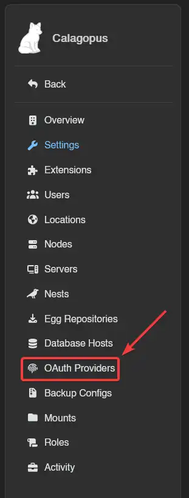
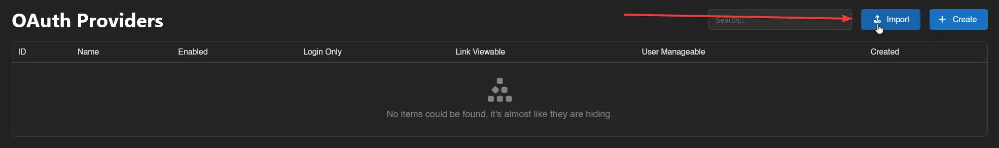
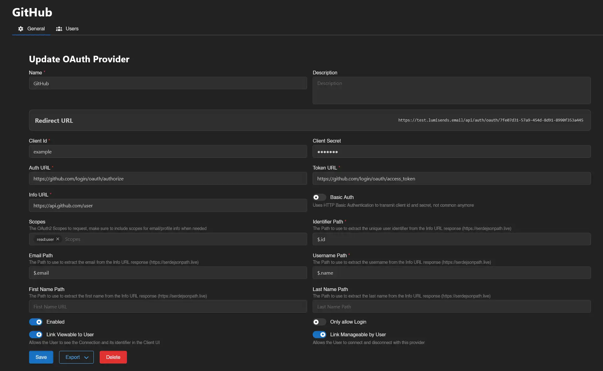
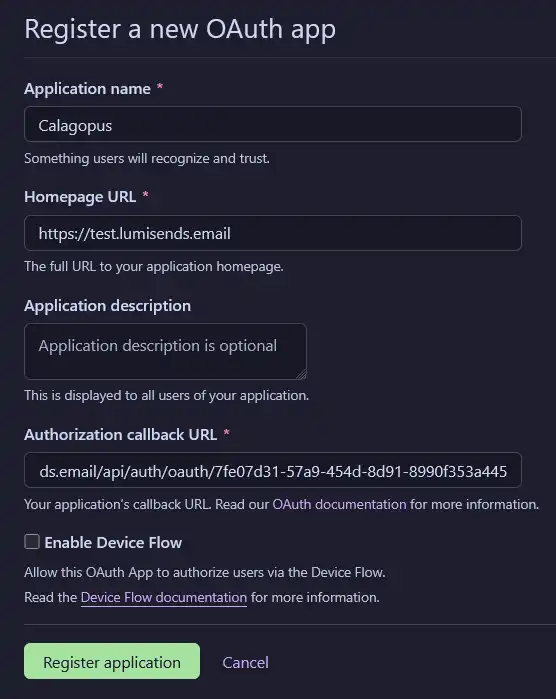
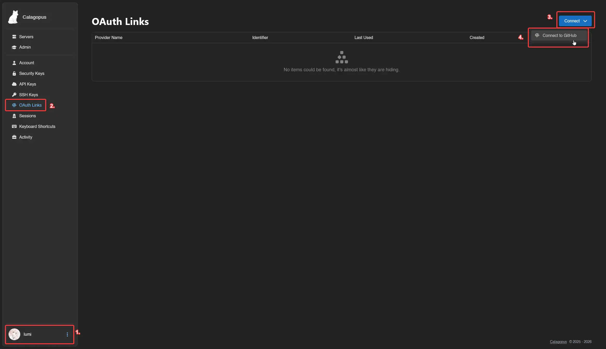
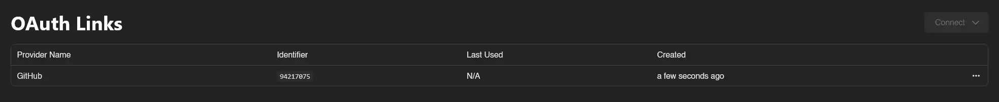

# GitHub OAuth Setup
This guide walks through setting up GitHub OAuth for your Calagopus Panel.

### Prerequisites
To set up GitHub OAuth, you need:

* [A GitHub account](https://github.com)
* A running Calagopus Panel

### Downloading required files
Download the `github.yml` template to import the GitHub provider configuration without entering values manually.

Right-click the link below and save the file locally.

<a href="/oauth2/github.yml" download>Download <code>github.yml</code> ➚</a>

### Import the template config
Once `github.yml` has been downloaded, head to your Calagopus Panel's admin page, and click on `OAuth Providers` on the side.

Then, click on the Import button and import the `github.yml` file.

Once imported, click on the newly created GitHub provider's ID and you should arrive to a page similar to this:

Copy the Redirect URL provided by the panel and proceed to the next step.

### Create your application
Open [this page](https://github.com/settings/applications/new) or navigate to your GitHub account/organisation settings → `Developer Settings` → `OAuth Apps` → `New OAuth App`.

Once on the page, fill out these values:

* `Application name`: Can be anything you want, will be shown on the login page.
* `Homepage URL`: Your Calagopus Panel URL (not used by Calagopus).
* `Application description`: Optional.
* `Authorization callback URL`: Paste your redirect URL generated by the panel at the previous step.
* `Enable Device Flow`: Do not tick this checkbox as it will not work with Calagopus.

With the required fields filled out, it should look something similar to this:

Once done, you can click on the `Register Application` button, add a logo if you want, and proceed to the next step.

### Generate a client secret
Click `Generate a new client secret`, confirm your identity, then copy both your Client ID and Client Secret - you will need them in the next step.

### Configuring the OAuth Provider
Back in the panel, enter the Client ID and Client Secret you copied from GitHub.

On the switches below, choose if you want to enable GitHub OAuth, only allow login, allow the user to view the connection and allow the user to link and unlink their accounts.

It should normally look like this:

Finally, save your changes, and you should be done!

### Test the configuration
To test your configuration, head into your account settings, click on `OAuth Links` at the sidebar, and connect to your GitHub account.

If everything works correctly, you should now be able to see your GitHub account in your list.

### Troubleshooting

#### Error: "Redirect URI Mismatch" or "Invalid Redirect URI"
The authorization callback URL in GitHub doesn't match the one provided by Calagopus Panel.

**Solution:**

1. Go back to your Calagopus Panel OAuth provider configuration page
2. Copy the exact Redirect URL shown
3. Go to your GitHub OAuth App settings (Account Settings → Developer Settings → OAuth Apps)
4. Click on your application
5. Update the "Authorization callback URL" field to match exactly (including `https://`, trailing slashes, etc.)
6. Click `Update application`

#### Error: "Invalid Client Credentials" or "Bad Credentials"
The Client ID or Client Secret is incorrect or expired.

**Solution:**

1. Go to your GitHub OAuth App settings
2. Copy your Client ID
3. Click `Generate a new client secret`
4. Copy the new Client Secret immediately (it won't be shown again)
5. Update both values in your Calagopus Panel OAuth provider configuration
6. Save the changes

#### OAuth connection doesn't work with "device_flow" error
Device Flow is enabled on your GitHub OAuth App.

**Solution:**

1. Go to your GitHub OAuth App settings
2. Ensure the `Enable Device Flow` checkbox is **unchecked**
3. Click `Update application`
4. Try the OAuth connection again
