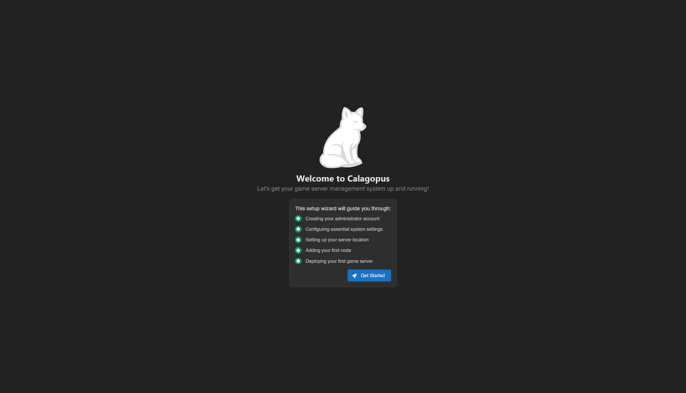

# Migrating from Pterodactyl
This guide will show you how to migrate from your old Pterodactyl Panel, to your new Calagopus Panel.

## What will be migrated?
Basically everything **EXCEPT** API Keys generated by Pterodactyl, due to Calagopus using a different format than Pterodactyl, both not reversible.

## Prerequisites
To migrate from Pterodactyl, you must have:
* Your Dockerized Pterodactyl's .env file ready. This guide assumes you have [Pterodactyl's Docker Compose file](https://github.com/pterodactyl/panel/blob/1.0-develop/docker-compose.example.yml), but you can also use [Blueprint's Docker Compose file](https://github.com/BlueprintFramework/docker/blob/Master/docker-compose.yml).
* Calagopus Panel installed, but not fully configured (stop at the OOBE)

## Installation
If you haven't already so, install Calagopus Panel first using [this guide](../../panel/installation.md). Once you have installed Calagopus Panel, and arrived to the OOBE, continue following this guide.

::: warning DO NOT PROGRESS THROUGH THE OOBE!
This guide requires a fresh database because we need to replace it with our old data. If you finished the OOBE, you will need to delete the database. Once you arrived to the following image below, close the tab and continue following this tab.


::: details How to delete the database?
::::tabs
=== Docker
Head to the directory where the compose file is, then stop Calagopus:
```bash
docker compose down
```
Then, nuke the database:
```bash
# We're nuking the database because we need to replace it with our old data
rm -r postgres
```
Finally, start Calagopus again:
```bash
docker compose up
```
=== APT/RPM, Binary
Shut down Calagopus first:
```bash
# Linux
systemctl stop calagopus-panel

# MacOS
# soon

# Windows
nssm stop "Calagopus Panel"
```

Then, login to the Postgres database:
```bash
# If on Linux or MacOS
sudo -u postgres psql

# If on Windows, follow the steps in https://calagopus.com/docs/panel/installation/binary#database-configuration
```
Then, nuke the database and remake it:
```sql
DROP DATABASE panel (FORCE);
CREATE DATABASE panel OWNER calagopus;
GRANT ALL PRIVILEGES ON DATABASE panel TO calagopus;
quit
```
Finally, start Calagopus back:
```bash
# Linux
systemctl start calagopus-panel

# MacOS
# soon

# Windows
nssm start "Calagopus Panel"
```
:::

First, define your Pterodactyl directory using the PTERODACTYL_DIRECTORY variable. This is not needed for this guide, but useful for this guide. If your Pterodactyl's host mount isn't located at `/srv/pterodactyl`, change the path of the command below.
```bash
# Use this command to set a $PTERODACTYL_DIRECTORY variable
# for use later in this guide.
export PTERODACTYL_DIRECTORY=/srv/pterodactyl
```

Depending of how you installed Calagopus, instructions have been seperated into 2 seperate tabs to adapt to your installation. Please select the installation method you used to install Calagopus.
::::tabs
=== Docker
Dockerized Pterodactyl is weird. https://discord.com/channels/@me/1276895349952352358/1481730295798693908 for more info
=== idk
docker
::::