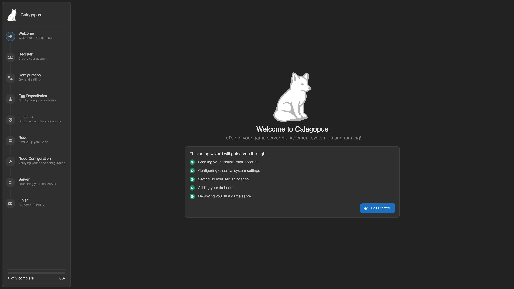

# Migrating from Pterodactyl (Dockerized)

This guide is for Pterodactyl installs running in Docker - if you have a `docker-compose.yml` with a Pterodactyl service, you are in the right place. If you are running Pterodactyl directly on the host without containers, use the [Standalone](./pterodactyl-standalone.md) guide instead.

This guide assumes Pterodactyl's standard [Docker compose setup](https://github.com/pterodactyl/panel/blob/1.0-develop/docker-compose.example.yml), but it also works for Blueprint's [Docker compose variant](https://github.com/BlueprintFramework/docker/blob/Master/docker-compose.yml). Variable names and locations are mostly the same.

The general shape of the import is the same regardless of how Pterodactyl is running: you point the Calagopus importer at a `.env` file containing Pterodactyl's database connection details, and it reads everything across. The Docker-specific wrinkle is that you'll usually need to construct that `.env` file yourself, since database hostnames inside Docker networks don't match what's in Pterodactyl's original `.env`.

API keys do not migrate. See the [intro](./pterodactyl.md) for the full reasoning - in short, the hashes are not compatible and the API is not either, so old keys would not work even if they were imported.

## Prerequisites

Before you start, you'll want:

- Access to your Dockerized Pterodactyl install (the directory containing the compose file and `.env`)
- Calagopus Panel installed but not yet configured - we need to land on the Out-of-Box Experience (OOBE) screen and stop there

## Install Calagopus First

If you haven't installed Calagopus yet, follow the [installation guide](../../panel/installation.md). Once you reach the OOBE screen, **stop**. Don't click through it. Don't create the admin user. Just leave it on that screen and come back here.

::: warning Don't click through the OOBE
The importer needs an empty Calagopus database to write into. The OOBE creates initial records (admin user, default settings) that would conflict with what the importer wants to do.



::: details I already clicked through - how do I undo it?
You'll need to drop and recreate the database. Pick the matching tab for how Calagopus is installed:

::::tabs
=== Docker
Head to the directory with your Calagopus compose file and stop the stack:

```bash
docker compose down
```

Delete the Postgres data directory:

```bash
# This wipes the Calagopus database. Don't run this if you have data you care about.
rm -r postgres
```

Start Calagopus back up:

```bash
docker compose up -d
```

=== APT/RPM, Binary
Stop Calagopus first:

```bash
# Linux
systemctl stop calagopus-panel

# Windows
nssm stop "Calagopus Panel"
```

Connect to Postgres and recreate the database:

```bash
# Linux/MacOS
sudo -u postgres psql

# Windows: see the binary install guide for psql access
# https://calagopus.com/docs/panel/installation/binary#database-configuration
```

```sql
DROP DATABASE panel WITH (FORCE);
CREATE DATABASE panel OWNER calagopus;
GRANT ALL PRIVILEGES ON DATABASE panel TO calagopus;
\q
```

Start Calagopus back up:

```bash
# Linux
systemctl start calagopus-panel

# Windows
nssm start "Calagopus Panel"
```

::::

## Set the Pterodactyl Directory

Most of the commands below reference your Pterodactyl install directory. To save typing, set it as a shell variable up front. If your Pterodactyl host mount is at `/srv/pterodactyl`, this is fine as-is; otherwise change the path:

```bash
export PTERODACTYL_DIRECTORY=/srv/pterodactyl
```

This isn't required - you can substitute the path inline anywhere you see `$PTERODACTYL_DIRECTORY` - but it makes the commands shorter.

## Choose Your Calagopus Install Method

The exact commands depend on how Calagopus itself is installed. Pick the matching tab and follow along:

::::tabs
=== Docker

### Building the Pterodactyl `.env` File

Pterodactyl's database is reachable from within the Pterodactyl containers, but likely not from your Calagopus containers - different Docker networks use different hostnames. The solution is to build a small `ptero.env` file with database connection details that work from where the importer will run.

The importer needs all seven of these variables: `APP_URL`, `APP_KEY`, `DB_HOST`, `DB_PORT`, `DB_DATABASE`, `DB_USERNAME`, and `DB_PASSWORD`. You'll find them across Pterodactyl's `docker-compose.yml` and `.env` file. A finished `ptero.env` looks something like:

```sh
APP_URL=https://panel.example.com
APP_KEY=xc5QXq4u3Qgi3zRP0Q9qq32mnZvl0lVY
DB_HOST=172.20.0.4
DB_PORT=3306
DB_DATABASE=panel
DB_USERNAME=pterodactyl
DB_PASSWORD=mZCcs8KInMWexDRe704T6C8swXmbP8W2M+kCpbnQuv4=
```

Assemble the values one at a time using the steps below.

#### `APP_URL`

This is your existing Pterodactyl domain, from Pterodactyl's `docker-compose.yml` or `.env`. Looks like:

```sh
APP_URL=https://panel.example.com
```

#### `APP_KEY`

From Pterodactyl's `.env`:

```bash
cat $PTERODACTYL_DIRECTORY/var/.env | grep APP_KEY
```

Looks like:

```sh
APP_KEY=xc5QXq4u3Qgi3zRP0Q9qq32mnZvl0lVY
```

#### `DB_HOST`

Pterodactyl's `.env` probably has `DB_HOST=database` (a Docker service name), which won't resolve from outside Pterodactyl's compose stack. Get the actual container IP instead, running from inside Pterodactyl's directory:

```bash
# Linux/MacOS
echo "DB_HOST=$(docker inspect -f '{{range .NetworkSettings.Networks}}{{.IPAddress}}{{end}}' $(docker compose ps -q database))"

# Windows
echo "DB_HOST=$($(docker compose ps -q database) | foreach { docker inspect -f '{{range .NetworkSettings.Networks}}{{.IPAddress}}{{end}}' $_ })"
```

Looks like:

```sh
DB_HOST=172.29.0.4
```

#### `DB_PORT`, `DB_DATABASE`, `DB_USERNAME`

If you haven't modified the default Pterodactyl compose file, these are all defaults:

```sh
DB_PORT=3306
DB_DATABASE=panel
DB_USERNAME=pterodactyl
```

If you've customized them, check Pterodactyl's `.env` for the actual values.

#### `DB_PASSWORD`

In Pterodactyl's `docker-compose.yml` or `.env`, look for `MARIADB_USER_PASS`. Copy its value and use that as `DB_PASSWORD`:

```sh
# In Pterodactyl's compose file:
MARIADB_USER_PASS=mZCcs8KInMWexDRe704T6C8swXmbP8W2M+kCpbnQuv4=

# Becomes in your ptero.env:
DB_PASSWORD=mZCcs8KInMWexDRe704T6C8swXmbP8W2M+kCpbnQuv4=
```

#### Assembling the File

Head to the Calagopus directory (where your `compose.yml` lives) and create a file called `ptero.env` with all seven variables.

### Running the Import

Copy the `ptero.env` you just made into the Calagopus container:

```bash
docker compose cp ptero.env web:/.env
```

Now run the importer:

```bash
docker compose exec web calagopus-panel import pterodactyl --environment /.env
```

This walks through users, servers, nodes, allocations, eggs, and so on. Larger Pterodactyl installs take longer; small ones finish in seconds. Progress is logged to stdout.

::: warning If the import errors out
Treat the database as poisoned. Partial imports leave Calagopus in an inconsistent state. Drop the Postgres data (the steps in the OOBE warning callout above), let Calagopus recreate it empty, and re-run the import.
:::

When the import finishes, restart the stack:

```bash
docker compose down
docker compose up -d
```

Log in with your existing Pterodactyl credentials.

=== APT/RPM, Binary

### Building the Pterodactyl `.env` File

For binary or APT/RPM installs of Calagopus, the importer runs directly on the host. If Pterodactyl's database is bound to a host port (e.g. `127.0.0.1:3306`), you can sometimes get away with pointing the importer at Pterodactyl's existing `.env` file directly. But more often, the database is only reachable from inside Pterodactyl's Docker network, in which case you'll need a separate `ptero.env` with the right hostname.

The importer needs all seven of these variables: `APP_URL`, `APP_KEY`, `DB_HOST`, `DB_PORT`, `DB_DATABASE`, `DB_USERNAME`, and `DB_PASSWORD`. You'll find them across Pterodactyl's `docker-compose.yml` and `.env` file. A finished `ptero.env` looks something like:

```sh
APP_URL=https://panel.example.com
APP_KEY=xc5QXq4u3Qgi3zRP0Q9qq32mnZvl0lVY
DB_HOST=172.20.0.4
DB_PORT=3306
DB_DATABASE=panel
DB_USERNAME=pterodactyl
DB_PASSWORD=mZCcs8KInMWexDRe704T6C8swXmbP8W2M+kCpbnQuv4=
```

Open a scratch text editor and assemble the values one at a time using the steps below.

#### `APP_URL`

This is your existing Pterodactyl domain, from Pterodactyl's `docker-compose.yml` or `.env`:

```sh
APP_URL=https://panel.example.com
```

#### `APP_KEY`

From Pterodactyl's `.env`:

```bash
cat $PTERODACTYL_DIRECTORY/var/.env | grep APP_KEY
```

Looks like:

```sh
APP_KEY=xc5QXq4u3Qgi3zRP0Q9qq32mnZvl0lVY
```

#### `DB_HOST`

If Pterodactyl's database is exposed to the host on a known port, use `127.0.0.1`. Otherwise, get the container IP from inside Pterodactyl's compose stack:

```bash
# Linux/MacOS
echo "DB_HOST=$(docker inspect -f '{{range .NetworkSettings.Networks}}{{.IPAddress}}{{end}}' $(docker compose ps -q database))"

# Windows
echo "DB_HOST=$($(docker compose ps -q database) | foreach { docker inspect -f '{{range .NetworkSettings.Networks}}{{.IPAddress}}{{end}}' $_ })"
```

Looks like:

```sh
DB_HOST=172.29.0.4
```

#### `DB_PORT`, `DB_DATABASE`, `DB_USERNAME`

If you haven't modified the default Pterodactyl compose file, these are all defaults:

```sh
DB_PORT=3306
DB_DATABASE=panel
DB_USERNAME=pterodactyl
```

If you've customized them, check Pterodactyl's `.env` for the actual values.

#### `DB_PASSWORD`

In Pterodactyl's `docker-compose.yml` or `.env`, look for `MARIADB_USER_PASS`. Copy its value and use that as `DB_PASSWORD`:

```sh
# In Pterodactyl's compose file:
MARIADB_USER_PASS=mZCcs8KInMWexDRe704T6C8swXmbP8W2M+kCpbnQuv4=

# Becomes in your ptero.env:
DB_PASSWORD=mZCcs8KInMWexDRe704T6C8swXmbP8W2M+kCpbnQuv4=
```

#### Assembling the File

Head to wherever your Calagopus `.env` lives (`/etc/calagopus` by default on Linux) and create a `ptero.env` next to it with all seven variables.

### Running the Import

From the directory containing `ptero.env`:

```bash
calagopus-panel import pterodactyl --environment ptero.env
```

This walks through users, servers, nodes, allocations, eggs, and so on. Larger Pterodactyl installs take longer; small ones finish in seconds. Progress is logged to stdout.

::: warning If the import errors out
Treat the database as poisoned. Partial imports leave Calagopus in an inconsistent state. Drop the Postgres database (the steps in the OOBE warning callout above), recreate it, and re-run.
:::

When the import finishes, restart Calagopus:

```bash
# Linux
systemctl restart calagopus-panel

# Windows
nssm restart "Calagopus Panel"
```

Log in with your existing Pterodactyl credentials.
::::

## What's Next

Wings also needs to be updated to point at the new panel. See [Wings - Updating](../../wings/updating.md) for that step.

After the migration, regenerate any API keys used by external scripts. The old Pterodactyl keys will not work, and the Calagopus API differs from Pterodactyl's, so those integrations will need to be updated regardless.
