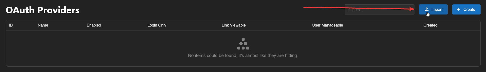
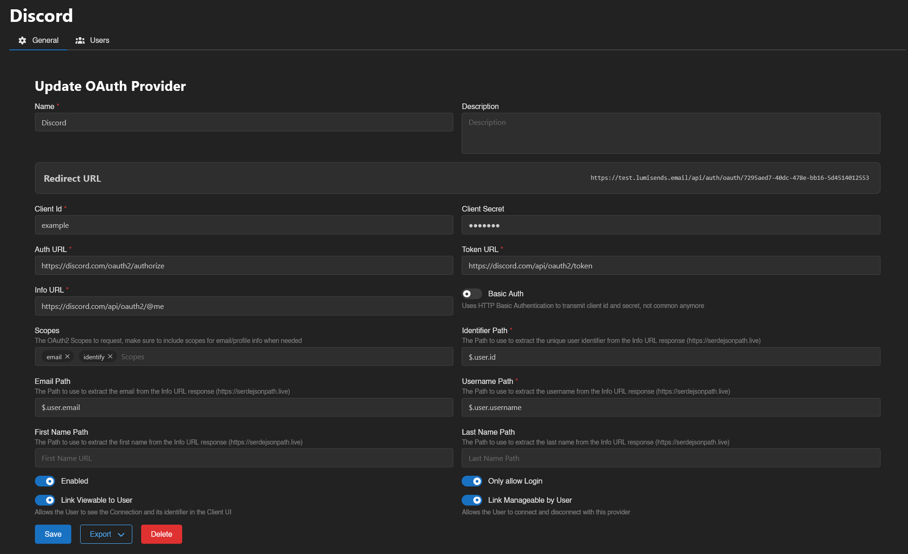
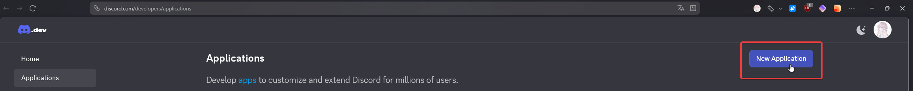
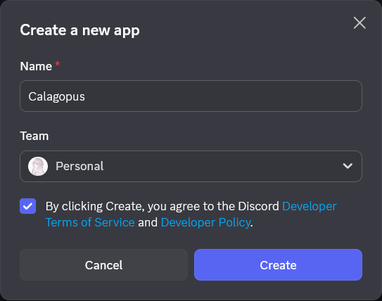
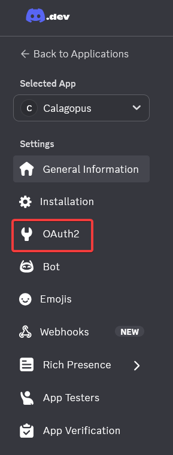
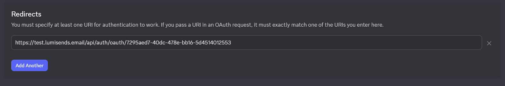
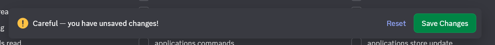
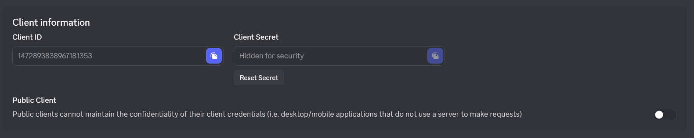
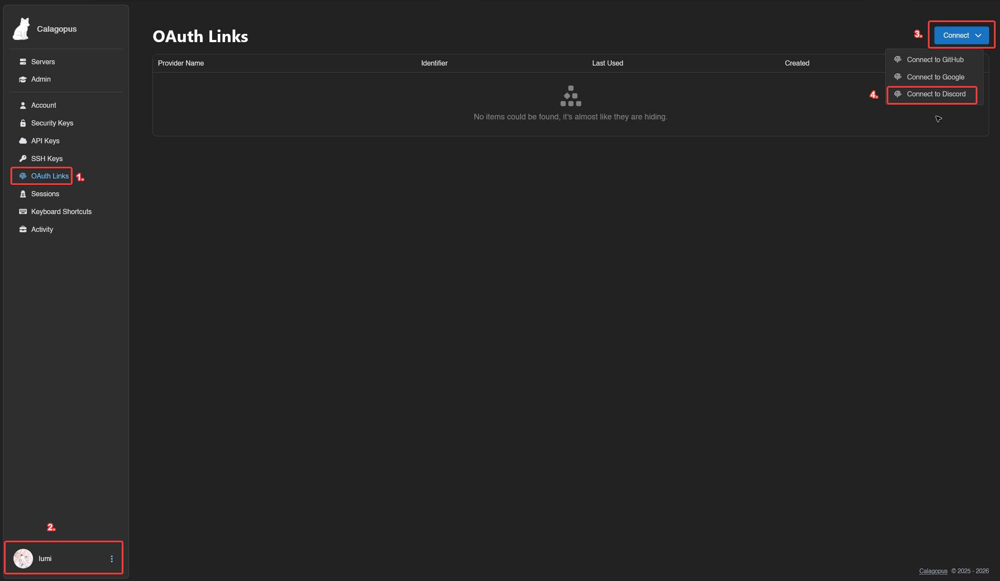
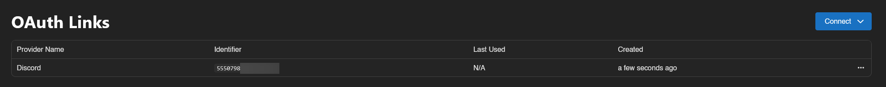

# Discord OAuth Setup

This guide will show you how to setup Discord OAuth for your Calagopus Panel.

### Prerequisites
To setup Discord OAuth, you only need 2 things:
* [A Discord account](https://discord.com)
* A Calagopus Panel, cause why would you read this guide if you don't have one??

### Downloading required files
To setup Discord OAuth, you can use the `discord.yml` file to import to Calagopus Panel without having to manually copy the values by yourself.

To download this file, right click on the link below, and save it locally on your computer.

<a href="./files/discord.yml" download>Download <code>discord.yml</code> ➚</a>

### Import the template config
Once `discord.yml` has been downloaded, head to your Calagopus Panel's admin page, and click on `OAuth Providers` on the side.

Then, click on the Import button and import the `discord.yml` file.

Once imported, click on the newly created Discord provider's ID and you should arrive to a page similar to this:

Copy the Redirect URL provided by the panel and proceed to the next step.

### Setting up Discord OAuth
#### Creating the application
Go to [Discord's Developer Portal](https://discord.com/developers/applications), and create an application.

In the popup, type the name of your application, which will be shown on the Discord login page. Select a team if you have one and then click on `Create`.

In the General Information page (the page you get redirected to once you click `Create`), set an icon and/or a description if you'll like, for this guide we're not gonna cover this step.

#### Add your Redirect URL to Discord OAuth
On the left sidebar, click on `OAuth2`.

On the Redirects section, click on `Add Redirect` and paste the redirect URL Calagopus Panel has given you.

At the bottom, you should see the warning below:

Click on the `Save Changes` button below.

#### Issue a OAuth Client ID and Secret
On the same `OAuth2` page, look for the Client information section. Reset your Client Secret by clicking on the `Reset Secret` button.

Once you reset your Client Secret, copy both your Client ID and Client Secret. You will need thoses for the next step.

### Configuring the OAuth Provider
Back to the panel, change the Client ID and the Client secret to the ones Discord has given you.

On the switches below, choose if you want to enable Discord OAuth, only allow login, allow the user to view the connection and allow the user to link and unlink their accounts.

It should normally look like this:

Finally, save your changes, and you should be done!

### Test the configuration
To test your configuration, head into your account settings, click on `OAuth Links` at the sidebar, and connect to your Discord account.

If everything works correctly, you should now be able to see your Discord account in your list.

### Troubleshooting
*todo: add troubleshooting guides*