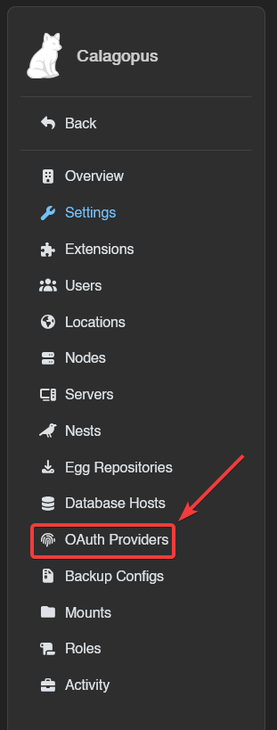
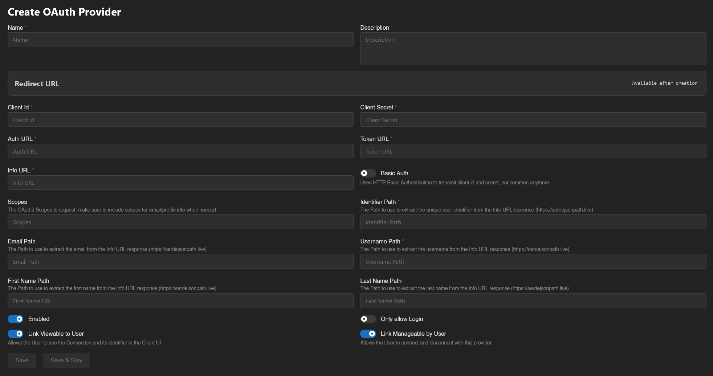

# Generic OAuth Setup

This guide will show you how to setup a generic OAuth provider for your Calagopus Panel.

This guide will show you first on how to find the required identifiers used by your provider, and then will show you on how you can integrate your generic OIDC provider to Calagopus Panel.

### Example files
Theses are example files made by the community that you can use as a preset. You will need to replace `id.example.com` with your own OIDC provider.\
Pocket-ID: <a href="./files/pocket-id.yml" download>Download <code>pocket-id.yml</code> ➚</a>\
Authentik: <a href="./files/authentik.yml" download>Download <code>authentik.yml</code> ➚</a>

If your provider isn't listed here, you may have to follow the steps below to adapt to your setup.

### Find the required identifiers
Most OIDC providers (hosted or self-hosted) come with what's known as a standard "well-known" URL. Depending of your provider, it should exist under the path `/.well-known/openid-configuration`. It should be a JSON object where it contains the 3 URLs we need.

For example, if your provider's URL is `https://id.example.com`, add `/.well-known/openid-configuration` at the end, so you would go to `https://id.example.com/.well-known/openid-configuration`.

::: warning
If that file does not exist, you may need to refer to your provider's documentation to find the 3 URLs needed.
:::

To obtain the URLs we need, visit the "well-known" URL from your provider (in this case, mine would be `https://id.example.com/.well-known/openid-configuration`) in a browser.

Once you arrived to the page, find the 3 values here and paste it on a clipboard or a text file:
| Identifier     | JSON Key                 |
|----------------|--------------------------|
| **Auth URL**   | `authorization_endpoint` |
| **Token URL**  | `token_endpoint`         |
| **Info URL**   | `userinfo_endpoint`      |

On the same JSON object, look for the `claims_supported` key, and find the claims you need. Below are some JSON path examples that you could use, although you may need to tweak them a little for your specific provider.
| Identifier          | Example                | Required |
|---------------------|------------------------|----------|
| **Identifier Path** | `$.sub`                | :white_check_mark:        |
| **Email Path**      | `$.email`              | :x:        |
| **Username Path**   | `$.preferred_username` | :x:        |
| **First Name Path** | `$.given_name`         | :x:        |
| **Last Name Path**  | `$.family_name`        | :x:        |

Finally, look for the `scopes_supported` key, and find the scopes you need. Usually, you should only put `openid`, `profile` and `email`, but it may depend on your provider.

Then, on your provider, setup Client ID and Client Secrets for Calagopus to use.

### Configuring the OAuth Provider
Once you got your URL's, your claims and your scopes, head to your Calagopus Panel's admin page, and click on `OAuth Providers` on the side.

Then, click on the Create button and you should arrive to a page similar to this:

On that page, fill out theses fields according to the guide below. It will explain what each field represents and give you some examples for [Pocket-ID](./files/pocket-id.yml).

## General Information
### Name
This would be the name of your provider, it will be displayed on the OAuth list of the user.

Required: :white_check_mark:\
Example: `Pocket-ID`

### Description
This would be a description of your provider, useful for organization.

Required: :x:

## OAuth Provider Config
### Client ID
This is your Client ID that your provider has given you.

Required: :white_check_mark:

### Client Secret
This is your Client Secret that your provider has given you.

Required: :white_check_mark:

## OAuth URLs
### Auth URL
This is the Authentication URL that you have grabbed from the `authorization_endpoint` JSON key.

Required: :white_check_mark:\
Example: `https://id.example.com/authorize`

### Token URL
This is the Token URL that you have grabbed from the `token_url` JSON key.

Required: :white_check_mark:\
Example: `https://id.example.com/api/oidc/token`

### Info URL
This is the User Info URL that you have grabbed from the `info_url` JSON key.

Required: :white_check_mark:\
Example: `https://id.example.com/api/oidc/userinfo`

### Basic Auth
Enable this if your provider transmits the Client ID and Client Secret via HTTP Basic Authentication. Do not enable this option unless you know what are you doing.

Required: :x:\
Example: Off

## Scopes and Paths
For all the paths, make sure to also add `$.` at the beginning, for example if your email path is `email`, you would do: `$.email`.
### Scopes
The scopes used to get the user data via OIDC.

Required: :x: according to the panel, although it is required if you want to extract the email, username, first and last name, and potentially the identifier aswell.\
Example: `openid`, `email`, `profile`

### Identifier Path
The Path to use to extract the unique user identifier from the Info URL response (https://serdejsonpath.live)

Required: :white_check_mark:\
Example: `$.sub`

### Email Path
The Path to use to extract the email from the Info URL response (https://serdejsonpath.live)

Required: :x:\
Example: `$.email`

### Username Path
The Path to use to extract the username from the Info URL response (https://serdejsonpath.live)

Required: :x:\
Example: `$.preferred_username`

### First Name Path
The Path to use to extract the first name from the Info URL response (https://serdejsonpath.live)

Required: :x:\
Example: `$.given_name`

### Last Name Path
The Path to use to extract the last name from the Info URL response (https://serdejsonpath.live)

Required: :x:\
Example: `$.family_name`

## Options
### Enabled
Enable this if you want users to be able to access the panel via the custom provider.

### Only allow Login
Enable this if you don't want people registering accounts via your OIDC provider.

### Link Viewable to User
Allows the User to see the Connection and its identifier in the Client UI.

### Link Manageable by User
Allows the User to connect and disconnect with this provider

---

Once that's done, you can click on the `Save` button, and your custom OIDC provider should be setup!

### Test the configuration
To test your configuration, head into your account settings, click on `OAuth Links` at the sidebar, and connect to your OIDC provider's account. If everything works correctly, you should now be able to see your OIDC provider's in your list.

### Troubleshooting

#### Error: "Redirect URI Mismatch" or "Invalid Redirect URI"
**Cause:** The redirect URL in your OIDC provider doesn't match the one provided by Calagopus Panel.

**Solution:**
1. Go back to your Calagopus Panel OAuth provider configuration page
2. Copy the exact Redirect URL shown
3. Go to your OIDC provider's configuration
4. Update the redirect/callback URL to match exactly (including `https://`, trailing slashes, etc.)
5. Save the changes in your OIDC provider

#### Error: "Invalid URLs" or connection fails immediately
**Cause:** One or more of the OAuth URLs (Auth URL, Token URL, Info URL) are incorrect.

**Solution:**
1. Visit your OIDC provider's well-known URL: `https://your-provider/.well-known/openid-configuration`
2. Verify the following values match:
   - Auth URL matches `authorization_endpoint`
   - Token URL matches `token_endpoint`
   - Info URL matches `userinfo_endpoint`
3. Update the URLs in your Calagopus Panel OAuth provider configuration
4. Save the changes

#### Error: "Failed to extract user data" or missing user information
**Cause:** The JSON paths for extracting user data are incorrect.

**Solution:**
1. Check your OIDC provider's `userinfo_endpoint` response format
2. Visit [https://serdejsonpath.live](https://serdejsonpath.live) to test your JSON paths
3. Verify each path:
   - Identifier Path (required) - usually `$.sub`
   - Email Path - usually `$.email`
   - Username Path - usually `$.preferred_username` or `$.username`
   - First Name Path - usually `$.given_name`
   - Last Name Path - usually `$.family_name`
4. Update the paths in your Calagopus Panel configuration
5. Save the changes

#### Error: "Invalid Scope" or "Insufficient Scopes"
**Cause:** The requested scopes are not supported by your OIDC provider or are incorrectly configured.

**Solution:**
1. Visit your OIDC provider's well-known URL: `https://your-provider/.well-known/openid-configuration`
2. Check the `scopes_supported` array
3. Ensure your configuration includes the necessary scopes (typically `openid`, `profile`, `email`)
4. Update the scopes in your Calagopus Panel OAuth provider configuration
5. Save the changes

#### Error: "Invalid Client" or "Authentication Failed"
**Cause:** Client ID, Client Secret, or Basic Auth configuration is incorrect.

**Solution:**
1. Verify your Client ID and Client Secret from your OIDC provider
2. Update both values in your Calagopus Panel configuration
3. Check if your provider requires HTTP Basic Authentication:
   - If yes, enable the `Basic Auth` option
   - If no, ensure `Basic Auth` is disabled
4. Save the changes

#### OAuth connection button doesn't appear
**Cause:** The OAuth provider is not enabled in the panel.

**Solution:**
1. Go to your Calagopus Panel admin page
2. Navigate to OAuth Providers
3. Click on your custom provider
4. Ensure the `Enabled` switch is turned on
5. Save the changes

#### Error: "Access Denied" after clicking authorize
**Cause:** User denied permission or OIDC provider account has issues.

**Solution:**
1. Try the authorization process again
2. Ensure you click the authorization/consent button on your provider's page
3. Verify your account with the OIDC provider is active and verified
4. Check if your OIDC provider requires additional configuration or permissions