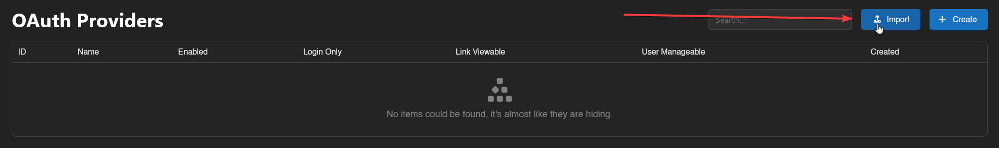

# Google OAuth Setup

This guide will show you how to setup Google OAuth for your Calagopus Panel.

### Prerequisites
To setup Google OAuth, you only need 2 things:
* [A Google account](https://accounts.google.com)
* A Calagopus Panel, cause why would you read this guide if you don't have one??

### Downloading required files
To setup Google OAuth, you can use the `google.yaml` file to import to Calagopus Panel without having to manually copy the values by yourself.

To download this file, right click on the link below, and save it locally on your computer.

[Download `google.yaml` ➚](./files/google.yml)

### Import the template config
Once `google.yaml` has been downloaded, head to your Calagopus Panel's admin page, and click on `OAuth Providers` on the side.

Then, click on the Import button and import the `google.yaml` file.
