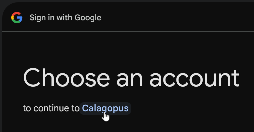
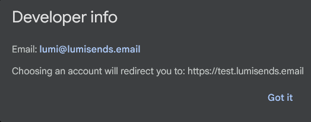
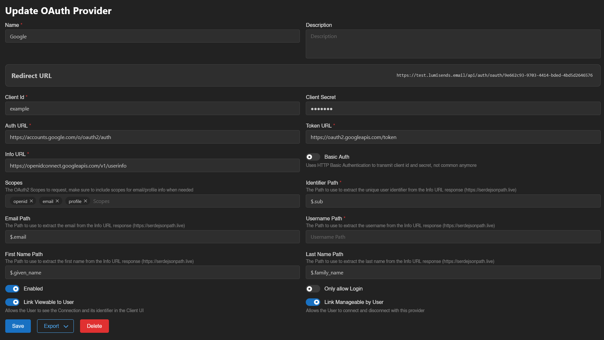

# Google OAuth Setup

This guide will show you how to setup Google OAuth for your Calagopus Panel.

::: warning
If you are planning to configure Google OAuth, please keep in mind that on Google's login page, it will leak your email address on the `Developer info` popup. You can literally do this by clicking on the app name:

If you don't want your personal email to be shared, you have 2 options:
* **1. Create a seperate Google account with a work email.** This will show your work email instead of your personal email, so you won't get spammed by bots on your personal email.
* **2. Don't use Google OAuth.** Use another provider from [this list](../oauth.md).
:::

### Prerequisites
To setup Google OAuth, you only need 2 things:
* [A Google account](https://accounts.google.com)
* A Calagopus Panel, cause why would you read this guide if you don't have one??

### Downloading required files
To setup Google OAuth, you can use the `google.yaml` file to import to Calagopus Panel without having to manually copy the values by yourself.

To download this file, right click on the link below, and save it locally on your computer.

[Download `google.yaml` ➚](./files/google.yml)

### Import the template config
Once `google.yaml` has been downloaded, head to your Calagopus Panel's admin page, and click on `OAuth Providers` on the side.

Then, click on the Import button and import the `google.yaml` file.

Once imported, click on the newly created Google provider's ID and you should arrive to a page similar to this:

Copy the Redirect URL provided by the panel and proceed to the next step.