# Google OAuth Setup

This guide will show you how to setup Google OAuth for your Calagopus Panel.

::: warning
If you are planning to configure Google OAuth, please keep in mind that on Google's login page, it will leak your email address on the `Developer info` popup. You can literally do this by clicking on the app name:
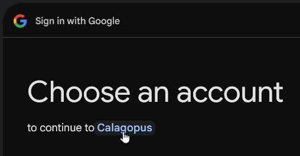

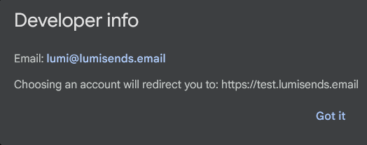

If you don't want your personal email to be shared, you have 2 options:
* **1. Create a seperate Google account with a work email.** This will show your work email instead of your personal email, so you won't get spammed by bots on your personal email.
* **2. Don't use Google OAuth.** Use another provider from [this list](../oauth.md).
:::

### Prerequisites
To setup Google OAuth, you only need 2 things:
* [A Google account](https://accounts.google.com)
* A Calagopus Panel, cause why would you read this guide if you don't have one??

### Downloading required files
To setup Google OAuth, you can use the `google.yml` file to import to Calagopus Panel without having to manually copy the values by yourself.

To download this file, right click on the link below, and save it locally on your computer.

<a href="./files/google.yml" download>Download <code>google.yml</code> ➚</a>

### Import the template config
Once `google.yml` has been downloaded, head to your Calagopus Panel's admin page, and click on `OAuth Providers` on the side.

Then, click on the Import button and import the `google.yml` file.

Once imported, click on the newly created Google provider's ID and you should arrive to a page similar to this:
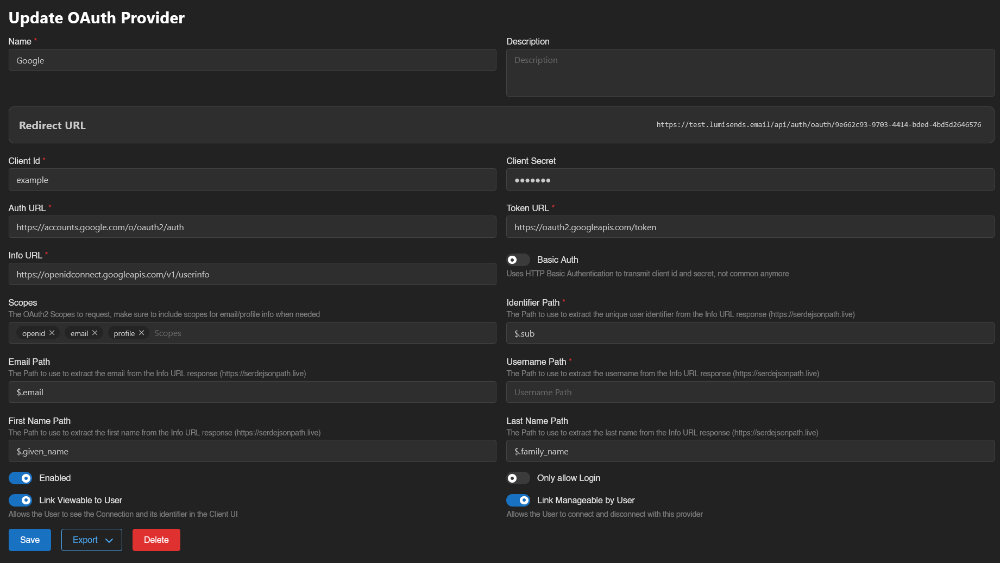

Copy the Redirect URL provided by the panel and proceed to the next step.

### Setting up Google OAuth
#### Select or create a Google Cloud project
Go to [Google Cloud console](http://console.cloud.google.com), for example, by clicking Console on [Google Cloud landing page](https://cloud.google.com/).
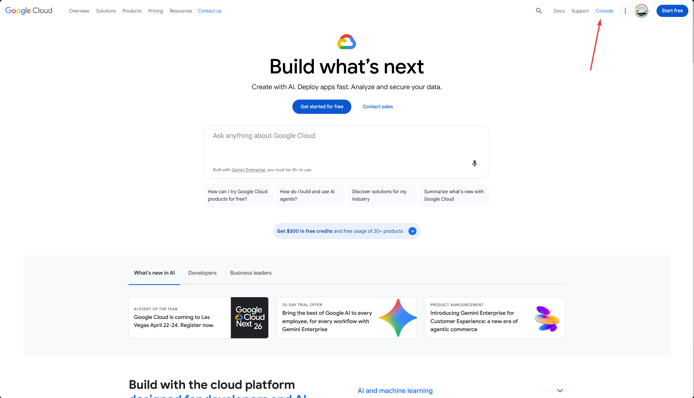

Once there, select a project that you want to use for the Google OAuth app.
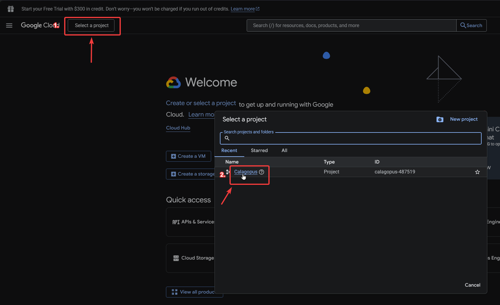

::: details How to create a project in Google Cloud?
In the `Select a project` pop-up, click `New project`.
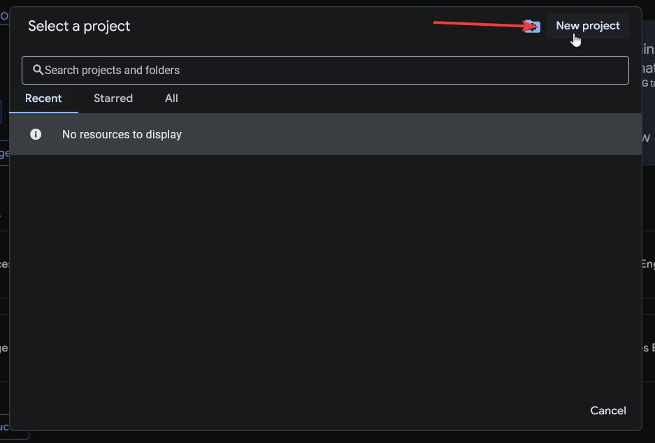

Pick a name for the project, in this case Calagopus. The organisation field can be left to no organization.
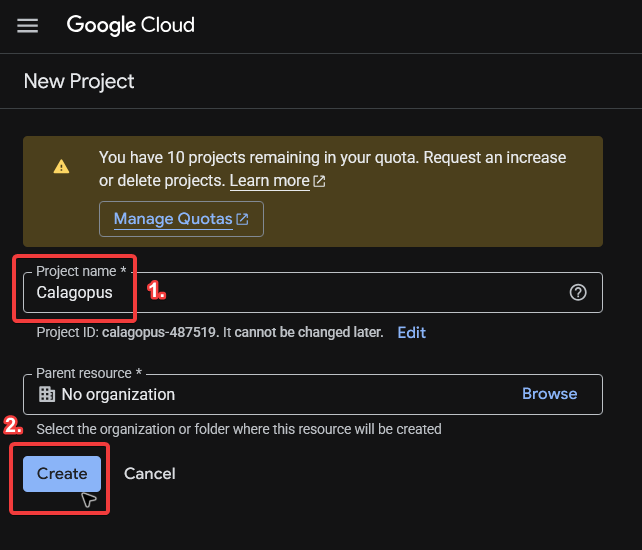

Once the project has been created, wait for all the other steps to complete and then select the project.
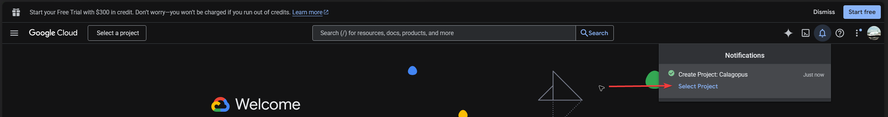
:::

#### Register the OAuth application
In the search bar, search for `APIs & Services` or something similar.
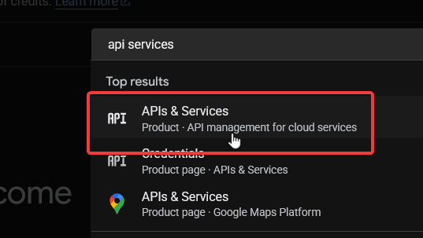

Then in the left sidebar, pick `OAuth consent screen` to begin the OAuth application registration.
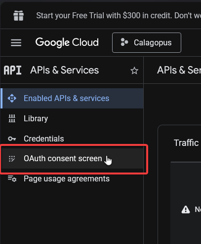

Then, on the `Google Auth Platform not configured yet` page, click on the `Get started` button.
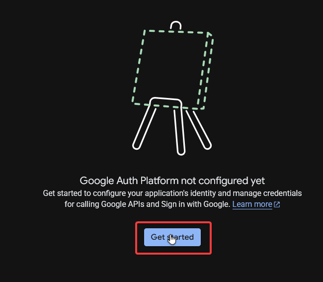

On the next screen, pick the name of the application to show on the login page and add your contact information. Then, click on `Next`.
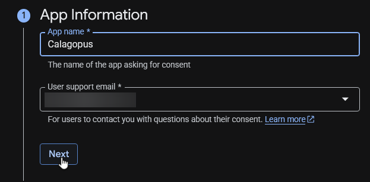

Choose `External` for the application type and then click `Next`.
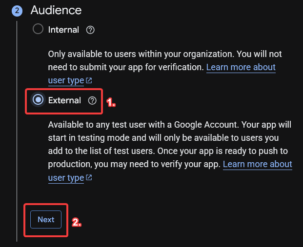

Add your contact information again, and then click `Next`.
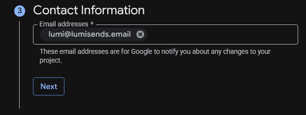

Accept the Google API Services: User Data Policy, and then click `Continue`, and then finally `Create`.
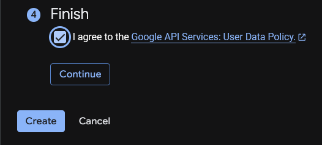

Go back to the `Branding` tab at the left sidebar, and scroll down until you find `Authorized domains`. Add a new domain, and enter your top private domain your Calagopus Panel is located. For example, if your panel is `test.example.com`, you would put `example.com`. Finally, click the `Save` button.
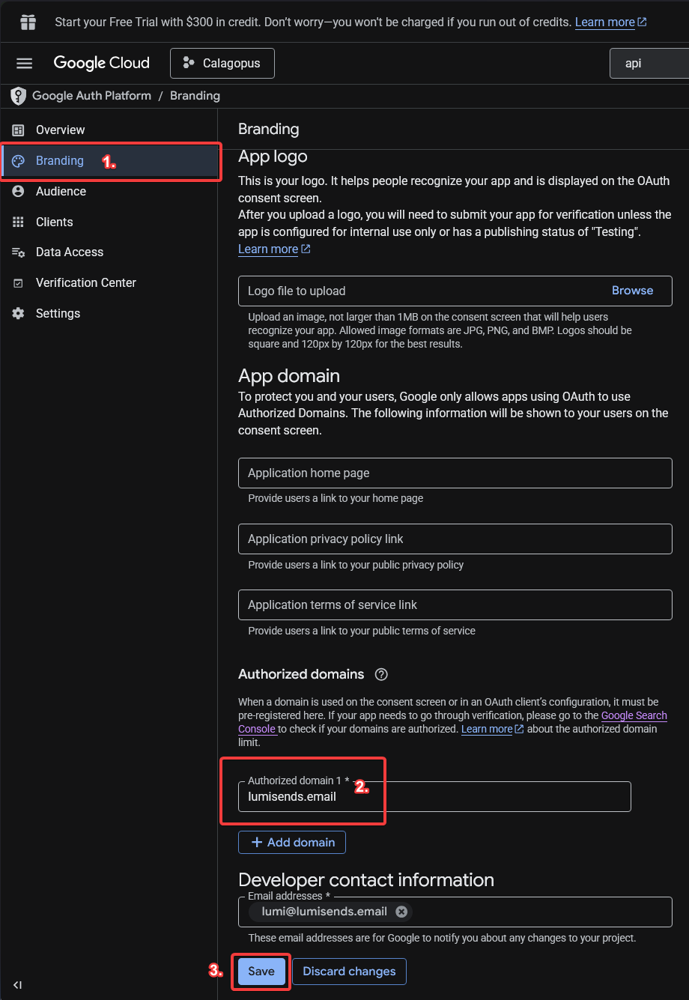

::: warning
Do NOT fill out the `App logo` field, as this will require getting your app verified, which can take some time.
:::

Next, go to the `Audience` tab, and publish the application.
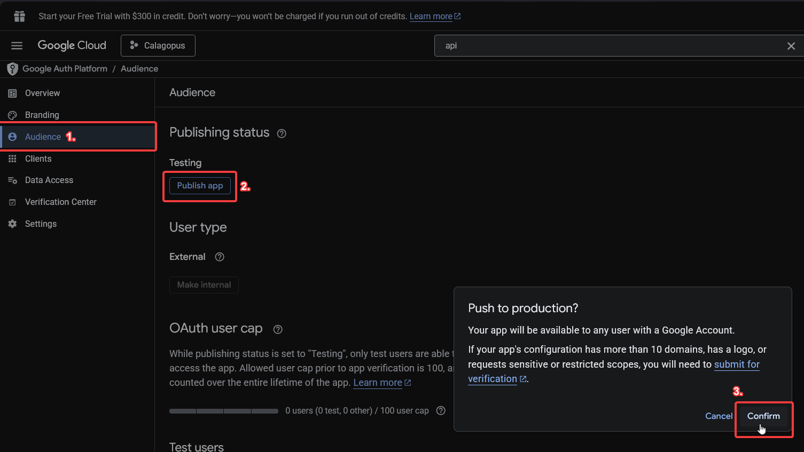

#### Issue an OAuth client and key for that application
Go back to the `APIs & Services` page. To do so, in the search bar, search for `APIs & Services` or something similar.

Pick `Credentials` in the sidebar. Click `+ Create credentials` dropdown and select `OAuth client ID`.
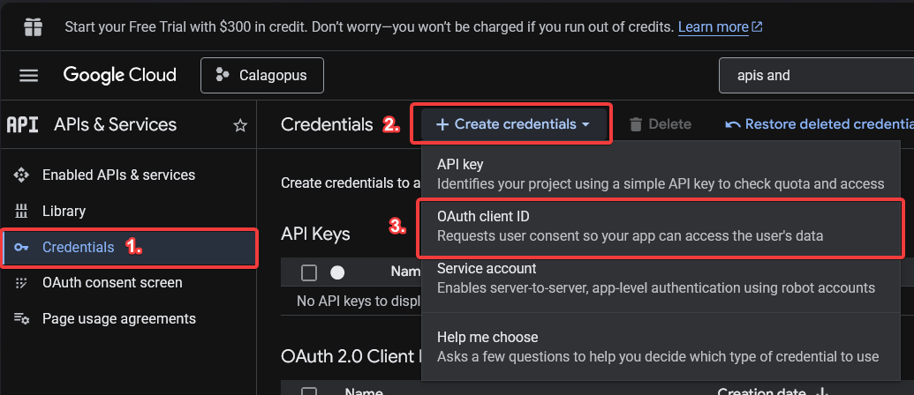

Pick `Web application` for the application type, type the name for the client, and add the redirect URL. Then, create the OAuth Client ID by clicking the `Create` button.
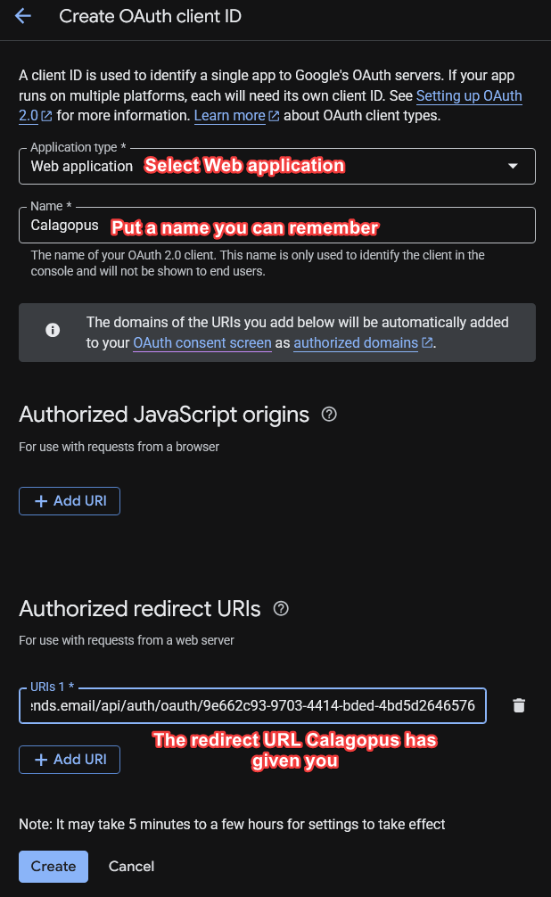

Copy both your Client ID and your Client secret, and then you can close Google Cloud. You will need thoses for the next step.
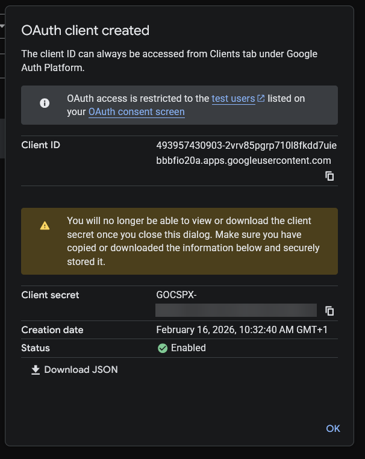

### Configuring the OAuth Provider
Back to the panel, change the Client ID and the Client secret to the ones Google has given you.

On the switches below, choose if you want to enable Google OAuth, only allow login, allow the user to view the connection and allow the user to link and unlink their accounts.

It should normally look like this:

Finally, save your changes, and you should be done!

### Test the configuration
To test your configuration, head into your account settings, click on `OAuth Links` at the sidebar, and connect to your Google account.
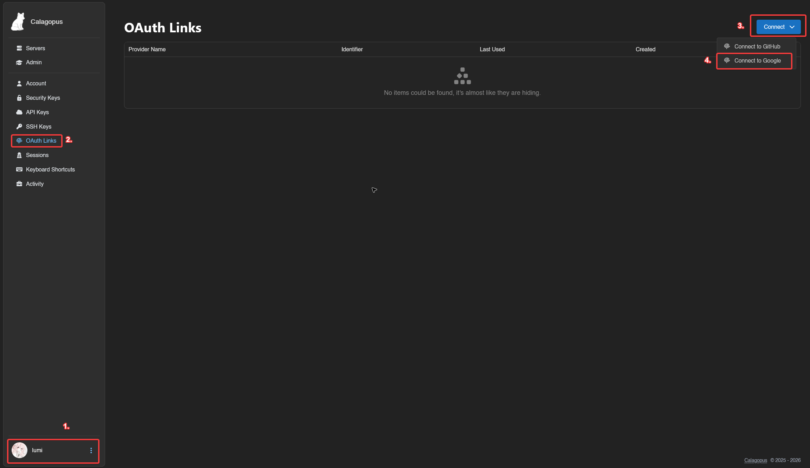

If everything works correctly, you should now be able to see your Google account in your list.
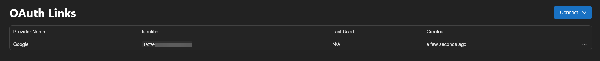

### Troubleshooting
*todo: add troubleshooting guides*