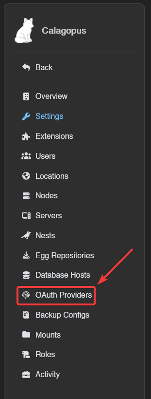
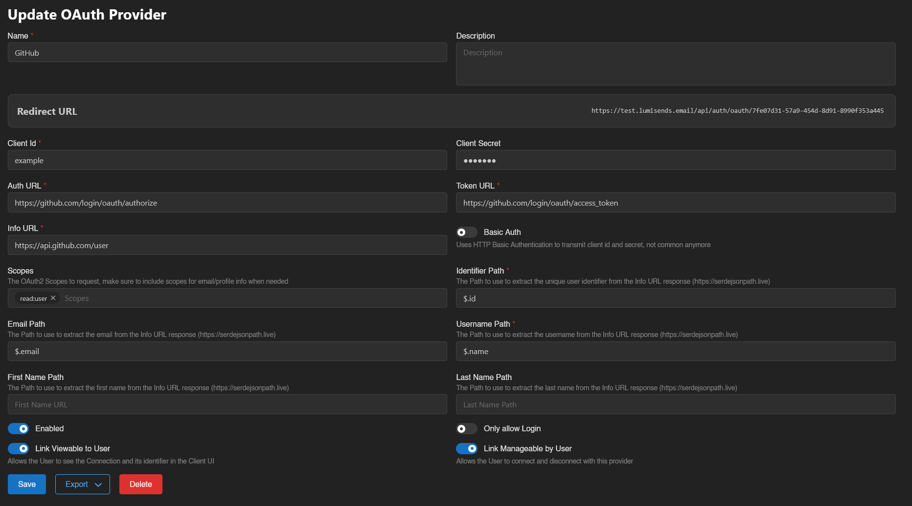
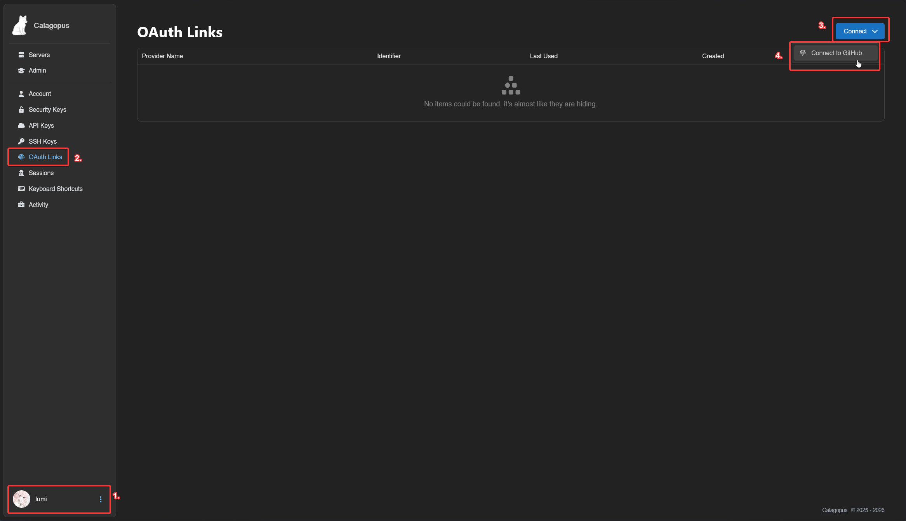
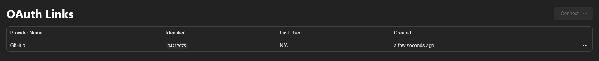

# GitHub OAuth2 Setup

This guide will show you how to setup GitHub OAuth2 for your Calagopus Panel.

### Prerequisites
To setup GitHub OAuth2, you only need 2 things:
* [A GitHub account](https://github.com)
* A Calagopus Panel, cause why would you read this guide if you don't have one??

### Downloading required files
To setup GitHub OAuth2, you can use the `github.yaml` file to import to Calagopus Panel without having to manually copy the values by yourself.

To download this file, right click on the link below, and save it locally on your computer.

[Download `github.yaml` ➚](./files/github.yml)

### Import the template config
Once `github.yaml` has been downloaded, head to your Calagopus Panel's admin page, and click on `OAuth Providers` on the side.

Then, click on the Import button and import the `github.yaml` file.

Once imported, click on the newly created GitHub provider's ID and you should arrive to a page similar to this:

Copy the Redirect URL provided by the panel and proceed to the next step.

### Create your application
On a new tab, head to [this page](https://github.com/settings/applications/new) or head to your GitHub's account/organisation settings, find `Developer Settings` at the sidebar, and click on `OAuth Apps` at the `Developer Settings`'s sidebar, and finally click on the `New OAuth App` button.

Once on the page, fill out theses values:
* `Application name`: Can be anything you want, will be shown on the login page.
* `Homepage URL`: Your Calagopus Panel URL, this isn't used by Calagopus.
* `Application description`: Optional.
* `Authorization callback URL`: Paste your redirect URL generated by the panel at the previous step.
* `Enable Device Flow`: Do not tick this checkbox as it will not work with Calagopus.

With the required fields filled out, it should look something similar to this:

Once done, you can click on the `Register Application` button, add a logo if you want, and proceed to the next step.

### Generate a client secret
To generate a client secret, just click on the `Generate a new client secret` button, confirm your identity, and copy both your Client ID and your Client secret. You will need thoses for the next step.

### Configuring the OAuth Provider
Back to the panel, change the Client ID and the Client secret to the ones GitHub has given you.

On the switches below, choose if you want to enable GitHub OAuth, only allow login, allow the user to view the connection and allow the user to link and unlink their accounts.

It should normally look like this:

Finally, save your changes, and you should be done!

### Test the configuration
To test your configuration, head into your account settings, click on `OAuth Links` at the sidebar, and connect to your GitHub account.

If everything works correctly, you should now be able to see your GitHub account in your list.

### Troubleshooting
*todo: add troubleshooting guides*