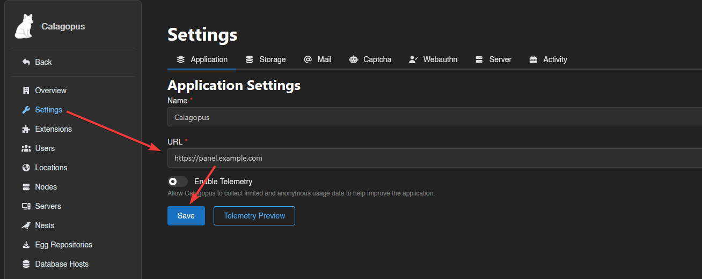

# Reverse Proxies

This guide explains how to set up a Reverse Proxy for the Calagopus Panel running in Docker. Using a reverse proxy allows the internal web server (default port `8000`) to be served securely over standard `HTTP`/`HTTPS` ports.

::: warning
Ensure that the Panel is already installed and running before continuing. Misconfigured proxy settings may make the Panel inaccessible.
:::

::: info
We assume you already have Let’s Encrypt certificates generated for your domain. All `<domain>` placeholders should be replaced with your actual domain name.
:::

### Trusted Proxies

When running the Panel behind a reverse proxy, you must configure the [APP_TRUSTED_PROXIES](../panel/environment#app-trusted-proxies) variable. This ensures that the Panel logs correct client IP addresses and operates securely.

```yaml
services:
  panel:
    environment:
      APP_TRUSTED_PROXIES="172.18.0.1"
```
### Container IP Address

The internal IP address used by your reverse proxy to forward traffic to the Panel depends on your Docker network and may be different on your system.

Before continuing, determine the IP address of the running Panel container and update your reverse proxy configuration accordingly.

You can run the following command from anywhere on the host to automatically detect the Panel container and print its internal IP address:

```bash
docker inspect -f '{{range .NetworkSettings.Networks}}{{.IPAddress}}{{end}}' $(docker ps --format '{{.Image}} {{.ID}}' | awk '$1 ~ /^ghcr\.io\/calagopus\/panel/ {print $2}')
```

This command will output an IP address *(for example `172.18.0.1`)*. Use this address wherever your reverse proxy needs to forward traffic to the Panel.


## Proxy Servers

::::tabs
=== Nginx
Create `/etc/nginx/sites-available/panel.conf` *(or `/etc/nginx/conf.d/panel.conf` on RHEL-based systems)* with the following content:

::: code-group
```nginx [With SSL]
server {
    listen 80;
    listen [::]:80;
    server_name <domain>;
    return 301 https://$server_name$request_uri;
}

server {
    listen 443 ssl http2;
    listen [::]:443 ssl http2;
    server_name <domain>;

    access_log /var/log/nginx/calagopus.app-access.log;
    error_log  /var/log/nginx/calagopus.app-error.log error;

    sendfile off;

    ssl_certificate /etc/letsencrypt/live/<domain>/fullchain.pem;
    ssl_certificate_key /etc/letsencrypt/live/<domain>/privkey.pem;
    ssl_session_cache shared:SSL:30m;
    ssl_protocols TLSv1.2 TLSv1.3;
    ssl_ciphers HIGH:!aNULL:!MD5;
    ssl_prefer_server_ciphers on;

    # Optional DH params and ECDH curve can be uncommented if needed
    # ssl_dhparam /etc/letsencrypt/ssl-dhparams.pem;
    # ssl_ecdh_curve X25519:secp384r1:secp256r1;
    ssl_session_timeout 10m;
    ssl_session_tickets on;

    # See https://hstspreload.org/ before uncommenting the line below.
    # add_header Strict-Transport-Security "max-age=15768000; preload;";
    add_header X-XSS-Protection "1; mode=block";
    # Prevent search engines from indexing or following links
    add_header X-Robots-Tag "noindex, nofollow" always;
    add_header Permissions-Policy "camera=(), microphone=(), geolocation=(), fullscreen=(self), clipboard-read=(self)" always;
    add_header Referrer-Policy "same-origin";

    location / {
        proxy_http_version 1.1;
        proxy_set_header Upgrade $http_upgrade;
        proxy_set_header Connection "upgrade";
        proxy_set_header Host $host;
        proxy_set_header X-Real-IP $remote_addr;
        proxy_set_header X-Forwarded-For $proxy_add_x_forwarded_for;
        proxy_set_header X-Forwarded-Proto $scheme;
        proxy_redirect off;
        proxy_buffering off;
        proxy_request_buffering off;
        # Make sure this IP matches your Panel container's IP address
        proxy_pass http://172.18.0.1:8000;

        # Pass headers from internal webserver
        proxy_pass_header Content-Type;
        proxy_pass_header Content-Length;
        proxy_pass_header ETag;
        proxy_pass_header Last-Modified;
        proxy_pass_header Content-Security-Policy;
        proxy_pass_header Location;
    }

    location ~ /\.ht {
        deny all;
    }
}
```
```nginx [Without SSL]
server {
    listen 80;
    listen [::]:80;
    server_name <domain>;

    access_log /var/log/nginx/calagopus.app-access.log;
    error_log  /var/log/nginx/calagopus.app-error.log error;

    sendfile off;

    add_header X-XSS-Protection "1; mode=block";
    # Prevent search engines from indexing or following links
    add_header X-Robots-Tag "noindex, nofollow" always;
    add_header Permissions-Policy "camera=(), microphone=(), geolocation=(), fullscreen=(self), clipboard-read=(self)" always;
    add_header Referrer-Policy "same-origin";

    location / {
        proxy_http_version 1.1;
        proxy_set_header Upgrade $http_upgrade;
        proxy_set_header Connection "upgrade";
        proxy_set_header Host $host;
        proxy_set_header X-Real-IP $remote_addr;
        proxy_set_header X-Forwarded-For $proxy_add_x_forwarded_for;
        proxy_set_header X-Forwarded-Proto $scheme;
        proxy_redirect off;
        proxy_buffering off;
        proxy_request_buffering off;
        # Make sure this IP matches your Panel container's IP address
        proxy_pass http://172.18.0.1:8000;

        # Pass headers from internal webserver
        proxy_pass_header Content-Type;
        proxy_pass_header Content-Length;
        proxy_pass_header ETag;
        proxy_pass_header Last-Modified;
        proxy_pass_header Content-Security-Policy;
        proxy_pass_header Location;
    }

    location ~ /\.ht {
        deny all;
    }
}
```
:::

=== Apache
First, remove the default Apache configuration.

```bash
a2dissite 000-default.conf
```

Create `/etc/apache2/sites-available/panel.conf` *(or `/etc/httpd/conf.d/panel.conf` on RHEL-based systems)* with the following content:

::: code-group
```apache [With SSL]
<VirtualHost *:80>
    ServerName <domain>
    RewriteEngine On
    RewriteRule ^ https://%{SERVER_NAME}%{REQUEST_URI} [R=301,L]
</VirtualHost>

<VirtualHost *:443>
    ServerName <domain>
    
    AllowEncodedSlashes NoDecode

    Protocols h2 http/1.1

    ErrorLog  /var/log/apache2/calagopus.app-error.log
    CustomLog /var/log/apache2/calagopus.app-access.log combined

    EnableSendfile Off

    SSLEngine on
    SSLCertificateFile      /etc/letsencrypt/live/<domain>/fullchain.pem
    SSLCertificateKeyFile   /etc/letsencrypt/live/<domain>/privkey.pem

    SSLProtocol -all +TLSv1.2 +TLSv1.3
    SSLCipherSuite HIGH:!aNULL:!MD5
    SSLHonorCipherOrder on
    SSLSessionTickets on

    # Optional DH params and ECDH curve can be uncommented if needed
    # SSLOpenSSLConfCmd DHParameters "/etc/letsencrypt/ssl-dhparams.pem"
    # SSLOpenSSLConfCmd Curves X25519:secp384r1:secp256r1

    # See https://hstspreload.org/ before uncommenting the line below.
    # Header always set Strict-Transport-Security "max-age=15768000; preload;"
    Header always set X-XSS-Protection "1; mode=block"
    # Prevent search engines from indexing or following links
    Header always set X-Robots-Tag "noindex, nofollow"
    Header always set Permissions-Policy "camera=(), microphone=(), geolocation=(), fullscreen=(self), clipboard-read=(self)"
    Header always set Referrer-Policy "same-origin"

    ProxyPreserveHost On
    ProxyRequests Off

    <Proxy *>
        Require all granted
    </Proxy>

    # Make sure this IP matches your Panel container's IP address
    ProxyPass / http://172.18.0.1:8000/ upgrade=websocket retry=0
    ProxyPassReverse / http://172.18.0.1:8000/

    RequestHeader set X-Real-IP %{REMOTE_ADDR}s
    RequestHeader add X-Forwarded-For %{REMOTE_ADDR}s
    RequestHeader set X-Forwarded-Proto "https"

    # Deny access to .ht files
    <FilesMatch "^\.ht">
        Require all denied
    </FilesMatch>

</VirtualHost>
```
```apache [Without SSL]
<VirtualHost *:80>
    ServerName <domain>

    AllowEncodedSlashes NoDecode

    ErrorLog  /var/log/apache2/calagopus.app-error.log
    CustomLog /var/log/apache2/calagopus.app-access.log combined

    EnableSendfile Off

    # Security headers (still optional for HTTP)
    Header always set X-XSS-Protection "1; mode=block"
    # Prevent search engines from indexing or following links
    Header always set X-Robots-Tag "noindex, nofollow"
    Header always set Permissions-Policy "camera=(), microphone=(), geolocation=(), fullscreen=(self), clipboard-read=(self)"
    Header always set Referrer-Policy "same-origin"

    ProxyPreserveHost On
    ProxyRequests Off

    <Proxy *>
        Require all granted
    </Proxy>

    # Make sure this IP matches your Panel container's IP address
    ProxyPass / http://172.18.0.1:8000/ upgrade=websocket retry=0
    ProxyPassReverse / http://172.18.0.1:8000/

    RequestHeader set X-Real-IP %{REMOTE_ADDR}s
    RequestHeader add X-Forwarded-For %{REMOTE_ADDR}s
    RequestHeader set X-Forwarded-Proto "http"

    # Deny access to .ht files
    <FilesMatch "^\.ht">
        Require all denied
    </FilesMatch>
</VirtualHost>
```
:::
=== Caddy 
*help wanted*
::::

## Enabling Configuration

::: code-group
```bash [Nginx]
# On RHEL-based systems, placing the file in /etc/nginx/conf.d/ is sufficient, so no symlink is needed.
sudo ln -s /etc/nginx/sites-available/panel.conf /etc/nginx/sites-enabled/panel.conf

# Finally restart nginx regardless of the OS.
sudo systemctl restart nginx
```
```bash [Apache (With SSL)]
# You do not need to run any of these commands on RHEL-based systems.
sudo a2enmod rewrite headers proxy proxy_http proxy_wstunnel ssl http2
sudo a2ensite panel.conf
sudo systemctl restart apache2
```
```bash [Apache]
# You do not need to run any of these commands on RHEL-based systems.
sudo a2enmod rewrite headers proxy proxy_http proxy_wstunnel http2
sudo a2ensite panel.conf
sudo systemctl restart apache2
```
```bash [Caddy]
systemctl restart caddy
```
:::

## Verify Access

Visit `https://<domain>` in your browser. You should now see the Panel login page served via your chosen Proxy Server.

## Set Server URL

After verifying access, go to your Panels Admin page, set your server URL, hit Save and you’re done. This URL is used for links, API calls, and Wings node connections.


