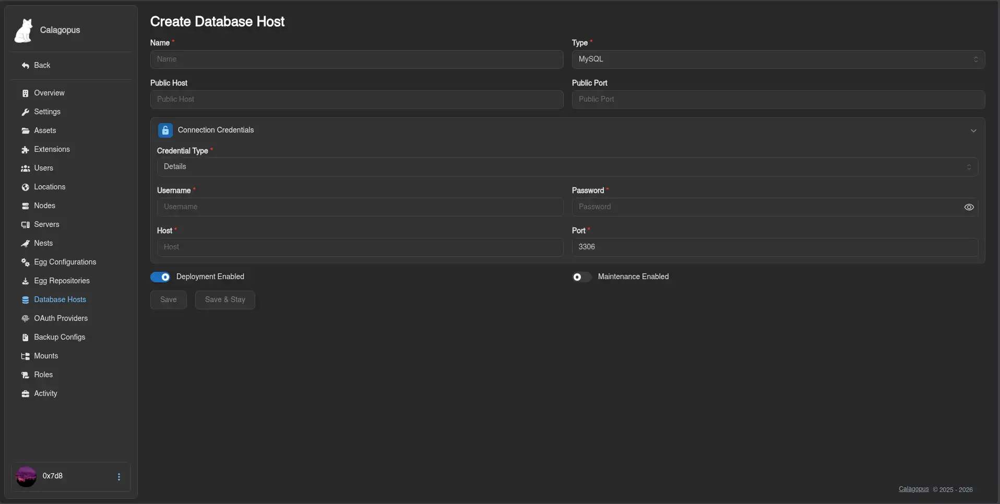

# MySQL (MariaDB)

This guide explains how to install and configure a **MariaDB** (or MySQL) database server to use as a database host in the Calagopus Panel. Once set up, your users will be able to create databases for their game servers directly from the panel.

::: info
The panel connects to this host using a privileged account to provision databases and users on demand. Each game server then receives its own isolated credentials.
:::

## Installation

::::tabs
=== Docker Compose

Create a directory for the service and enter it:

```bash
mkdir mariadb && cd mariadb
```

Create a `compose.yaml` with the following content:

```yaml
services:
  mariadb:
    image: mariadb:12
    restart: unless-stopped
    environment:
      MARIADB_ROOT_PASSWORD: <strong-root-password>
    volumes:
      - ./data:/var/lib/mysql
    ports:
      - "0.0.0.0:3306:3306"
```

Start the service:

```bash
docker compose up -d
```

Then open a shell inside the container to continue with user setup:

```bash
docker compose exec mariadb mariadb -u root -p
```

=== APT (Debian / Ubuntu)

```bash
sudo apt update
sudo apt install -y mariadb-server
sudo systemctl enable --now mariadb
```

Run the interactive security script to set a root password, remove anonymous users, and disable remote root login:

```bash
sudo mariadb-secure-installation
```

Connect as root:

```bash
sudo mariadb -u root -p
```

=== RPM (RHEL / Fedora / Rocky / Alma)

```bash
sudo dnf install -y mariadb-server
sudo systemctl enable --now mariadb
```

Run the interactive security script:

```bash
sudo mariadb-secure-installation
```

Connect as root:

```bash
sudo mariadb -u root -p
```

::::

## Configuring Remote Access

By default, MariaDB only listens on `127.0.0.1`. To accept connections from the panel and Wings nodes, update the bind address.

::: info
If you used Docker Compose, the `ports` entry already handles this - skip this section.
:::

::::tabs
=== APT (Debian / Ubuntu)

Edit `/etc/mysql/mariadb.conf.d/50-server.cnf`:

```ini
[mysqld]
bind-address = 0.0.0.0
```

Restart MariaDB:

```bash
sudo systemctl restart mariadb
```

=== RPM (RHEL / Fedora / Rocky / Alma)

Edit `/etc/my.cnf.d/mariadb-server.cnf`:

```ini
[mysqld]
bind-address = 0.0.0.0
```

Restart MariaDB:

```bash
sudo systemctl restart mariadb
```

::::

## Creating the Panel User

Inside the MariaDB shell, create a dedicated account that the panel uses to provision user databases:

::: danger
The user below can connect from **any IP address** (`%`). Use a long, randomly generated password - a weak password on an exposed port is a critical security risk.
:::

```sql
CREATE USER 'calagopus'@'%' IDENTIFIED BY '<strong-password>';
GRANT ALL PRIVILEGES ON *.* TO 'calagopus'@'%' WITH GRANT OPTION;
FLUSH PRIVILEGES;
```

::: info
`WITH GRANT OPTION` is required so the panel can create per-game-server users and grant them access to their individual databases.
:::

## Adding the Host to the Panel

1. Go to **Admin → Database Hosts → Create**.
2. Change the Credential Type to **Details**.
3. Fill in the form:

| Field | Value |
| --- | --- |
| **Name** | A friendly label, e.g. `MariaDB` |
| **Host** | IP address or hostname of the database server |
| **Port** | `3306` |
| **Username** | `calagopus` |
| **Password** | The password you set above |



4. Click **Save**. You will be able to verify the connection afterwards.

## Making the Database Host Show Up for Users

By default, new database hosts are not visible to any client API endpoints, to fix this, we need to add the database host to the Locations Database Host List.

1. Go to **Admin → Locations** and click on the location you want to add the database host to.
2. Click the **Database Hosts** tab at the top.
3. Click **Add** and select the database host you just created from the dropdown, then submit.


::: info
For further reference on MariaDB configuration, see the [official MariaDB documentation](https://mariadb.com/kb/en/documentation/).
:::
