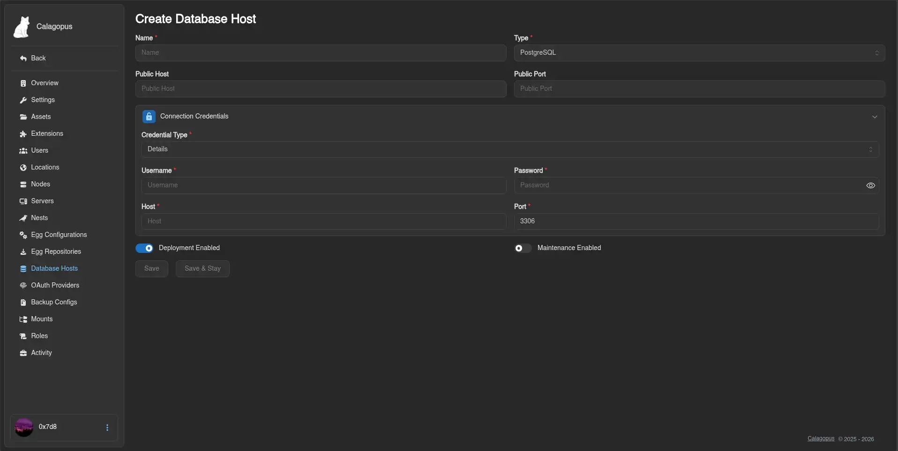
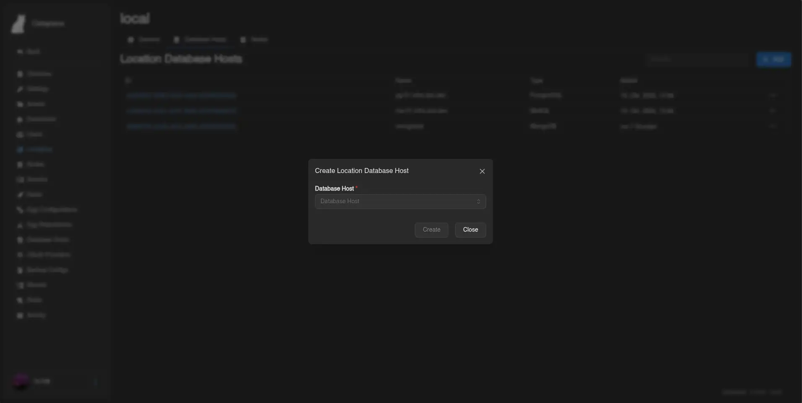

# PostgreSQL

This guide explains how to install and configure a **PostgreSQL** database server to use as a database host in the Calagopus Panel. Once set up, your users will be able to create databases for their game servers directly from the panel.

::: info
The panel connects to this host using a privileged account to provision databases and roles on demand. Each game server then receives its own isolated credentials.
:::

## Installation

::::tabs
=== Docker Compose

Create a directory for the service and enter it:

```bash
mkdir postgres && cd postgres
```

Create a `compose.yaml` with the following content:

```yaml
services:
  postgres:
    image: postgres:18
    restart: unless-stopped
    environment:
      POSTGRES_PASSWORD: <strong-root-password>
    volumes:
      - ./data:/var/lib/postgresql/data
    ports:
      - "0.0.0.0:5432:5432"
```

Start the service:

```bash
docker compose up -d
```

Then open a `psql` shell inside the container to continue with user setup:

```bash
docker compose exec postgres psql -U postgres
```

=== APT (Debian / Ubuntu)

```bash
sudo apt update
sudo apt install -y postgresql
sudo systemctl enable --now postgresql
```

Connect as the default `postgres` superuser:

```bash
sudo -u postgres psql
```

=== RPM (RHEL / Fedora / Rocky / Alma)

```bash
sudo dnf install -y postgresql-server postgresql-contrib
sudo postgresql-setup --initdb
sudo systemctl enable --now postgresql
```

Connect as the default `postgres` superuser:

```bash
sudo -u postgres psql
```

::::

## Configuring Remote Access

By default, PostgreSQL only listens on `127.0.0.1` and uses `ident` authentication for local connections. You need to update both the listen address and the client authentication rules.

::: info
If you used Docker Compose, the `ports` entry already exposes the port - you still need to update `pg_hba.conf` for non-Docker installs if you want password auth.
:::

::::tabs
=== APT (Debian / Ubuntu)

Find the PostgreSQL config directory (typically `/etc/postgresql/<version>/main/`):

Edit `postgresql.conf`:

```ini
listen_addresses = '*'
```

Edit `pg_hba.conf` and add the following line to allow password authentication from any host:

```conf
host    all             all             0.0.0.0/0               scram-sha-256
```

Restart PostgreSQL:

```bash
sudo systemctl restart postgresql
```

=== RPM (RHEL / Fedora / Rocky / Alma)

Find the PostgreSQL data directory (typically `/var/lib/pgsql/data/`):

Edit `postgresql.conf`:

```ini
listen_addresses = '*'
```

Edit `pg_hba.conf` and add:

```conf
host    all             all             0.0.0.0/0               scram-sha-256
```

Restart PostgreSQL:

```bash
sudo systemctl restart postgresql
```

::::

## Creating the Panel User

Inside the `psql` shell, create a dedicated role that the panel uses to provision user databases:

::: danger
The role below can connect from **any IP address**. Use a long, randomly generated password - a weak password on an exposed port is a critical security risk.
:::

```sql
CREATE USER calagopus WITH PASSWORD '<strong-password>' CREATEDB CREATEROLE;
```

::: info
`CREATEDB` and `CREATEROLE` allow the panel to provision databases and per-game-server roles without needing full superuser access.
:::

## Adding the Host to the Panel

1. Go to **Admin → Database Hosts → Create**.
2. Change the Credential Type to **Details**.
3. Fill in the form:

| Field | Value |
| --- | --- |
| **Name** | A friendly label, e.g. `PostgreSQL` |
| **Host** | IP address or hostname of the database server |
| **Port** | `5432` |
| **Username** | `calagopus` |
| **Password** | The password you set above |



4. Click **Save**. You will be able to verify the connection afterwards.

## Making the Database Host Show Up for Users

By default, new database hosts are not visible to any client API endpoints, to fix this, we need to add the database host to the Locations Database Host List.

1. Go to **Admin → Locations** and click on the location you want to add the database host to.
2. Click the **Database Hosts** tab at the top.
3. Click **Add** and select the database host you just created from the dropdown, then submit.



::: info
For further reference on PostgreSQL configuration, see the [official PostgreSQL documentation](https://www.postgresql.org/docs/).
:::
