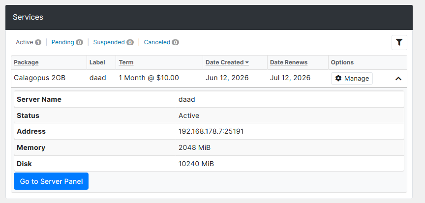
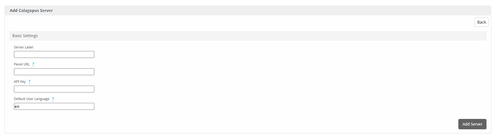

# Blesta

The **Calagopus Blesta module** is a server provisioning module for [Blesta](https://www.blesta.com). It provisions and manages Calagopus servers from Blesta as part of your billing workflow, with support for nests/eggs, node- or location-based deployment, egg variables, and custom (extension-added) feature limits.

::: info
This module is based on the official [Blesta Pterodactyl module](https://github.com/blesta/module-pterodactyl), adapted for the Calagopus panel API and its additional features.
:::

::: danger
This module authenticates with an **admin API key**, which grants full administrative access to your panel - creating users and servers, reading every resource, and more. Treat it like a root password: never share it, and rotate it immediately if it is ever exposed.
:::

## What it does

The module maps Blesta's service lifecycle onto the Calagopus admin API:

| Blesta action | Effect on the panel |
| --- | --- |
| Add | Finds or creates a panel user for the client, then provisions a server (on a specific node, or auto-deployed across locations). |
| Suspend / Unsuspend | Toggles the server's suspended state. |
| Edit / Change package | Updates the server's resource and feature limits to match the package configuration. |
| Cancel | Deletes the server from the panel. |

Clients are matched to panel users by their Blesta client ID (stored as the user's `external_id`), so each client reuses the same panel account across all of their services. If a matching email or username already exists, the module links to it instead of creating a duplicate.

The client service page shows a server summary (name, status, address, memory, disk) with an **Open in Panel** button, and the admin service tab surfaces the same details.



## Requirements

- A running [Blesta](https://www.blesta.com) installation.
- A running Calagopus panel with at least one node, location, nest, and egg configured.
- An **admin API key** from your Calagopus panel.

## Installation

1. Upload the contents of the [module repository](https://github.com/calagopus/blesta-module) into your Blesta installation:

   ```sh
   /path/to/blesta/components/modules/calagopus/
   ```

2. In Blesta, go to **Settings → Company → Modules → Available**, find **Calagopus**, and click **Install**.

3. Click **Manage** on the Calagopus module, then **Add Server** and configure:

   | Field | Description |
   | --- | --- |
   | **Server Label** | A friendly name for this panel connection. |
   | **Panel URL** | Your panel URL, e.g. `https://panel.example.com`. |
   | **API Key** | An admin API key for your Calagopus panel. |
   | **Default User Language** | Two-letter language code for newly created users, e.g. `en`. |

   Saving validates the connection against the panel.



## Configuring a package

Create a **Package** and select the **Calagopus** module. The package configuration defines what every server provisioned from it looks like.

::: info
The **Nest**, **Egg**, **Node**, and **Location** fields are populated live from your panel through the API key on the server, so you can pick them from dropdowns. Changing the nest or egg refreshes the dependent options and the egg variable fields.
:::

### Deployment target

You can deploy in one of two ways:

- **Specific node** - pick a **Node**, and the module provisions onto the first available allocation on that node.
- **Auto deploy** - leave the node set to *Auto* and select one or more **Locations**. Calagopus picks a node and allocation automatically.

At least one of a node or one or more locations must be set, or the package will not save.

### Resources and limits

| Field | Notes |
| --- | --- |
| **Memory / Swap / Disk** | In MiB. Set swap to `-1` for unlimited or `0` to disable. |
| **CPU Limit** | Percentage; `100` = one thread, `0` = unlimited. |
| **Memory Overhead** | Hidden memory added on top of the container's limit. |
| **IO Weight** | `10`–`1000`; leave blank for the default. |
| **Allocations / Databases / Backups / Schedules** | Standard feature limits. |
| **Custom Feature Limits** | Extension-added limits, as `key:value` pairs, e.g. `plugins:5,worlds:3`. |

### Egg and advanced options

| Field | Notes |
| --- | --- |
| **Docker Image** | Override the egg default. Blank uses the egg's default image. |
| **Startup Command** | Override the egg default startup command. |
| **Server Name Prefix** | Servers are named `<prefix><service id>`. Blank defaults to `Server-`. |
| **Pinned CPUs** | Comma-separated core IDs, e.g. `0,1,2`. Blank disables pinning. |
| **Backup Configuration UUID** | Optional backup configuration to assign to the server. |
| **Skip Installer** | Skips the egg's installation script. |
| **Start on Completion** | Starts the server automatically once installation finishes. |
| **Hugepages / KVM Passthrough** | Mount `/dev/hugepages` / allow `/dev/kvm` inside the container. |

### Egg variables

The package form renders a field for each of the egg's environment variables, validated against the egg's own rules. Each variable has a **(display)** checkbox - tick it to expose that variable to the client during checkout, letting them set its value themselves; leave it unticked to keep the value fixed by the package.

## Troubleshooting

### Saving the server fails with a connection error

The API key is missing, malformed, or lacks admin access, or the Panel URL is incorrect. Confirm the Panel URL points at your panel (HTTPS is assumed if you omit the protocol) and re-enter a valid **admin** API key.

### "No available allocations on the selected node"

The chosen node has no free allocations. Add allocations to the node, or switch the package to auto-deploy across locations.

### The package will not save

Either the Nest or Egg is unset, or neither a node nor any locations were selected. All selections must come from the same panel the server is configured against.

### Clients get a duplicate panel account

The module matches existing users by email and username. If a client registered on the panel separately with a different email than the one in Blesta, link the accounts by setting that panel user's `external_id` to the Blesta client ID.
