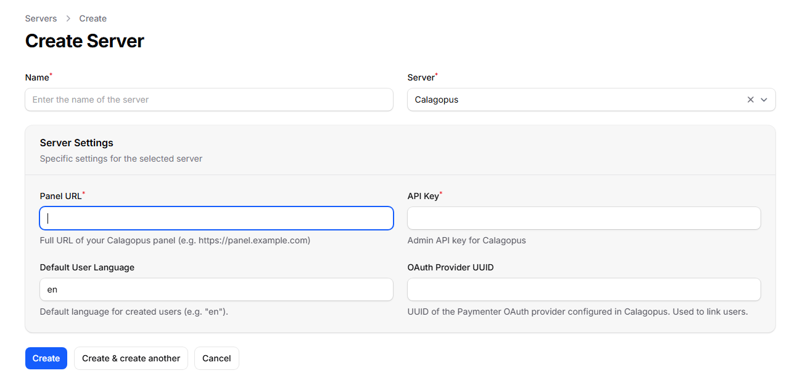

# Paymenter

The **Calagopus Paymenter module** is a server provisioning extension for [Paymenter](https://paymenter.org). It lets Paymenter automatically create, suspend, unsuspend, upgrade, and terminate Calagopus servers as part of your billing workflow, and can optionally link customer accounts to the panel via OAuth so they log in with their Paymenter credentials.

::: danger
This module authenticates with an **admin API key**, which grants full administrative access to your panel (creating users, servers, reading every resource, and more). Treat it like a root password: store it only in Paymenter's encrypted configuration, never commit it anywhere, and rotate it immediately if it is ever exposed.
:::

## What it does

Once configured against a product, the module maps Paymenter's service lifecycle onto the Calagopus admin API:

| Paymenter action | Effect on the panel |
| --- | --- |
| Create | Finds or creates a panel user for the customer, then provisions a server (on a specific node, or auto-deployed across locations). |
| Suspend / Unsuspend | Toggles the server's suspended state. |
| Upgrade / Change package | Updates the server's resource and feature limits to match the new product configuration. |
| Terminate | Deletes the server (backups are removed). |

Customers are matched to panel users by their Paymenter user ID (stored as the user's `external_id`), so each customer reuses the same panel account across all of their services. If a matching email or username already exists, the module links to it instead of creating a duplicate.

## Requirements

- A running [Paymenter](https://paymenter.org) installation.
- A running Calagopus panel with at least one node, location, nest, and egg configured.
- An **admin API key** from your Calagopus panel.

## Installation

1. Upload the `extensions/Servers/Calagopus/` directory from the [module repository](https://github.com/calagopus/paymenter-module) into your Paymenter installation:

   ```sh
   /path/to/paymenter/extensions/Servers/Calagopus/
   ```

2. In the Paymenter admin area, go to **Servers → New server** and create a server using the **Calagopus** extension.

3. Configure the server with the following fields:

   | Field | Description |
   | --- | --- |
   | **Panel URL** | Full URL of your panel, e.g. `https://panel.example.com`. |
   | **API Key** | An admin API key for your Calagopus panel (stored encrypted). |
   | **Default User Language** | Two-letter language code for newly created users, e.g. `en`. |
   | **OAuth Provider UUID** | Optional - used for account linking, see [below](#optional-oauth-account-linking). |

4. Use **Test Connection** to confirm Paymenter can reach the panel with the supplied key.



## Configuring a product

Create a product (or edit an existing one) and select **Calagopus** as the server extension. The product configuration is where you define what every server provisioned from this product looks like.

::: tip
The **Nest**, **Egg**, **Node**, and **Location** fields are populated live from your panel through the API key you configured on the server, so you can pick them from dropdowns rather than copying UUIDs by hand. Choosing a nest refreshes the available eggs.
:::

### Deployment target

You can deploy in one of two ways:

- **Specific node** - pick a **Node**, and the module provisions onto the first available allocation on that node.
- **Auto deploy** - leave the node set to *Auto* and select one or more **Locations**. Calagopus picks a node and allocation automatically.

If no node is selected and no locations are provided, provisioning fails, so make sure at least one is set.

### Resources and limits

| Field | Notes |
| --- | --- |
| **Memory / Swap / Disk** | In MiB. Set swap to `-1` for unlimited or `0` to disable. |
| **CPU Limit** | Percentage; `100` = one thread, `0` = unlimited. |
| **Memory Overhead** | Hidden memory added on top of the container's limit. |
| **IO Weight** | `10`–`1000`; leave blank for the default. |
| **Allocations / Databases / Backups / Schedules** | Standard feature limits. |
| **Custom Feature Limits** | Extension-added limits, as `key:value` pairs, e.g. `plugins:5,worlds:3`. |

### Egg and advanced options

| Field | Notes |
| --- | --- |
| **Docker Image** | Override the egg default. Blank uses the egg's default image. |
| **Startup Command** | Override the egg default startup command. |
| **Server Name Prefix** | Servers are named `<prefix><service id>`, e.g. `MC-12345`. Blank defaults to `Server-`. |
| **Skip Egg Install Script** | Skips the egg's installation script. |
| **Start on Completion** | Starts the server automatically once installation finishes. |
| **Hugepages / KVM Passthrough** | Mount `/dev/hugepages` / allow `/dev/kvm` inside the container. |
| **Pinned CPUs** | Comma-separated core IDs, e.g. `0,1,2`. Blank disables pinning. |
| **Backup Configuration UUID** | Optional backup configuration to assign to the server. |

When a service is active, the module exposes a **Go to Server** button in the Paymenter client area that links straight to the server in your panel.

## Optional: OAuth account linking

OAuth linking lets your customers log into the Calagopus panel using their Paymenter account, so they never need a separate panel password. When enabled, newly provisioned servers automatically link the customer's panel user to their Paymenter identity.

1. Download the `paymenter-oauth-provider.yml` template from the [module repository](https://github.com/calagopus/paymenter-module).

2. In your Calagopus panel, go to **Admin → OAuth Providers → Import** and import the template.

3. Open the imported provider and edit every URL to point at your Paymenter installation (the template uses `https://your.paymenter.panel` placeholders). Save it, then copy the **Redirect URL**.

4. In the Paymenter admin area, go to **OAuth Clients → New OAuth client**, paste the Redirect URL into the **Redirect** field, give it a name, and save.

5. Copy the **Client ID** and **Secret** from the new Paymenter OAuth client.

6. Back in Calagopus, edit the imported OAuth provider, paste in the Client ID and Secret, and save.

7. Copy the **UUID** of the OAuth provider in Calagopus and paste it into the **OAuth Provider UUID** field on your Paymenter Calagopus server configuration. Save.

From now on, when a server is created for a customer, Paymenter links their panel account to their Paymenter identity automatically, letting them sign in to the panel with their Paymenter credentials.

::: info
The provided template is configured as **login only** - customers use it to authenticate, and the provider does not let them manage the link themselves. For more on OAuth providers in general, see [Setting up OAuth](../advanced/oauth/).
:::

## Troubleshooting

### "Calagopus API Error (HTTP 401)" on Test Connection

The API key is missing, malformed, or lacks admin access. Generate a fresh **admin** API key in your panel and re-enter it.

### "No available allocations on the selected node"

The chosen node has no free allocations. Add allocations to the node, or switch the product to auto-deploy across locations.

### "Server already exists on the panel"

A server is already linked to this service's ID (`external_id`). Remove or re-link the existing panel server before re-provisioning.

### Customers get a duplicate panel account

The module matches existing users by email and username. If a customer signed up to the panel separately with a different email than the one in Paymenter, link the accounts by setting that panel user's `external_id` to the Paymenter user ID.
