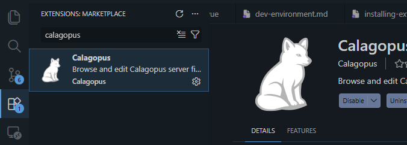
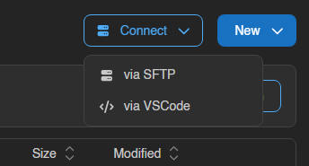
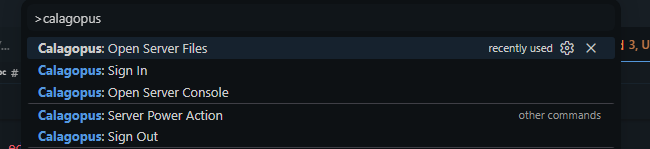
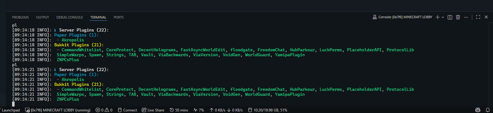
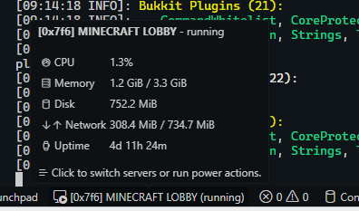
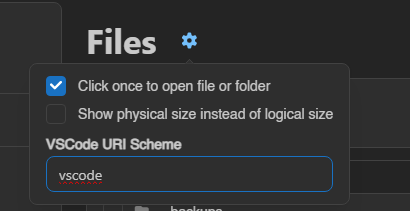

# VS Code

The **Calagopus** extension lets you browse and edit your server's files and attach to its live console directly from your editor, without leaving your development environment. Files are mounted as a workspace folder over a virtual `calagopus://` filesystem, so the full power of your editor - multi-cursor editing, search, extensions, and the integrated terminal - works against your server just like a local project.

## Supported editors

The extension is published to both major registries, so it works in Visual Studio Code and the wider ecosystem of compatible editors:

- [**Visual Studio Code Marketplace**](https://marketplace.visualstudio.com/items?itemName=calagopus.calagopus) - for Visual Studio Code.
- [**Open VSX Registry**](https://open-vsx.org/extension/calagopus/calagopus) - for editors that cannot use the Microsoft marketplace, including [VSCodium](https://vscodium.com), [code-server](https://github.com/coder/code-server), [Gitpod](https://www.gitpod.io), Cursor, Windsurf, and most other VS Code forks.

::: info
Pick the registry that matches your editor. The extension is identical on both - only the distribution channel differs. Any editor that can install from Open VSX is supported.
:::

The extension is open source - you can browse the code, file issues, or build it yourself from the [`calagopus/vscode-extension`](https://github.com/calagopus/vscode-extension) repository.

## Requirements

- A Calagopus account with access to one or more servers.
- VS Code (or a compatible editor) version `1.120.0` or newer.

## Installation

::::tabs
=== Visual Studio Code

1. Open the **Extensions** view (`Ctrl`/`Cmd` + `Shift` + `X`).
2. Search for **Calagopus**.
3. Click **Install** on the extension published by `calagopus`.

Alternatively, install it from the [Marketplace page](https://marketplace.visualstudio.com/items?itemName=calagopus.calagopus) in your browser.

=== VSCodium / Open VSX

1. Open the **Extensions** view (`Ctrl`/`Cmd` + `Shift` + `X`).
2. Search for **Calagopus**.
3. Click **Install** on the extension published by `calagopus`.

VSCodium, code-server, and most other forks are wired to the [Open VSX Registry](https://open-vsx.org/extension/calagopus/calagopus) out of the box. If your editor does not surface the extension in search, you can download the `.vsix` from Open VSX and install it manually via **Extensions → ... → Install from VSIX**.

::::



## Connecting from the panel

The quickest way to get started is straight from your server's file manager. Open the **Files** tab for any server, then click the **Connect** dropdown in the toolbar and choose **Connect via VS Code**.



Your editor opens, mounts the server's files as a workspace folder, and attaches to the console automatically. The same **Connect** dropdown is available in the header while editing a file, which will open that exact file in your editor once the server is mounted.

::: info
The first time you connect to a panel, the extension will prompt you to sign in. Your credentials are stored securely in your editor's secret storage and reused on future connections - see [Authentication](#authentication).
:::

## Connecting from within the editor

You can also drive everything from the editor using the Command Palette (`Ctrl`/`Cmd` + `Shift` + `P`). The extension contributes the following commands, all under the **Calagopus** category:

| Command | Description |
| --- | --- |
| `Calagopus: Sign In` | Authenticate with your Calagopus panel. |
| `Calagopus: Sign Out` | Clear stored credentials for one or all panels. |
| `Calagopus: Open Server Files` | Pick a server and mount its files as a workspace folder. |
| `Calagopus: Open Server Console` | Pick a server and attach to its console. |
| `Calagopus: Server Power Action` | Start, stop, restart, or kill the active server. |



## Features

### Remote file editing

Once a server is mounted, its files appear as an ordinary workspace folder. You can edit, create, rename, move, and delete files and directories using native editor tooling - every change is written back to the server over the `calagopus://` filesystem.

### Searching files

When the editor's proposed search APIs are enabled, you can search across your server's files by **name** and **content** using the editor's built-in search. This relies on proposed APIs that are not available in every build; if search results do not appear, your editor likely has the proposed APIs disabled.

### Live console

Attach to your server's console as an integrated terminal. Output streams in real time and you can send commands straight from the terminal input, exactly as you would from the panel's console tab.



### Power actions & status bar

The current server's power state is shown in the status bar. Use the **Calagopus: Server Power Action** command (or the status bar item) to **start**, **stop**, **restart**, or **kill** the server without switching back to the panel.



## Deep links

The extension registers a `calagopus` URI handler. This is the mechanism the panel's **Connect via VS Code** button uses, and you can build your own links to open a server (and optionally a specific file and the console) from anywhere:

```
vscode://calagopus.calagopus/open?origin=<panel-url>&server=<server-uuid>
```

| Parameter | Required | Description |
| --- | --- | --- |
| `origin` | Yes | Panel base URL, e.g. `https://panel.example.com`. |
| `server` | Yes | The server's UUID. |
| `console` | No | When truthy (`1`/`true`), also attach to the server console. |
| `file` | No | Path (relative to the server root) to open in the editor after mounting. |
| `apiKey` | No | An API key for an ephemeral, non-persisted session (credentials are not saved). |

::: warning
A `vscode://` link is the canonical scheme for Visual Studio Code. Some forks register a different scheme (for example, `vscodium://` or `codium://`) - if a link does not open in your editor, click the settings icon in the top left of the file manager and change the VS Code URI scheme to match your editor's registered scheme.


:::

## Authentication

Sign-in is per panel and backed by your editor's secret storage, so your credentials never touch the workspace and persist securely between sessions. Connecting to a new panel for the first time prompts you to sign in; from then on the session is reused automatically.

To revoke access, run **Calagopus: Sign Out**. If you are signed in to more than one panel, you can sign out of a single panel or all of them at once.

::: info
Deep links that include an `apiKey` parameter open an **ephemeral** session - that key is used for the connection only and is never written to secret storage.
:::

## Troubleshooting

### The deep link does not open my editor

Your editor may register a URI scheme other than `vscode://`. Click the settings icon in the top left of the file manager and change the VS Code URI scheme to match your editor's registered scheme (for example, `vscodium://` or `codium://`).


### File search returns no results

Search relies on proposed editor APIs that are not enabled in every build. File **editing** still works without them - only name/content search across server files is affected.

### "Malformed open link" error

A deep link is missing the required `origin` or `server` parameter. Both must be present, and `origin` must be the full panel base URL (including `https://`).
