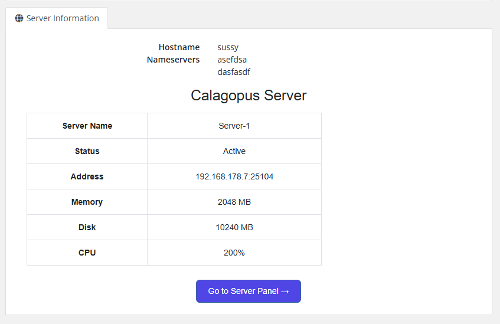
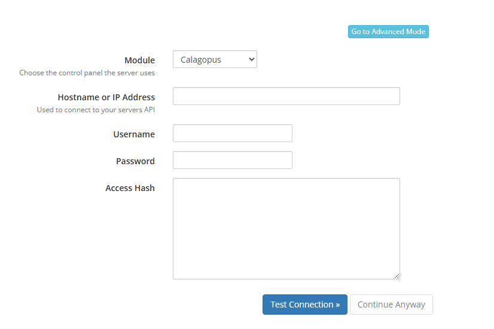

# WHMCS

The **Calagopus WHMCS module** is a server provisioning module for [WHMCS](https://www.whmcs.com). It lets WHMCS automatically create, suspend, unsuspend, upgrade, and terminate Calagopus servers as part of your billing workflow, and shows customers their server details directly in the WHMCS client area.

::: danger
This module authenticates with an **admin API key** (entered as the server password), which grants full administrative access to your panel - creating users and servers, reading every resource, and more. Treat it like a root password: never share it, and rotate it immediately if it is ever exposed.
:::

## What it does

The module maps WHMCS's provisioning lifecycle onto the Calagopus admin API:

| WHMCS action | Effect on the panel |
| --- | --- |
| Create | Finds or creates a panel user for the client, then provisions a server (on a specific node, or auto-deployed across locations). |
| Suspend / Unsuspend | Toggles the server's suspended state. |
| Change Package | Updates the server's resource limits, feature limits, and egg variables to match the new product configuration. |
| Terminate | Deletes the server (backups are removed). |

Clients are matched to panel users by their WHMCS user ID (stored as the user's `external_id`), so each client reuses the same panel account across all of their services. If a matching email or username already exists, the module links to it instead of creating a duplicate.

The client area renders a server summary (name, status, address, memory, disk, CPU) with a **Go to Server Panel** button, and the admin services tab surfaces the server UUID, node, owner, and panel link.



## Requirements

- A running [WHMCS](https://www.whmcs.com) installation.
- A running Calagopus panel with at least one node, location, nest, and egg configured.
- An **admin API key** from your Calagopus panel.

## Installation

1. Upload the `modules/servers/calagopus/` directory from the [module repository](https://github.com/calagopus/whmcs-module) into your WHMCS installation:

   ```sh
   /path/to/whmcs/modules/servers/calagopus/
   ```

2. In the WHMCS admin area, go to **System Settings → Servers → Add New Server** and configure:

   | Field | Value |
   | --- | --- |
   | **Module** | Select **Calagopus**. |
   | **Hostname** | Your panel domain, e.g. `panel.example.com`. |
   | **Port** | Optional - only if your panel runs on a non-standard port. |
   | **Password** | Your Calagopus **admin API key**. |
   | **Secure** | Tick this when your panel uses HTTPS. |

3. Click **Test Connection** to verify the credentials.

4. Create a **Server Group** and assign your Calagopus server to it.



::: tip
To store the panel's server UUID against each service, create two **custom fields** named `Server UUID` and `Server ID` on the product (admin-only). The module fills these in automatically on provisioning. They are optional - without them, the module falls back to looking the server up by its `external_id`.
:::

## Configuring a product

Create a product, set its module to **Calagopus**, and configure the module options. Unlike the Paymenter module, WHMCS fields are plain text, so you enter UUIDs directly.

::: warning
WHMCS enforces a hard limit of **24 module configuration options**. This module uses all of them, so do not add further custom config options to a Calagopus product.
:::

### Deployment target

| Field | Description |
| --- | --- |
| **Nest UUID** | UUID of the nest containing the egg. Required. |
| **Egg UUID** | UUID of the egg to provision. Required. |
| **Node UUID** | Deploy onto a specific node. Leave blank to use deploy mode. |
| **Location UUIDs** | Comma-separated location UUIDs for auto-deploy. Used when **Node UUID** is blank. |

At least one of **Node UUID** or **Location UUIDs** must be set, or provisioning fails. The product save is validated, so missing required fields are reported before you can save.

### Resources and limits

| Field | Notes |
| --- | --- |
| **Memory / Swap / Disk** | In MB. |
| **CPU Limit** | Percentage; `100` = one thread, `0` = unlimited. |
| **Memory Overhead** | Hidden memory added on top of the container's limit. |
| **IO Weight** | `10`–`1000`; leave blank for the default. |
| **Allocation / Database / Backup / Schedule Limit** | Standard feature limits. |
| **Custom Feature Limits** | Extension-added limits, as `key:value` pairs, e.g. `plugins:5,worlds:3`. |

### Egg and advanced options

| Field | Notes |
| --- | --- |
| **Docker Image** | Override the egg default. Blank uses the egg's default image. |
| **Startup Command** | Override the egg default startup command. |
| **Server Name Prefix** | Servers are named `<prefix><service id>`, e.g. `MC-12345`. Blank defaults to `Server-`. |
| **Egg Variables** | One `VAR_NAME=value` per line. |
| **Skip Installer** | Skips the egg's installation script. |
| **Start on Completion** | Starts the server automatically once installation finishes (default: on). |
| **Backup Configuration UUID** | Optional backup configuration to assign to the server. |
| **Hugepages / KVM Passthrough** | Mount `/dev/hugepages` / allow `/dev/kvm` inside the container. |

## Troubleshooting

### Test Connection fails

Confirm the **Hostname** has no scheme or trailing path (just the domain), the **Secure** checkbox matches your panel's protocol, and the **Password** field contains a valid **admin** API key.

### "No available allocations on the selected node"

The chosen node has no free allocations. Add allocations to the node, or switch the product to auto-deploy by clearing the Node UUID and supplying Location UUIDs.

### Provisioning fails with a validation error on save

Either Nest UUID or Egg UUID is missing, or neither a Node UUID nor Location UUIDs were provided. All UUIDs must come from the same panel the server is configured against.

### Clients get a duplicate panel account

The module matches existing users by email and username. If a client registered on the panel separately with a different email than the one in WHMCS, link the accounts by setting that panel user's `external_id` to the WHMCS user ID.
