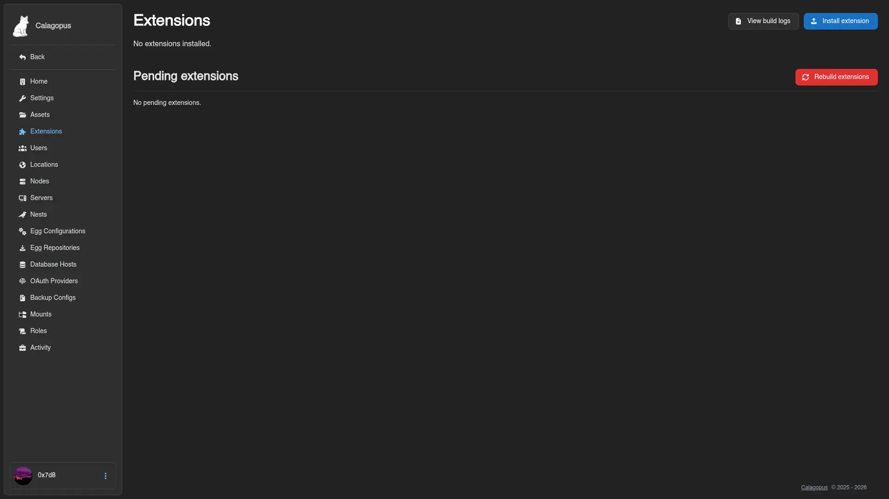

# Installing Extensions

Extensions ship as `.c7s.zip` files - a single archive containing both backend and frontend code. This page covers how to install one in your Calagopus Panel.

::: warning Requires the `:heavy` image or a development environment
Installing extensions requires the Panel to compile new code (yours, plus whatever the extension brings) at install time. The regular `:latest` and `:nightly` Docker images don't include the toolchain for that. You need either:

- The `:heavy` or `:nightly-heavy` Docker image variant, or
- A full local development environment

If you're not on the heavy docker image already, switch to the heavy variant first. See [Switching to the heavy image](./switching-to-the-heavy-image.md).
:::

## Install an Extension

The steps depend on which environment you're running. Pick the matching tab:

::::tabs
=== With Docker

Once your stack is on `:heavy` or `:nightly-heavy`, you have two options.

**Option 1: Upload through the admin UI.** Open the Panel's extension management page, drop the `.c7s.zip` file into the upload area, and the Panel handles the rest - install, compile, and load.



**Option 2: Drop the file in directly and restart.** Copy the `.c7s.zip` into the Panel's `extensions/` data directory (with the default heavy compose stack, that's `./build/extensions` relative to your compose file), then restart the container:

```bash
docker compose restart web
```

The Panel detects the new file on startup and installs it, you can see the progress via the aforementioned admin UI or simply wait, it shouldn't take more than a minute or two even for complex extensions.

=== With Development Environment

Add the extension source to your tree:

```bash
panel-rs extensions add path/to/extension.c7s.zip
```

That gets the source in place but doesn't compile it yet. To compile and apply:

```bash
panel-rs extensions apply --profile balanced
```

The `balanced` profile compiles the backend with cargo's `heavy-release` profile - production-grade optimization but a lot faster to compile than `release`. If you're iterating locally and want faster compile times, use `--profile dev` instead, which compiles with cargo's `dev` profile. Don't ship `dev`-built binaries to production; the speed comes at a real performance cost.

::: details Manual frontend + backend builds
If you'd rather drive the build steps yourself instead of going through `extensions apply`:

```bash
cd frontend
pnpm i # extensions may bring new dependencies
pnpm build:fast

cd ..
cargo b --profile heavy-release
# binary lands at ./target/heavy-release/panel-rs
```

Same end result; just more granular if you're debugging a build issue.
:::

::::
