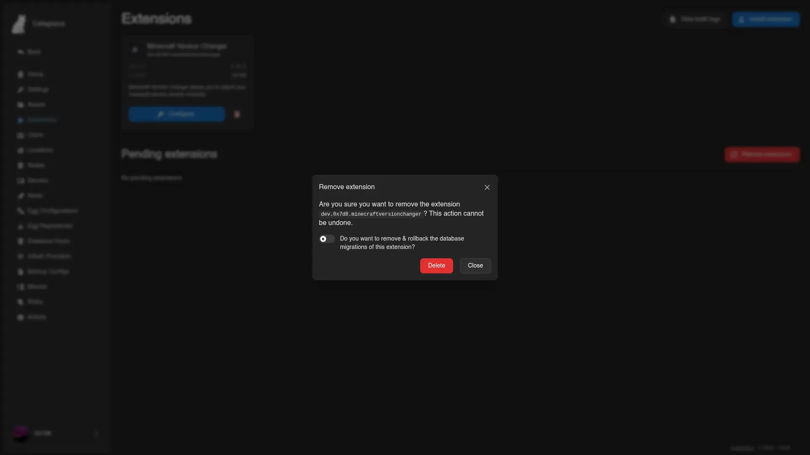

# Uninstalling Extensions

Sometimes an extension isn't working out, or you no longer need its functionality, or you want a clean slate before installing a different version. This page covers how to remove an extension from your Calagopus Panel - and what happens to its data when you do (spoiler: it stays put).

::: warning Data is not removed when an extension is uninstalled
Uninstalling an extension removes its code, not its data. The settings the extension stored, any rows it wrote into core tables via model extensions, and any tables/columns its migrations created **all stay in the database**. The Panel deliberately leaves them alone, because:

- If you reinstall the same extension later (after troubleshooting, or to upgrade to a newer version), it picks up exactly where it left off - users don't lose their configuration, server data isn't wiped.
- If you've decided to permanently get rid of an extension, the data it left behind is yours to inspect, archive, or drop on your own terms.

There's an opt-in `--remove-migrations` flag on the dev-environment uninstall command that will roll back the extension's migrations during removal. **It's not recommended.** Migrations rolling back means dropping columns, dropping tables, deleting data. If you're confident you want it gone, run a manual database cleanup with a backup in hand instead - that way you know exactly what's getting deleted.
:::

::: warning Requires the `:heavy` image or a development environment
Same as installing: the regular `:latest` and `:nightly` Docker images don't have the toolchain to recompile after an extension is removed. You need either the `:heavy` / `:nightly-heavy` Docker image variant, or a full local development environment.
:::

## Uninstall an Extension

Pick the matching tab for your environment:

::::tabs
=== With Docker

Two ways to uninstall, same end result.

**Option 1: Remove through the admin UI.** Open the Panel's extension management page, find the extension you want to remove, and click Uninstall. The Panel handles the recompile and reload.



**Option 2: Delete the file and restart.** Remove the `.c7s.zip` from the Panel's `extensions/` data directory (with the default heavy compose stack, that's `./build/extensions` relative to your compose file), then restart the container:

```bash
docker compose restart web
```

The Panel notices the file is gone on startup and uninstalls accordingly.

=== With Development Environment

Run the remove command with the extension's package name (the same identifier from its `Metadata.toml`):

```bash
panel-rs extensions remove dev.yourname.extension
```

That removes the extension source from your tree but leaves the existing compiled binary running. To recompile without it:

```bash
panel-rs extensions apply --profile balanced
```

Same `apply` command you'd use after installing - it rebuilds the Panel against whatever extensions are currently in the source tree.

::: details Removing migrations as well
If you're absolutely certain you want the extension's database changes rolled back along with its code, there's a `--remove-migrations` flag:

```bash
panel-rs extensions remove dev.yourname.extension --remove-migrations
```

This runs the extension's `down.sql` migrations during removal. **Read the data-persistence warning at the top of this page first.** This is destructive, irreversible without a backup, and almost always not what you want - prefer manually cleaning up the database after you've confirmed what's actually in there.
:::

::::

## After Uninstalling

The Panel's no longer running the extension's code, but the extension's data is still in the database. What you do next depends on why you uninstalled:

- **Troubleshooting** - reinstall the same `.c7s.zip`, the extension picks back up with all its previous data intact. The Panel doesn't track "this extension was uninstalled and reinstalled" as a distinct state; it just sees the source is back and compiles it in.
- **Upgrading to a new version** - install the new `.c7s.zip` directly, no need to uninstall the old one first. The Panel handles the swap, and the extension's own migration scripts handle any schema changes between versions.
- **Permanent removal** - the extension's columns and tables linger in your database. If you want them gone, write SQL to drop them manually after taking a backup. Look at the extension's `migrations/` directory (in the original `.c7s.zip` if you still have it) to see exactly what got created.
