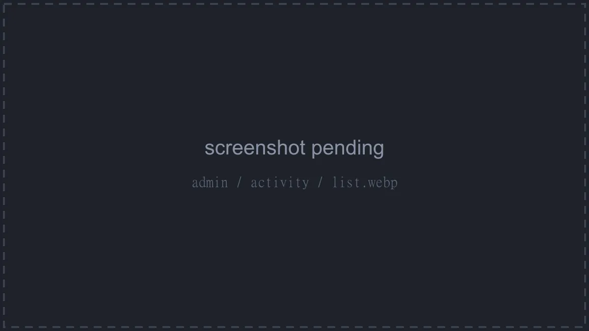
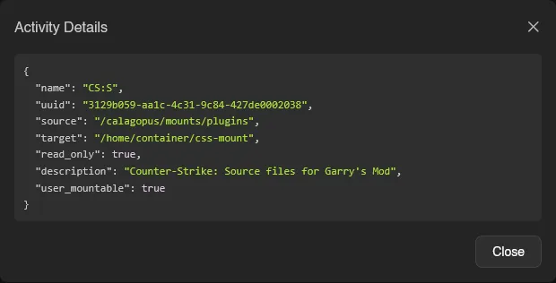

# Activity

**Activity** under **Users & Access** is the panel-wide audit log: every admin-side action, who performed it, from which IP, and when. It works exactly like the [server activity](../server/activity.md) page, searchable and paginated, with an **Actor** column (including "Impersonated by ..." markers and **System** rows for actions without a user), Event, IP, and When, plus an info button on rows carrying extra JSON metadata. Click an actor to filter the log to that user; **Clear User Filter** undoes it.



Events are namespaced by the admin resource they touch, which makes searching easy:

```
settings:update      user:create           role:update
server:create        oauth-provider:update node:allocation.create
location:create      nest:create           egg-configuration:update
```



Per-account activity lives on each user's [Activity tab](./users.md#activity), and per-server activity on each server's [Activity page](../server/activity.md).

::: info
Admin activity is pruned automatically, by default after 180 days. Both the retention days and an optional cap on the number of entries kept are configured under [Settings > Activity](./settings.md#activity).
:::
