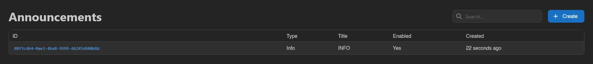
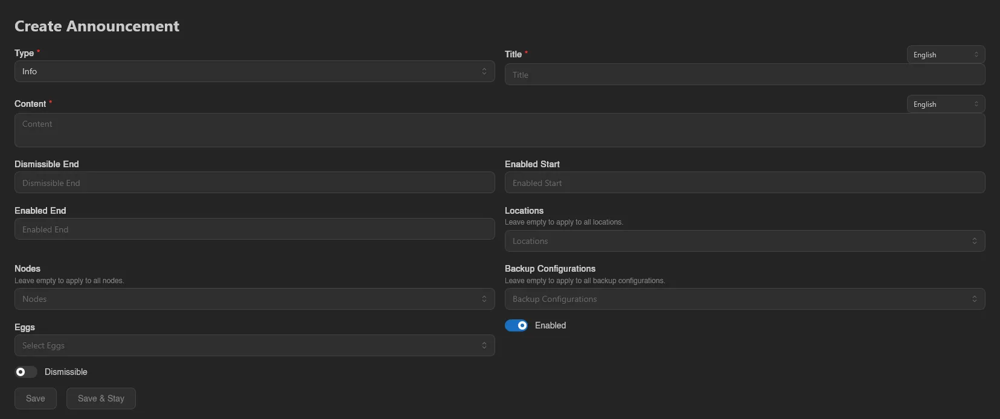
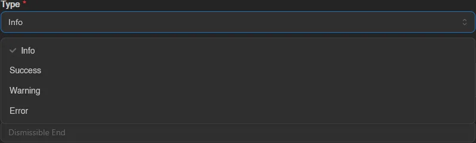
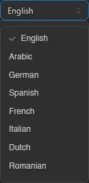
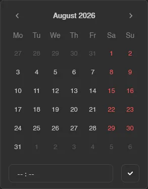
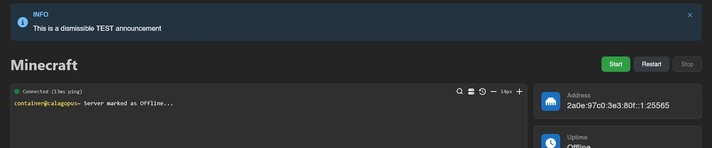

# Announcements

Announcements (**System** > **Announcements**) are colored banners shown to users at the top of the panel. Use them for maintenance windows, migrations, or anything else your users should see.

The list shows each announcement's **ID**, **Type**, **Title**, **Enabled**, and **Created**.

## Creating an Announcement

Click **Create**.

| Field | Meaning |
| --- | --- |
| **Type** | **Info**, **Success**, **Warning**, or **Error**; sets the banner color and icon. |
| **Title** | Banner heading. Localizable: provide per-language variants alongside the default. |
| **Content** | Banner body, rendered as Markdown. Localizable like the title. |
| **Enabled** | Master switch; disabled announcements never show. |
| **Enabled Start** / **Enabled End** | Optional schedule window. Outside it, the announcement is hidden even while enabled. |
| **Dismissible** | Lets users close the banner. Dismissals are stored in the user's browser. |
| **Dismissible End** | Optional date after which dismissals expire: the banner comes back for everyone and can no longer be closed. |

The four types set the banner's color and icon, the language selector next to Title and Content holds the per-language variants, and the Enabled Start/End fields use a date picker with an optional time. Every user sees the variant matching their own panel language, with the default text as the fallback for languages you didn't fill in:

### Targeting

Four optional fields scope who sees the announcement: **Locations**, **Nodes**, **Backup Configurations**, and **Eggs**. Each one says "Leave empty to apply to all", and leaving all four empty makes the announcement global.

Finish with **Save**, or **Save & Stay** to keep creating. Opening an existing announcement shows the same form with **Duplicate** and **Delete** buttons.

## Where Announcements Render

- An announcement with **no targeting** shows at the top of every dashboard page, for every user.
- An announcement with **any targeting** shows only on server pages, and only for servers matching at least one selected location, node, backup configuration, or egg.

In both cases only enabled announcements inside their schedule window are shown.

Managing announcements requires the `announcements.create`, `announcements.update`, and `announcements.delete` admin permissions. See the [Permissions Reference](../dashboard/permissions.md).
