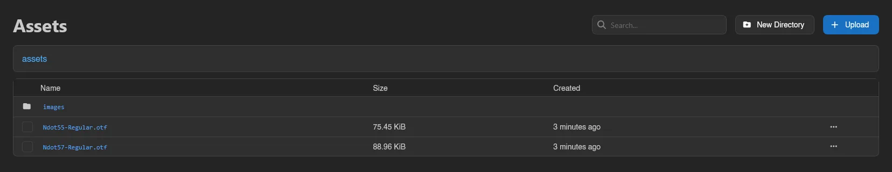

# Assets

Assets (**System** > **Assets**) is a small file browser for publicly served files. Anything you upload here gets a public URL, which is exactly what the **Icon** and **Banner** fields in [Settings > Application](./settings.md#application) expect: those fields autocomplete from your uploaded assets.

The browser shows a breadcrumb (starting at `assets`) and a table with **Name**, **Size**, and **Created**. Click a directory to enter it, click a file name to open it in a new tab, and use the search box to find assets in the current directory by name.

## Uploading and Organizing

- **Upload** picks files from your machine; you can also drag and drop files anywhere on the page ("Drop files here to upload"). Uploads continue if you navigate away, with a progress toast ("Uploading 3 files to the admin assets...") whose close button cancels them and whose **Show files** button brings you back here. There is no restriction on file type or size here - the panel stores whatever you give it and serves it publicly, so treat this as a trusted-admin surface and don't upload anything you wouldn't publish.
- **New Directory** previews the full path for a new folder inside the current one; the folder itself isn't created until you upload a file into it.

## Managing Assets

Right-click a file for:

- **Copy Link**: copies the asset's public URL.
- **Delete**: removes the asset after confirmation. Deletion cannot be undone.

You can also select multiple files (checkboxes, Ctrl+click, drag selection, or Ctrl+A for everything on the page) and delete them in one go with the action bar or the Delete key.

## Public URLs

With the default filesystem storage driver, assets are served by the panel itself at `<panel URL>/assets/<path>`, e.g. `https://panel.example.com/assets/branding/icon.png`. With the S3 storage driver, links use the bucket's configured **Public URL** instead. The storage driver is set in [Settings > Storage](./settings.md#storage).

Uploading requires the `assets.upload` admin permission, deleting `assets.delete`, viewing `assets.read`. See the [Permissions Reference](../dashboard/permissions.md).
