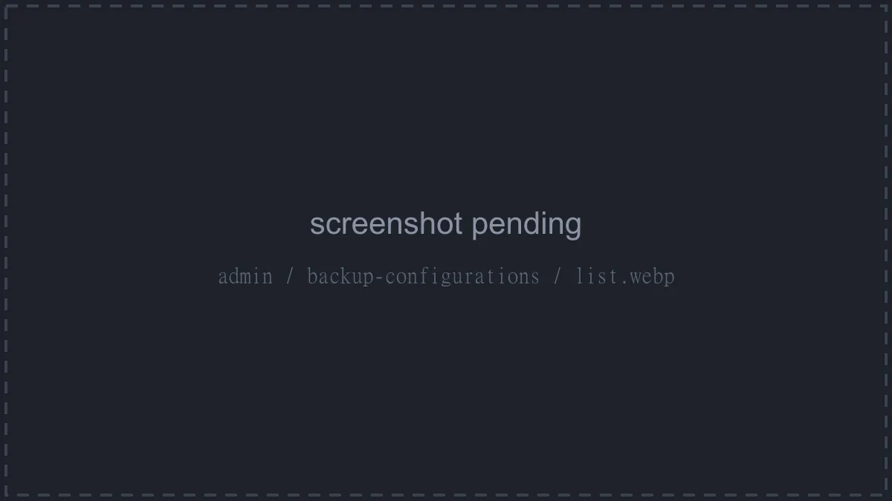

# Backup Configurations

Backup configurations (**Storage** > **Backup Configurations**) define where and how server backups are stored: local disk, S3, restic, Proxmox Backup Server, Kopia, or a filesystem snapshot.

::: info
This page only describes the admin UI surface. The full walkthrough, including every per-disk field, driver comparison, and assignment guide, lives at [Setting up Backup Configurations](../../../wings/advanced/backup-configurations.md).
:::

The list shows each configuration's **ID**, **Name**, **Disk**, and **Created**.

## Creating a Configuration

Click **Create**. The common fields are **Name**, **Backup Disk** (Local, S3, Ddup-Bak, Btrfs, ZFS, Restic, Proxmox Backup Server, or Kopia), **Description**, and two switches:

- **Maintenance Enabled**: "If enabled, any server using this backup configuration will not be able to create new backups, or manage existing ones."
- **Shared**: "If enabled, backups on this backup configuration will not be transferred between nodes, they will be assumed to be accessible by all nodes."

Picking S3, Restic, Proxmox Backup Server, or Kopia reveals a disk-specific settings section; the node-local disks need none. See the [per-disk field reference](../../../wings/advanced/backup-configurations.md#backup-disks) for what goes in each. Btrfs, ZFS, and Ddup-Bak show a warning with extra requirements when selected.

## Where Configurations Attach

A configuration takes effect once it's assigned to a **location**, **node**, or **server**; the panel picks the most specific one when a backup is created (server first, then node, then location). Assignment happens on those resources' own edit forms, each of which has a **Backup Configuration** field. See [Assigning a Backup Configuration](../../../wings/advanced/backup-configurations.md#assigning-a-backup-configuration).

Opening a configuration shows tabs for **General** (the edit form, plus **Duplicate** and **Delete**), **Stats**, **Backups** (every backup stored on it), and read-only **Locations**, **Nodes**, and **Servers** lists showing where it's currently assigned.

Managing configurations requires the `backup-configurations.create`, `backup-configurations.update`, and `backup-configurations.delete` admin permissions; the Backups tab uses `backup-configurations.backups`. See the [Permissions Reference](../dashboard/permissions.md).
