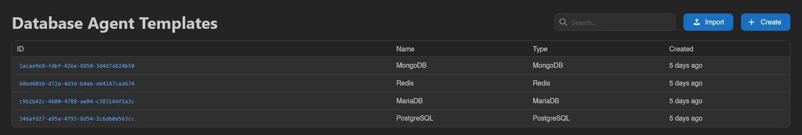
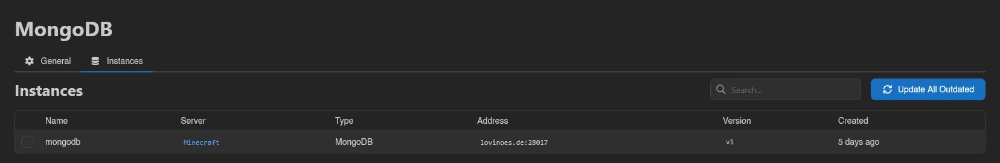

# Database Agent Templates

Templates are the blueprints for managed databases: each one defines the Docker images an instance can run, its environment, volumes, and resource limits. When a user [creates a managed database](../server/databases.md#creating-a-managed-database), they pick from your templates, grouped by database type.

::: info
[Setting up Templates](../../../db-agent/templates.md) has ready-to-import example files for PostgreSQL, MariaDB/MySQL, MongoDB, and Redis, plus a full field reference. Importing a preset and adapting it beats writing one from scratch.
:::

The list at `/admin/database-agent-templates` shows each template's ID, Name, Type, and Created date.

## Import and Create

**Import** accepts a `.json`, `.yml`, or `.yaml` template file; you can also just drag files onto the page. **Create** opens a blank form instead. Both need the `database-agent-templates.create` permission.

The form's fields, briefly (see the [field reference](../../../db-agent/templates.md#field-reference) for the details that matter when building your own):

| Field | Description |
| ----- | ----------- |
| **Name**, **Description** | What users see when picking a template. |
| **Type** | **PostgreSQL**, **MariaDB**, **MongoDB**, or **Redis**. Locked after creation. |
| **Docker Images** | Display name to image mappings. With more than one entry, users choose an image when creating an instance. |
| **Environment Variables** | Passed into the database container. |
| **Volumes** | Additional volume mounts. |
| **Socket Path** | The unix socket file path inside the database container; must match where the configured image actually creates its socket. |
| **Image UID** / **Image GID** | The user and group the container runs as. |
| **Memory**, **Swap**, **Disk**, **CPU Limit (%)** | Resource limits every instance created from this template gets (`0` means no limit, `-1` for swap). |
| **Deployment Enabled** | Whether users can create new instances from this template. Templates with it off stay usable by existing instances but disappear from the create dialog. |

**Command** and **IO Weight** only appear with the **Advanced** toggle enabled.

## Versions and Updating Instances

Each template carries a version, shown as a badge on its **General** tab; saving a change to the template's runtime configuration bumps it. Instances remember the version they were created or last updated from, so after a change they show up as **Outdated**.

The **Instances** tab lists every instance using the template: Name, Server, Type, Address, Version, and Created, with an **Outdated** badge where an update is pending. Select instances (drag, Ctrl/Cmd-click, or Ctrl/Cmd+A) and hit **Apply Updates**, or use **Update All Outdated** for everything at once, including instances not shown by the current search.

::: warning
Applying updates restarts the affected databases to pick up the new configuration. Locked instances and instances on hosts in maintenance mode are skipped. Users can also apply a pending update themselves from the instance page.
:::

## Export, Duplicate, and Delete

On a template's **General** tab: **Export** downloads the template **as JSON** or **as YAML**, in the same format **Import** accepts, which makes it easy to move templates between panels. **Duplicate** creates a copy under a **New Name**, and **Delete** removes the template after confirmation.
