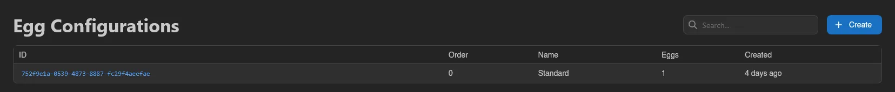
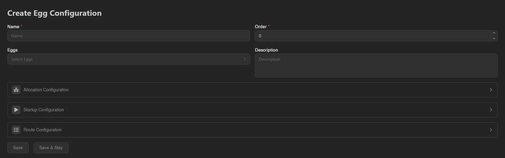
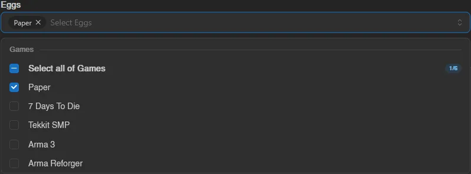
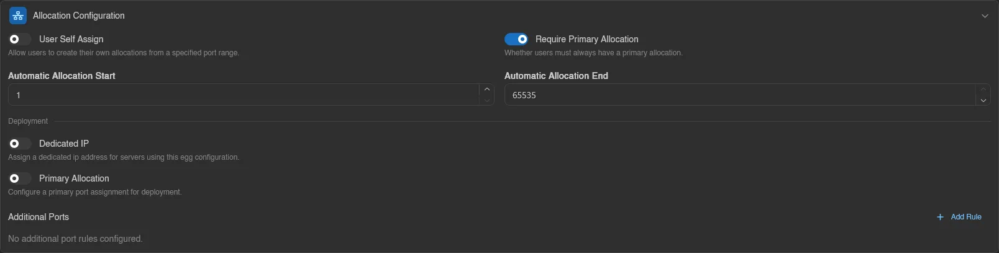
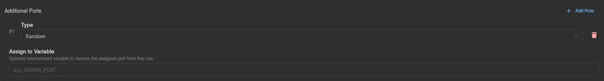
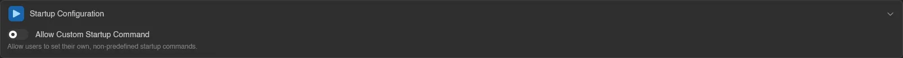
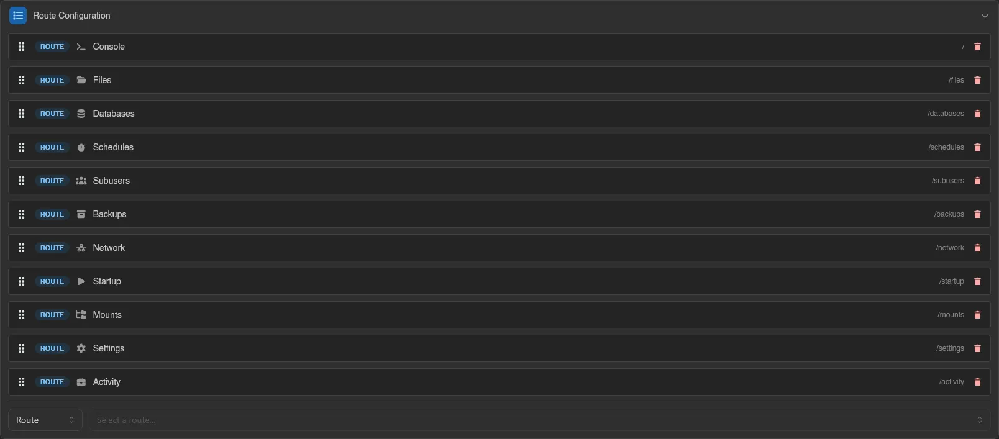
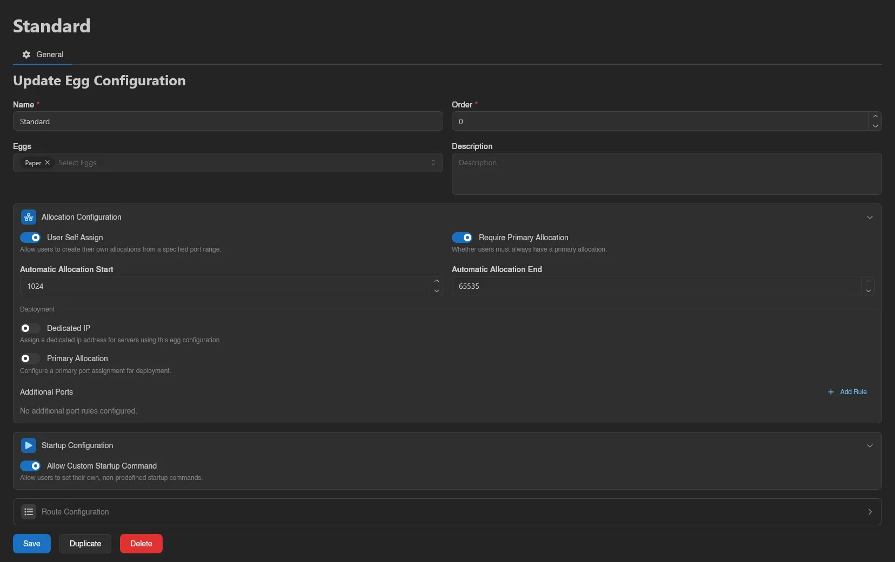

# Egg Configurations

An egg configuration is a named set of [eggs](./nests.md) plus optional behavior that applies to every server using one of those eggs: how allocations are assigned, whether users may write their own startup command, and which pages the server sidebar shows. It's a Calagopus concept with no Pterodactyl equivalent, and it lets you define this behavior once instead of per egg.

The list shows ID, **Order**, Name, **Eggs** (how many eggs the configuration contains), and Created. Use the search box to filter.

## How Configurations Stack

An egg can appear in multiple configurations. All configurations containing a server's egg apply, sorted by their **Order** value (lowest first, creation date as tie-breaker), and each section (allocation, startup, page order) is taken from the last configuration in that ordering that defines it.

If no configuration defines a section, the built-in defaults apply: self-assign off, primary allocation required, custom startup commands off, sidebar in its normal order. In practice: put your broad defaults at a low Order and targeted overrides at a higher one.

## Creating and Editing

Click **Create**, or open a configuration's ID to edit it. The base fields are **Name**, **Order**, **Eggs** (a multi-select grouped by nest, each group with a **Select all** row and a selected count), and **Description**. If your panel has no eggs yet, a warning tells you to create a nest and egg first.

Below are three collapsible sections. Each has an enable toggle; a disabled section isn't defined by this configuration, so a lower-priority one (or the default behavior) applies.

### Allocation Configuration

The top half controls what users can do on their server's [Network page](../server/network.md):

- **User Self Assign**: lets users create their own allocations, drawn from the **Automatic Allocation Start** / **Automatic Allocation End** port range. Without a configuration enabling this, the client-side create button is rejected.
- **Require Primary Allocation**: whether users must always have a primary allocation.

The **Deployment** half controls automatic allocation assignment when servers are deployed through the deployment API (a manual allocation choice always wins over these rules):

- **Dedicated IP**: assign a dedicated IP address for servers using this configuration.
- **Primary Allocation**: pick the primary port from a **Primary Start Port** / **Primary End Port** range, with an optional **Assign to Variable** (e.g. `SERVER_PORT`) that receives the assigned port as an environment variable.
- **Additional Ports**: extra allocation rules, added with **Add Rule**. Each rule has a type: **Random**, **Port Range** (start/end), or one derived from the primary port, **Add to Primary**, **Subtract from Primary**, **Multiply Primary**, **Divide Primary** (each with a **Value**). Every rule also takes its own optional **Assign to Variable**.

### Startup Configuration

One switch: **Allow Custom Startup Command**. When off, users on the server's [Startup page](../server/startup.md) can only pick between the egg's predefined startup commands; when on, they can write their own.

### Route Configuration

Reorders the server sidebar for affected servers. Each entry shows its path and has a remove button; drag entries to reorder. The bottom row adds entries by type: **Route** picks a page, **Divider** (optionally named) groups them, **Redirect** (a name plus a destination URL) adds an external link. Divider and redirect names are translatable per language.

::: warning
Pages left out of the list are not just hidden from the sidebar, they become inaccessible for those servers. Only remove pages you genuinely want to cut off.
:::

## Duplicating and Deleting

When editing, **Duplicate** copies the whole configuration under a new name and **Delete** removes it (servers and eggs are untouched, only the layered behavior disappears).

::: info
These actions map to the `egg-configurations.*` admin permissions; see the [Permissions Reference](../dashboard/permissions.md).
:::
