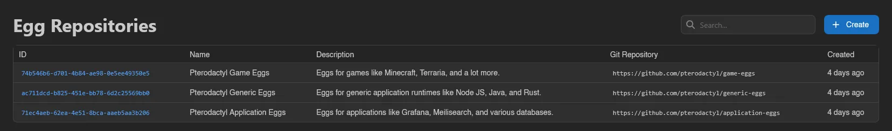
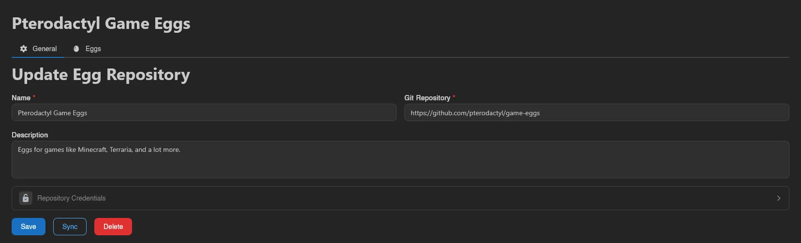
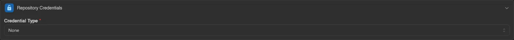
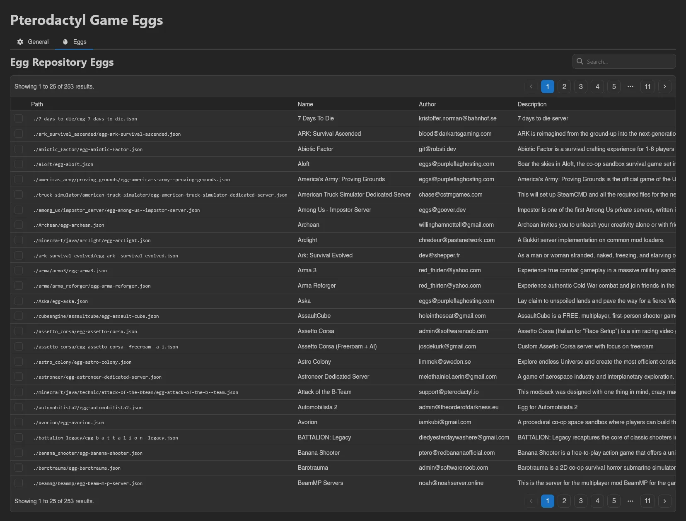
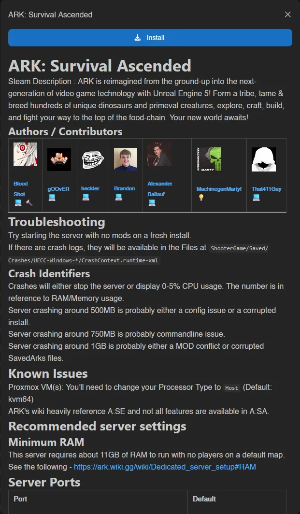

# Egg Repositories

Egg repositories connect Git repositories containing egg definitions to your panel, so you can browse and install eggs without downloading files by hand. This page describes the admin surface; the full setup and usage walkthrough, including importing and updating eggs, lives in [Setting up Egg Repositories](../../next-steps/egg-repos.md).

The list shows ID, Name, Description, **Git Repository**, and Created. Repositories you selected during the panel's first-time setup appear here already; use the search box to filter.

## Creating and Editing

Click **Create** and fill in **Name**, **Git Repository** (the repository URL), and an optional **Description**. Opening an existing repository shows the same form on its **General** tab, next to the [Eggs](#eggs-tab) tab, with **Sync** and **Delete** alongside **Save**.

For private repositories, enable the **Repository Credentials** section and pick a **Credential Type**: **None**, **Password** (a **Username** plus a **Password or Access Token**), or **Private Key** (a **Username** plus an SSH **Private Key** with optional **Passphrase**). Password credentials work with both `https` and `ssh` repository URLs; private keys require an `ssh` one.

## Syncing

Open a repository and hit **Sync**. The panel clones the repository, scans it for egg definitions (`.json`, `.yml`, `.yaml`, with any nearby README picked up for the preview drawer), refreshes the repository's egg list, and drops entries that no longer exist in the repository. Syncing never installs or modifies eggs in your nests; it only updates what's available to install.

## Eggs Tab

The **Eggs** tab lists everything found by the last sync (Path, Name, Author, Description, Updated), searchable and paginated. Click a row to open its README in a drawer with its own **Install** button, or select eggs and **Install** them into a nest. See [the walkthrough](../../next-steps/egg-repos.md) for the install and update flows step by step.

::: info
Actions here map to the `egg-repositories.*` admin permissions (syncing needs `egg-repositories.sync`); see the [Permissions Reference](../dashboard/permissions.md).
:::
