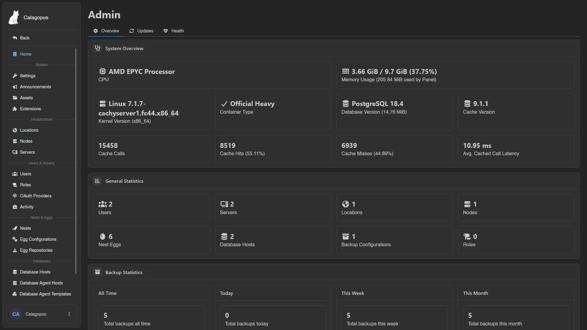
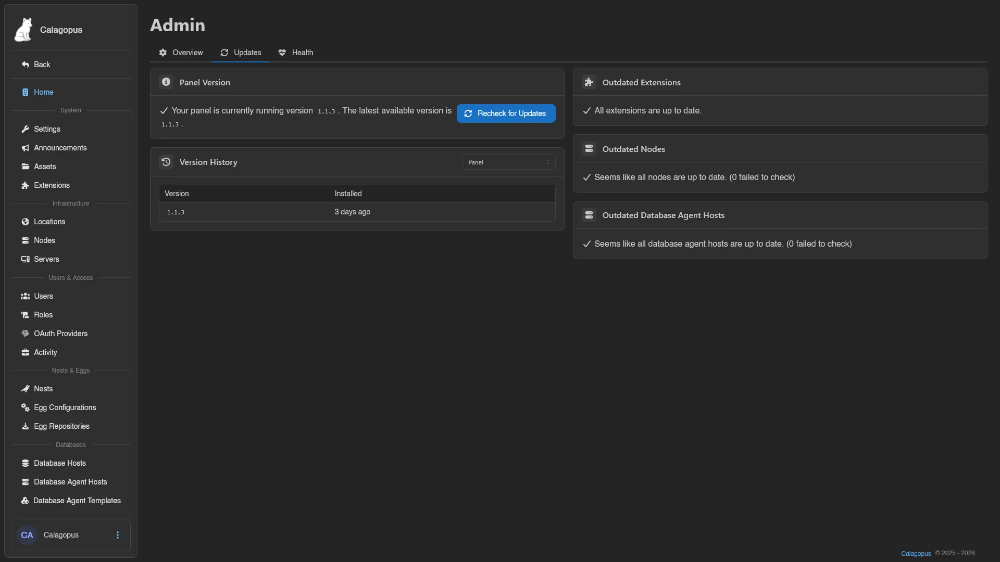
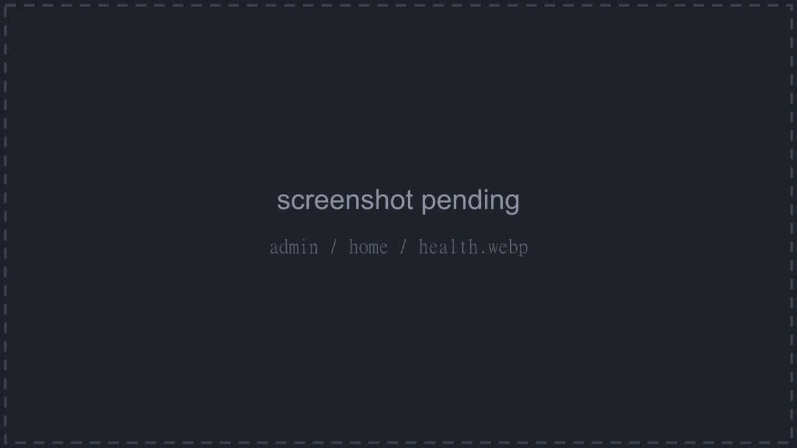

# Admin

The Admin area is the instance-wide side of the panel: nodes, servers, users, eggs, databases, and panel settings all live here. It's only visible to administrators: root admins (accounts with the **Admin** toggle, see [Users](./users.md)) and users granted admin permissions through a [Role](./roles.md). See the [Permissions Reference](../dashboard/permissions.md) for what each admin key covers.

The sidebar starts with **Back** (returns to the dashboard) and **Home**, followed by these groups, and the [Quick actions](../dashboard/index.md#quick-actions) palette (`Ctrl+Space`) jumps to any of these pages by name:

## System

| Page | Description |
| --- | --- |
| [Settings](./settings.md) | Panel-wide configuration, from branding to rate limits |
| [Announcements](./announcements.md) | Panel-wide announcement banners |
| [Assets](./assets.md) | Public file hosting for the panel, e.g. custom icons and banners |
| [Extensions](./extensions.md) | Install and manage panel extensions |

## Infrastructure

| Page | Description |
| --- | --- |
| [Locations](./locations.md) | Group nodes by physical or logical location |
| [Nodes](./nodes.md) | The Wings machines your servers run on |
| [Servers](./servers.md) | Every server on the panel, from creation to transfers |

## Users & Access

| Page | Description |
| --- | --- |
| [Users](./users.md) | All user accounts on the panel |
| [Roles](./roles.md) | Named sets of admin and server permissions |
| [OAuth Providers](./oauth-providers.md) | Third-party login and account linking |
| [Activity](./activity.md) | Audit log of admin-side actions |

## Nests & Eggs

| Page | Description |
| --- | --- |
| [Nests](./nests.md) | Collections of eggs, the server type definitions |
| [Egg Configurations](./egg-configurations.md) | Named, ordered sets of eggs with deployment settings |
| [Egg Repositories](./egg-repositories.md) | Git repositories to import eggs from |

## Databases

| Page | Description |
| --- | --- |
| [Database Hosts](./database-hosts.md) | MySQL and PostgreSQL hosts for user-created databases |
| [Database Agent Hosts](./database-agent-hosts.md) | Hosts running the [database agent](../../../db-agent/index.md) for managed database instances |
| [Database Agent Templates](./database-agent-templates.md) | Templates defining managed database images and resource limits |

## Storage

| Page | Description |
| --- | --- |
| [Mounts](./mounts.md) | Host directories that can be mounted into server containers |
| [Backup Configurations](./backup-configurations.md) | Where server backups are stored |
| [System Backup Policies](./system-backup-policies.md) | Scheduled automatic server backups with retention, scoped to locations, nodes, or servers |

## Home

`/admin` lands on Home, a status dashboard with three tabs: **Overview**, **Updates**, and **Health**. The **Updates** and **Health** tabs require the `stats.read` permission, and so does the content of **Overview**. Whenever a newer panel version is available, a banner at the top links to the upgrade instructions.

### Overview

Three cards:

- **System Overview**: CPU model, memory usage (including how much the panel process itself uses), kernel version and architecture, container type (**Official**, **Official AIO**, **Official Heavy**, or **None detected**), PostgreSQL version and database size, cache version, and cache calls/hits/misses with the average cached call latency.
- **General Statistics**: how many **Users**, **Servers**, **Locations**, **Nodes**, **Nest Eggs**, **Database Hosts**, **Backup Configurations**, and **Roles** the panel has.
- **Backup Statistics**: backup counts for **All Time**, **Today**, **This Week**, and **This Month**, each broken down into total, successful (with size), failed, and deleted.

### Updates

- **Panel Version**: the version you're running versus the latest available, with a **Recheck for Updates** button that re-runs every update check on this tab.
- **Version History**: a table of installed versions and when they were installed. The dropdown switches between the panel's history and each extension's.
- **Outdated Extensions**: extensions with a newer version available, listing package name, installed and latest version, and the changelog. Extensions that failed the update check are listed separately with their error.
- **Outdated Nodes**: nodes running an older Wings version than the latest, including how many failed to check. Requires `nodes.read`.
- **Outdated Database Agent Hosts**: the same for database agent hosts. Requires `database-agent-hosts.read`.

### Health

- **General Health**: applied database migrations (e.g. `107 / 107 (100.00%)`) and the panel's **Avg. NTP Offset**, highlighted when it climbs above 100 ms.
- **Extension Migration Health**: applied versus total migrations per installed extension.
- **Debug Mode**: shows whether debug mode is currently enabled, with an **Enable Debug Mode** / **Disable Debug Mode** button (requires `settings.update`). The setting resets to its default when the application restarts.
- **Desync Nodes**: nodes whose clock is more than 5 seconds off the panel's clock, which can cause file download and console issues. Ideally this list stays empty.
