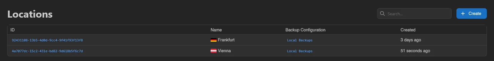
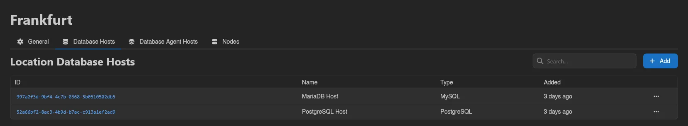

# Locations

Locations group nodes together, usually by region or provider. They do three things:

- **Organize nodes**: every node belongs to exactly one location, and the location's **Nodes** tab lists them.
- **Backup configuration inheritance**: nodes without their own backup configuration use the one set on their location.
- **Database host attachment**: database hosts and database agent hosts attached to a location are available to every node in it, without attaching them to each node individually.

You need at least one location before you can create nodes; the Nodes page prompts you to create one if none exist. For the full node setup walkthrough, see [Configuring a New Node](../../../wings/next-steps/configure-node.md).

The list shows each location's ID, Name (with its flag, if set), Backup Configuration, and Created timestamp. Click an ID to open the location.

## Creating a Location

Click **Create** in the top right (requires `locations.create`).

| Field | Description |
|---|---|
| **Name** | Required. A label to distinguish this location. |
| **Backup Configuration** | Optional. Used by nodes in this location that don't set their own. Defaults to **None**. See [Backup Configurations](../../../wings/advanced/backup-configurations.md). |
| **Description** | Optional notes. |
| **Flag** | Optional country flag shown next to the name across the admin area. |

Hit **Save**, or **Save & Stay** to keep the form open for creating another.

::: info
Picking a backup configuration requires the `backup-configurations.read` admin permission. See the [Permissions Reference](../dashboard/permissions.md) for all `locations.*` keys.
:::

## Location Tabs

Opening a location shows four tabs: **General**, **Database Hosts**, **Database Agent Hosts**, and **Nodes**.

### General

The same form as creating, plus:

- **Duplicate** creates a copy under a new name (prefilled `<name> (copy)`).
- **Delete** removes the location after confirmation (requires `locations.delete`).

### Database Hosts

Database hosts attached here are offered to every node in the location. Click **Add** and pick a host from the list (grouped by type). Deleting a row only detaches the host from the location, the host itself keeps existing.

See [Setting up Database Hosts](../../../additional/database-hosts/index.md) for creating the hosts themselves.

### Database Agent Hosts

Same pattern for [database agent](../../../db-agent/index.md) hosts: **Add** attaches an existing agent host to the location, deleting a row detaches it.

### Nodes

A read-only list of the nodes assigned to this location, in the same format as the main [Nodes](./nodes.md) list.
