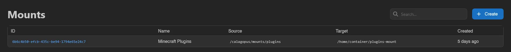
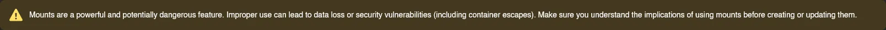
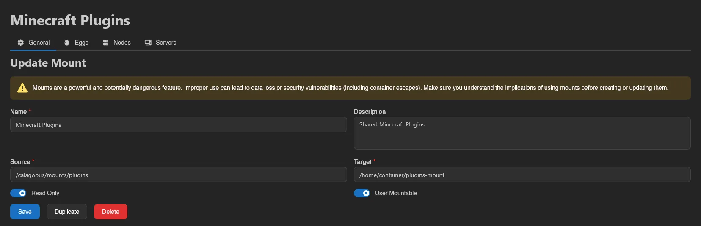
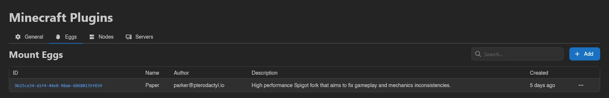
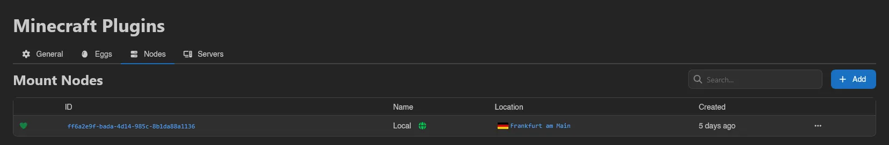
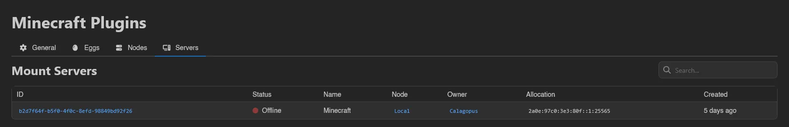

# Mounts

Mounts make a directory on a node's host machine available inside server containers at a fixed path, for example a shared plugins or assets folder. This page (**Storage** > **Mounts**) is where you define them; users attach and detach them from their server's [Mounts page](../server/mounts.md).

The list shows each mount's **ID**, **Name**, **Source** (the path on the host, e.g. `/srv/mounts/plugins`), **Target** (the path inside the container, e.g. `/home/container/plugins-mount`), and **Created**.

## Creating a Mount

Click **Create** in the top right.

| Field | Meaning |
| --- | --- |
| **Name** | Display name shown to admins and users. |
| **Description** | Optional, shown on the user-facing mounts table. |
| **Source** | Directory on the host machine. |
| **Target** | Path inside the container where the source appears. |
| **Read Only** | Mounts the directory read-only inside the container. |
| **User Mountable** | Lets users attach and detach the mount themselves. |

::: warning
Mounts are a powerful and potentially dangerous feature. A badly chosen source path can lead to data loss or security vulnerabilities, including container escapes. Make sure you understand the implications before creating one.

:::

Finish with **Save**, or **Save & Stay** to keep creating.

::: warning
Defining a mount in the panel is not enough on its own: Wings refuses any mount whose source is not whitelisted in the node's [`allowed_mounts`](../../../wings/configuration.md#allowed_mounts) setting. Add the source path there on every node that should serve the mount.
:::

## Eggs, Nodes, and Servers

Opening a mount shows four tabs: **General** (the edit form, plus **Duplicate** and **Delete**), **Eggs**, **Nodes**, and **Servers**.

**Eggs** and **Nodes** control eligibility: use **Add** to assign the mount to an egg or node, and right-click a row for **Remove**; both lists are searchable. A mount can only be attached to a server whose node *and* egg are both assigned here.

**Servers** is a read-only, searchable list of every server the mount is currently attached to, with the same columns as the [Servers](./servers.md) list.

## How Mounts Reach Users

For a mount to show up on a server's user-facing [Mounts page](../server/mounts.md), all three must be true: **User Mountable** is on, the server's node is assigned, and the server's egg is assigned. Mounts that are not user mountable can still be attached by an admin from the server's **Mounts** tab in the admin server view, as long as the node and egg are eligible.

Managing mounts requires the `mounts.create`, `mounts.update`, and `mounts.delete` admin permissions; the egg and node assignment tabs use `eggs.mounts` and `nodes.mounts`. See the [Permissions Reference](../dashboard/permissions.md).
