# Nodes

A node is a machine running wings that hosts servers. This page covers the admin UI surface; for the step-by-step setup of a new node, follow [Configuring a New Node](../../../wings/next-steps/configure-node.md).

The list shows a health indicator, ID, Name, Location, and Created timestamp for each node. The heart is green when the panel can reach wings, yellow and pulsing when a wings update is available, and broken red when the node is unreachable. Next to the name, a globe shows whether deployment is enabled (green) or disabled (red); an All-in-One node (wings built into the panel container) gets a purple heart.

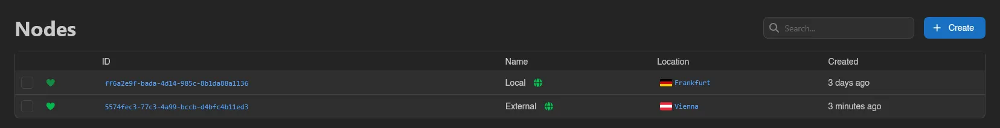

Select nodes with the checkboxes, by dragging, or with `Ctrl+A` (`Escape` clears). An action bar appears with **Update Config**, which opens a YAML editor and applies the entered configuration to every selected node at once.

## Creating a Node

Click **Create** in the top right (requires `nodes.create`). If no location exists yet, a create-location modal appears first.

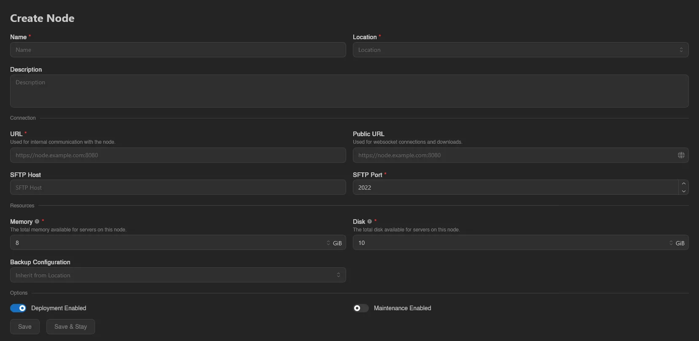

| Field | Description |
|---|---|
| **Name** | Required. A short, identifiable name. |
| **Location** | Required. The [location](./locations.md) this node belongs to. |
| **Description** | Optional notes. |

**Connection** section:

| Field | Description |
|---|---|
| **URL** | Required. "Used for internal communication with the node.", e.g. `https://node.example.com:8080`. If you leave the port off, a warning explains the panel will connect on the URL's implicit port instead of the wings default `8080`, with a one-click **Add :8080** button. |
| **Public URL** | Optional. "Used for websocket connections and downloads." by users' browsers. When editing, the globe button fills in a `wings-proxy` URL that routes browser traffic through the panel. |
| **SFTP Host** | Optional. Custom SFTP hostname shown to users; defaults to the URL's hostname. |
| **SFTP Port** | Required, default `2022`. |

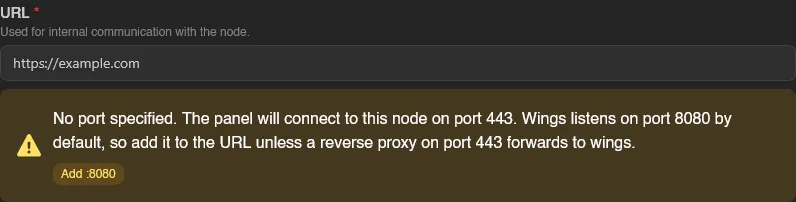

**Resources** section:

| Field | Description |
|---|---|
| **Memory** | Required, default 8 GiB. "The total memory available for servers on this node." `0` means no limit. |
| **Disk** | Required, default 10 GiB. "The total disk available for servers on this node." `0` means no limit. |
| **Backup Configuration** | Optional. Defaults to **Inherit from Location**. See [Backup Configurations](../../../wings/advanced/backup-configurations.md). |

**Options** section: **Deployment Enabled** (on by default) controls whether new servers can be deployed to this node, and **Maintenance Enabled** (off by default) marks it as under maintenance.

Hit **Save**, or **Save & Stay** to create another. These limits are what deployment checks, not the physical machine capacity, so setting them above the real hardware over-allocates the node.

## Overview

Two status badges up top: **Deployment Enabled** / **Deployment Disabled** and **Under Maintenance** / **Not Under Maintenance**.

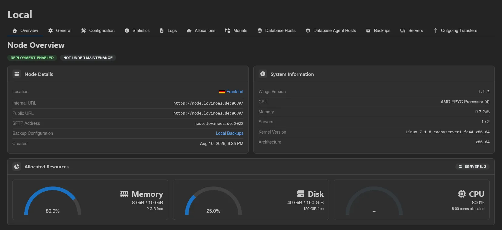

- **Node Details**: Location, Internal URL, Public URL, SFTP Address, Backup Configuration (shows **Inherited from Location** when the node has none of its own), Description, and Created.
- **System Information**: live data from wings - Wings Version (with an **Update Available** badge when outdated), CPU model and core count, Memory, Servers (online / total), Kernel Version, and Architecture. Shows **Unavailable** when the node can't be reached.
- **Allocated Resources**: what servers on this node have been promised, with a **Servers** count. Memory and Disk show allocated / limit gauges with the free remainder (the gauge turns red at 90% and caps at 100% even when over-allocated); a limit of `0` shows **No node limit**. CPU is always uncapped and shows the total allocated percentage as "cores allocated". Reserved container memory overhead is listed separately.

## General

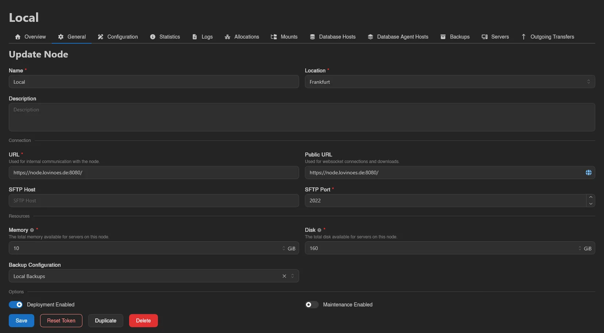

The same form as [creating a node](#creating-a-node), plus three extra buttons:

- **Reset Token** (requires `nodes.reset-token`): issues a new connection token. The wings config contains this token, so re-apply the configuration afterwards or the node loses contact.
- **Duplicate**: copies the node's settings under a new name.
- **Delete**: removes the node after confirmation.

## Configuration

Everything needed to connect wings to this node entry. The page starts collapsed behind **Reveal Configuration** because the output contains the node token (requires `nodes.read-token`). Hidden entirely on All-in-One nodes.

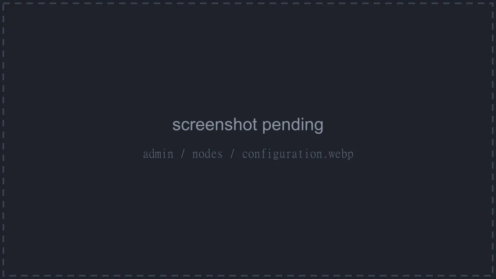

**Initial Setup** walks through three steps:

1. **Settings**: Panel URL ("The URL wings uses to reach this panel."), API Port ("The port wings listens on."), and SFTP Port. These generate the config below; a warning appears if the node URL's port doesn't match the API port.
2. **Apply Configuration**: the generated YAML to place into `/etc/pterodactyl/config.yml`, or a copyable `calagopus-wings configure --join-data <...>` one-liner that does it for you.
3. **Verify Connection**: checks **Backend to Wings** (panel reaches the node) and **Frontend to Wings** (your browser reaches it; the console, downloads, and uploads depend on this one).

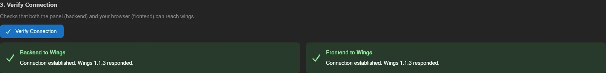

**Live Configuration** below edits the full `config.yml` of the running wings instance in a YAML editor. **Save Configuration** (or `Ctrl+S`) pushes it to the node. See the [wings configuration reference](../../../wings/configuration.md) for every option.

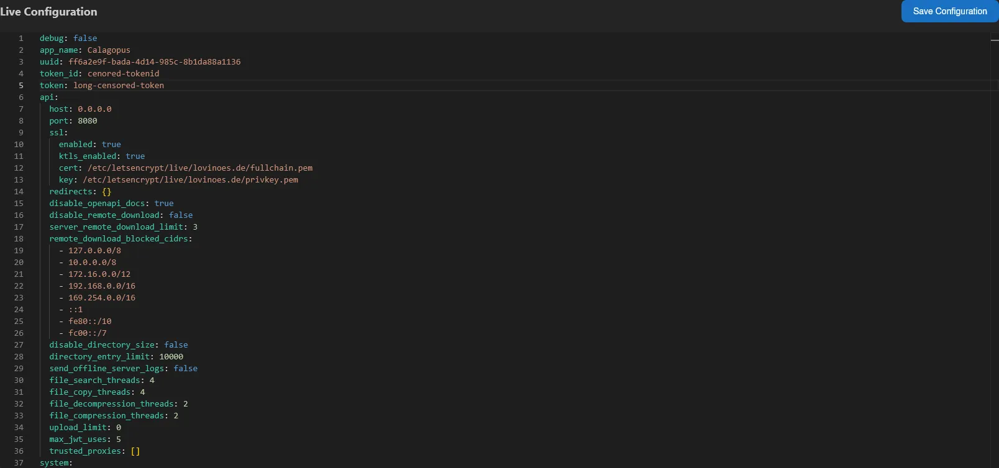

## Statistics

Live host metrics streamed from wings: CPU (model and threads), Memory (including how much wings itself uses), Disk, and Network gauges, followed by rolling **Graphs** for CPU Load, Memory Usage, Disk I/O (read/write), and Network Traffic (inbound/outbound).

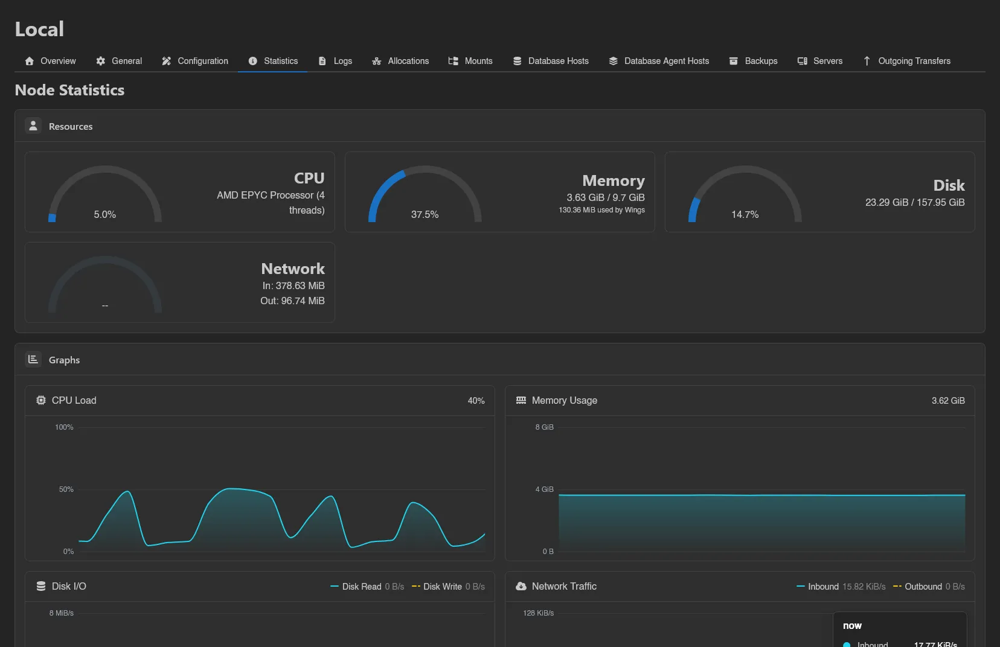

## Logs

Reads log files straight off the node. Pick a **Log File** (sizes shown in the dropdown), set **Lines** (default 1000), then **Load Logs** to view or **Download Full Log** to save it. The **Follow** switch tails the file live, with a connection indicator.

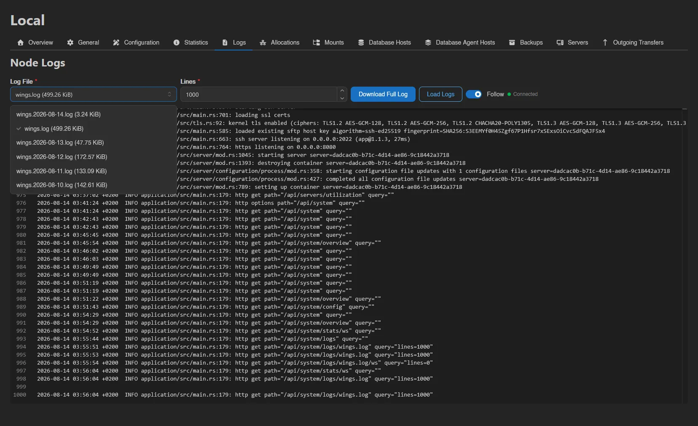

## Allocations

The node's IP:port pool that servers draw from (requires `nodes.allocations`). Columns: ID, Server (which server holds the allocation, if any), IP, IP Alias, Port, and Created. Filter by IP or port with the dropdowns next to the search box.

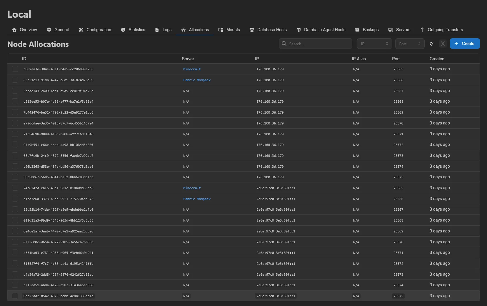

Click **Create** to bulk-create allocations: an **IP**, an optional **IP Alias**, and **Port Ranges** (single ports or ranges like `3000-4000`). The button shows how many allocations will be created.

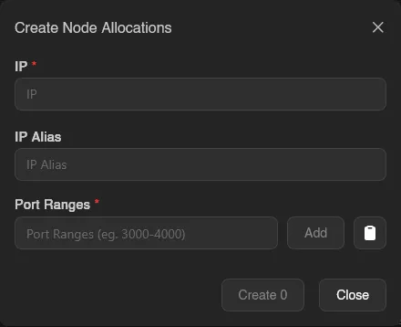

Select allocations (drag, checkboxes, or `Ctrl+A`) for the action bar: **Update** rewrites the IP or IP Alias of all selected at once, **Delete** removes them (also on the `Delete` key). See [Setting up Allocations](../../../wings/next-steps/setting-up-allocations.md) for guidance on choosing IPs.

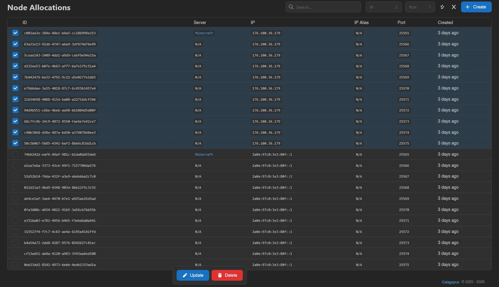

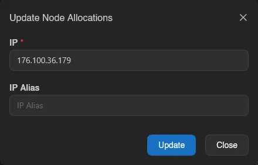

## Mounts

Which admin-defined [mounts](../server/mounts.md) are usable on this node (requires `nodes.mounts`). **Add** attaches an existing mount; removing a row only detaches it from the node. Wings must also allow the source path via [`allowed_mounts`](../../../wings/configuration.md#allowed_mounts).

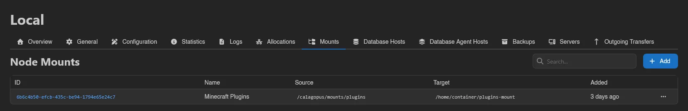

## Database Hosts

Database hosts attached directly to this node (requires `nodes.database-hosts`). Servers on a node can use hosts attached to the node or to its location. **Add** attaches an existing host, deleting a row detaches it. See [Setting up Database Hosts](../../../additional/database-hosts/index.md).

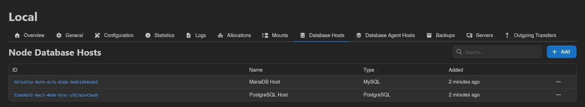

## Database Agent Hosts

Same attach/detach pattern for [database agent](../../../db-agent/index.md) hosts (requires `nodes.database-agent-hosts`).

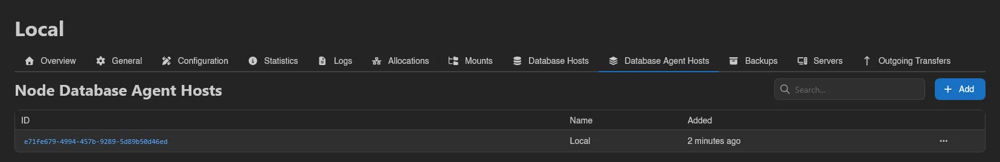

## Backups

Every backup stored on this node, regardless of which server it belongs to (requires `nodes.backups`). Columns: Name, Server, Checksum, Size, Files, and Created. The **Only show detached backups** switch filters to backups no longer linked to any server. A warning icon marks backups whose server now lives on a different node; those aren't viewable from the client area.

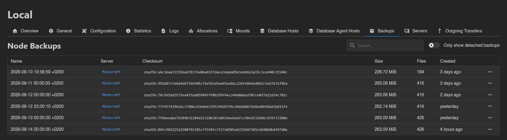

Right-click a backup for:

- **Download**, with a format submenu for streaming backups.
- **Restore**: pick a target server, optionally empty its filesystem first, and optionally restore the startup settings.
- **Export to Files**: unpack the backup into a server's filesystem at a destination directory, as an archive file.
- **Reattach** / **Detach**: link the backup to a server, or unlink it without deleting anything. Reattaching is not a transfer tool: unless the backup is on shared storage, the target server must be on the same node.
- **View Metadata**: the backup's raw metadata as JSON.
- **Delete**, with a **Force** switch that removes the backup even if its configuration is missing or the remote storage is unreachable (may leave orphaned files behind).

For the user-facing side, see [server Backups](../server/backups.md).

## Servers

All servers on the node, in the standard admin server list (ID, Status, Name, Node, Owner, Allocation, Created). The header buttons run mass actions against every server on the node, each with a count and a confirmation: **Start**, **Restart**, **Stop** (require `nodes.power`), and **Transfer** (requires `nodes.transfers`).

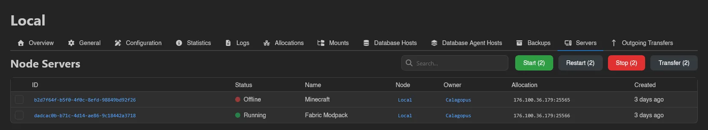

Select individual servers (checkboxes, drag, `Ctrl+A`, or click while holding `S`) to run the same actions on just the selection.

**Transfer Servers** moves servers to another node:

| Field | Description |
|---|---|
| **Node** | The destination node. |
| **Allocation Mode** | How allocations map onto the destination node; the six modes are listed below. |
| **Transfer backups** | "Whether to transfer backups along with the servers." |
| **Delete source backups** | Deletes the transferred backups on the source node once the transfer finishes. |
| **Archive Format** / **Compression Level** | How the server data is packed for the move: `.tar` or `.itaf`, plain or compressed as `.gz`, `.xz`, `.lz`, `.bz2`, `.lz4`, or `.zst`; the level is **Best Speed**, **Good Speed**, **Good Compression**, or **Best Compression**. |
| **Multiplex Channels** | Extra parallel HTTP connections for split archives, 0 to 16. |

The six **Allocation Mode** options, with the caveats their dropdown entries state:

- **None**: scraps all allocations; the server is not automatically assigned new allocations on the destination node.
- **Randomize primary allocation**: removes additional allocations.
- **Randomize all allocations**: recommended to avoid incompatibility issues with the destination node.
- **Preserve port numbers** (the default): reuses the same port numbers on the destination node where available, falls back to random allocations otherwise.
- **Assign allocations based on Egg deployment configuration**: only works if the egg has a [deployment configuration](./egg-configurations.md#allocation-configuration) and the destination node has compatible allocations.
- **Self-assign new allocations based on Egg port range**: only works if the egg has a port range and the destination node has compatible allocations.

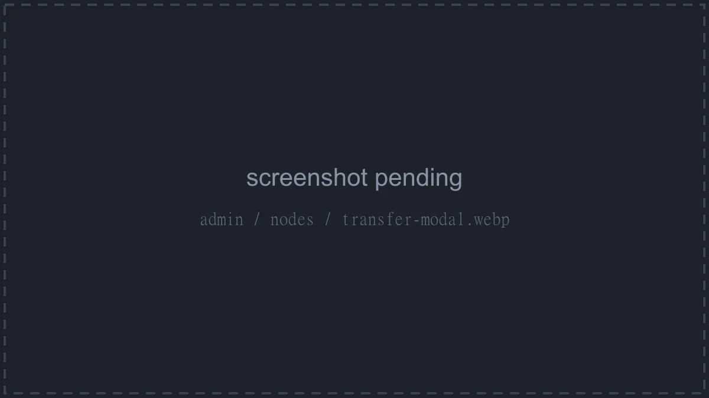

After confirming, you're taken to the **Outgoing Transfers** tab. Transfers cannot be undone.

## Outgoing Transfers

Live view of transfers currently leaving this node (requires `nodes.transfers`): ID, Progress, Archive Rate, Network Rate, Name, destination Node, Owner, and Created, updating in real time over a websocket.

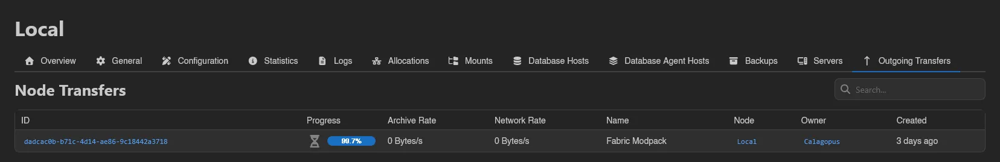

## Private Network

This tab puts the node on the **private network** (requires `nodes.tunnel`). Once it is on, the servers it hosts can join and be [connected privately](../server/network/connections.md) to servers on any other node that is also on the network: "Traffic goes node to node over an encrypted tunnel and never touches the public internet." The tab is hidden on All-in-One nodes.

The tunnel daemon has to be turned on for the node first, and it is off by default: see [`tundra.enabled`](../../../wings/configuration.md#tundra-enabled). Three alerts cover the cases where the node cannot take part:

| Alert | Meaning |
| --- | --- |
| **Unreachable** | "The node could not be reached, so its side of the network could not be checked." |
| **Not supported** | "This node **cannot run the private network**. It is either turned off in the node configuration, or the node uses rootless Docker, which is unsupported." |
| **No certificate** | "This node has **not reported a certificate**, so no peer can open a connection to it. Restart the node's tunnel daemon to re-enrol it." Peers dial a node by its certificate, so until one is reported nothing can connect to it. |

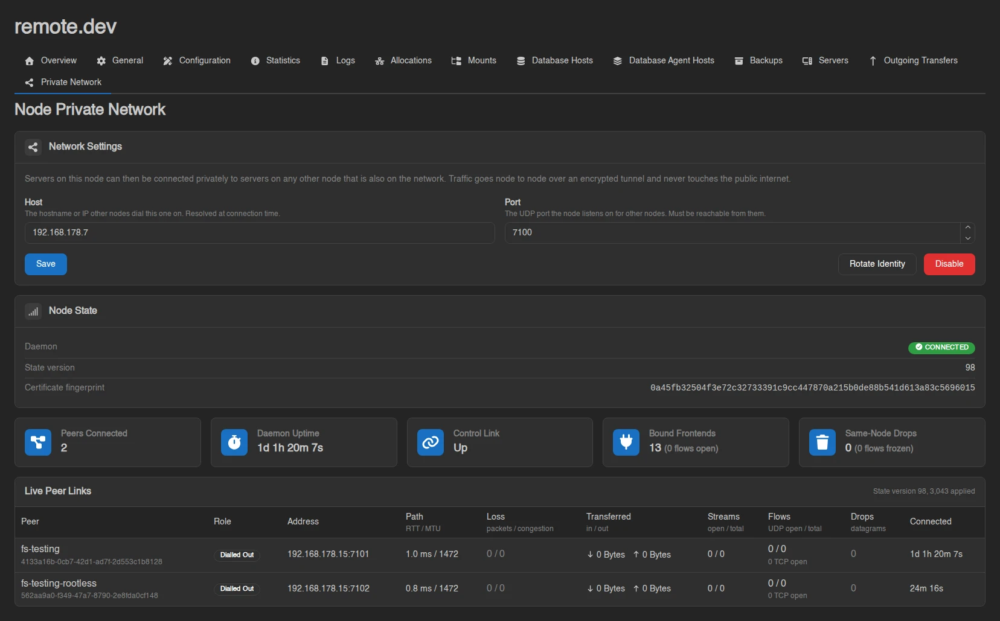

**Network Settings** holds the two fields peers need to find this node, and **Enable** puts it on the network:

| Field | Description |
|---|---|
| **Host** | "The hostname or IP other nodes dial this one on. Resolved at connection time." Defaults to the hostname from the node's URL. |
| **Port** | "The UDP port the node listens on for other nodes. Must be reachable from them." Default `7100`. It is a UDP port, not the wings API port. |

**Node State** below reports whether the daemon is **Connected**, the state version it is on, and the certificate fingerprint it enrolled with.

**Rotate Identity** replaces that certificate: "Peers sever their connections to this node immediately. It re-admits itself with a fresh certificate within a minute, and connections re-establish on their own."

**Disable** takes the node back off, and it is disruptive: "Every connection to and from the servers on this node is dropped, and those servers lose their private addresses."

### Live Peer Links

While the node is reachable, the page streams the daemon's own metrics over a websocket. Five tiles across the top give **Peers Connected**, **Daemon Uptime**, **Control Link**, **Bound Frontends** and **Same-Node Drops**. Below them there is a row per peer node, with its **Role** (**Dialled Out** if this node opened the connection, **Accepted** if the peer did), its **Address**, and then **Path** (RTT and MTU), **Loss**, **Transferred**, **Streams**, **Flows**, **Drops**, and how long it has been **Connected**.

::: info
All `nodes.*` admin permission keys are listed in the [Permissions Reference](../dashboard/permissions.md).
:::
