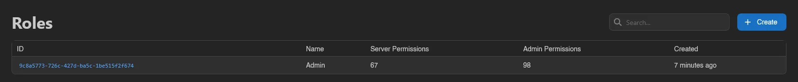
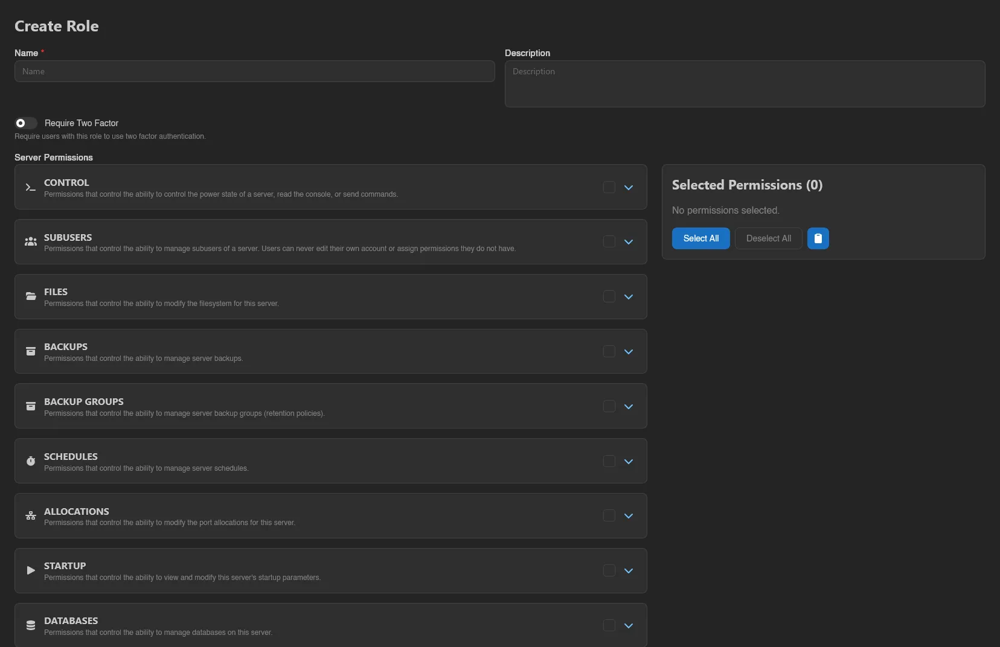
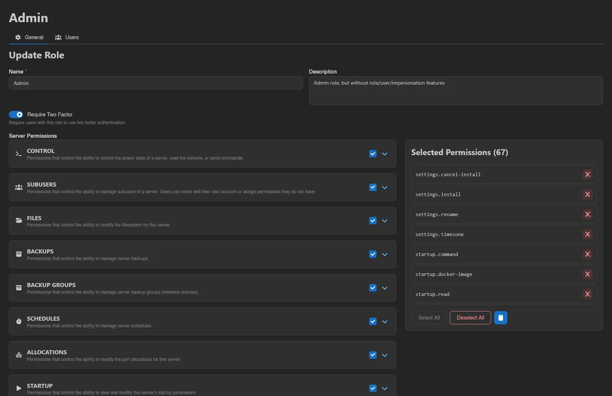
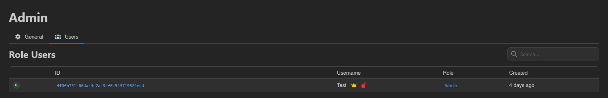

# Roles

**Roles** under **Users & Access** are named permission sets you assign to users, the way to give staff scoped access without handing out the full **Admin** flag. A role bundles two lists:

- **Admin Permissions** control which admin-area actions its holders can perform, like `servers.read` or `nodes.create`.
- **Server Permissions** are the same keys [subusers](../server/subusers.md) use, granted on every server the holder can open, on top of whatever they already have as owner or subuser. Combined with the `servers.read` admin permission, that effectively applies them panel-wide.

Every key is documented in the [Permissions Reference](../dashboard/permissions.md). Root admins bypass roles entirely; a role only matters for accounts without the **Admin** toggle. Users get a role on their [admin user page](./users.md), or automatically through [OAuth provider mappings](./oauth-providers.md#mappings).

The list shows each role's ID, Name, Server Permissions and Admin Permissions (as counts), and Created date. **Create** requires `roles.create`.

## Creating and Editing a Role

The form is the same for creating and updating:

| Field | Notes |
| --- | --- |
| **Name** | Required. |
| **Description** | Optional. |
| **Require Two Factor** | "Require users with this role to use two factor authentication." Enforced hard: holders without 2FA are blocked from everything except setting up 2FA on their [Account page](../dashboard/account.md) and logging out. |

Below that sit the two permission pickers, **Server Permissions** and **Admin Permissions**: expandable categories where you tick individual permissions or toggle a whole category at once, with copy and paste for moving a selection between roles. It's the same picker used when scoping [API keys](../dashboard/api-keys.md).

Finish with **Save** (or **Save & Stay** when creating). An existing role also offers **Duplicate** (requires `roles.create`; asks for a new name, prefilled with "(copy)") and **Delete** (requires `roles.delete`, with a confirmation).

::: warning
Selecting `users.impersonate` shows a warning for good reason: it lets holders of this role impersonate other users. Be cautious assigning it to roles with less trusted users, see [Impersonation](./users.md#impersonation) for the exact rules.

:::

## Users Tab

A role's view has a **Users** tab (requires `users.read`) listing every user currently holding the role, with the same columns as the [Users](./users.md) list. Role-based admins get the same crown marker there as root admins.

