# Servers

**Servers** under **Infrastructure** lists every server on the panel, no matter who owns it. The table shows each server's ID, Status, Name, Node, Owner, Allocation, and Created date; the node and owner link to their own admin pages, and clicking a row opens the [server view](#server-view).

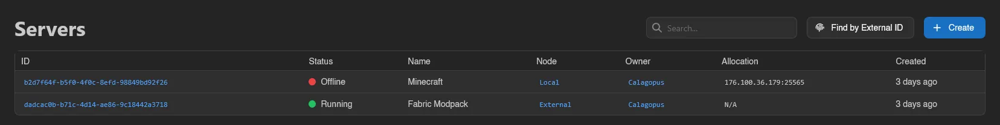

Next to **Create** sits **Find by External ID**: enter the external identifier (for example one set by your billing system), hit **Search**, and a **Server Found** card shows the matching server's name, owner, and node with a **View Server** button. If nothing matches, you get "No server found with that external ID."

## Creating a Server

Click **Create** (or go to `/admin/servers/new`). The form is a set of cards; an **Advanced mode** toggle in the top right reveals the fields marked *advanced* below and is remembered across admin forms.

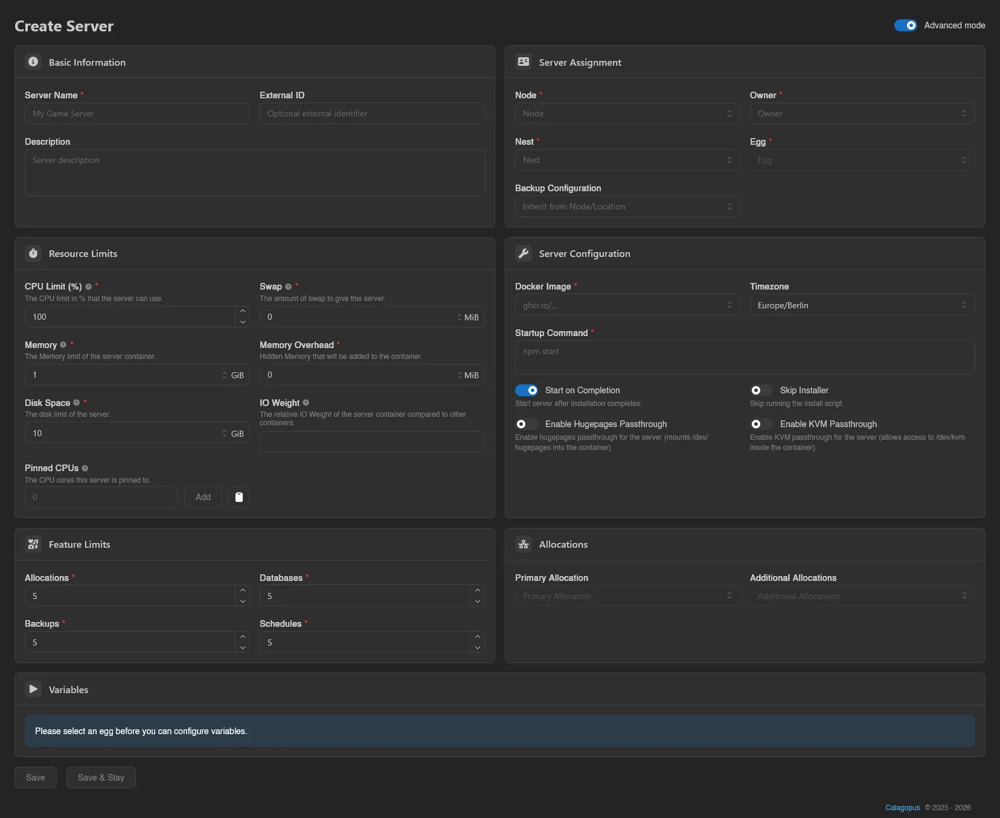

### Basic Information

**Server Name** (required), an optional **External ID** for linking external systems, and an optional **Description**.

### Server Assignment

| Field | Notes |
| --- | --- |
| **Node** | Required. Where the server will be deployed. |
| **Owner** | Required. The user who owns the server. |
| **Nest** | Required. Selecting one unlocks the egg dropdown. |
| **Egg** | Required. Determines images, startup commands, and variables. |
| **Backup Configuration** | Optional; defaults to "Inherit from Node/Location". |

All five are searchable dropdowns. Picking an egg immediately prefills the Docker image and startup command from the egg's defaults. Backup configurations are covered in the [backup configurations guide](../../../wings/advanced/backup-configurations.md).

### Resource Limits

Size fields take a value plus a unit (B through PiB).

| Field | Meaning |
| --- | --- |
| **CPU Limit (%)** | 1 thread = 100%. `0` sets no limit. |
| **Memory** | Memory limit of the server container. `0` sets no limit. |
| **Disk Space** | "This is a soft-limit unless the disk limiter is configured on Wings.", see [`system.disk_limiter_mode`](../../../wings/configuration.md#system-disk-limiter-mode). `0` sets no limit. |
| **Swap** (*advanced*) | Amount of swap. `-1` sets no limit. |
| **Memory Overhead** (*advanced*) | "Hidden Memory that will be added to the container.", extra headroom the owner doesn't see. |
| **IO Weight** (*advanced*) | Relative IO weight compared to other containers, 0 to 1000. May not work on all systems. |
| **Pinned CPUs** (*advanced*) | CPU cores the server is pinned to, by index (e.g. `0`, `1`, `2`). Empty allows all cores. |

### Server Configuration

| Field | Meaning |
| --- | --- |
| **Docker Image** | Required. Pick from the egg's predefined images. |
| **Timezone** | Timezone inside the container; **System** uses the node's own. |
| **Predefined Startup Commands** | Only shown when the egg defines named startup commands; picking one fills the field below, **Custom** lets you write your own. |
| **Startup Command** | Required. What actually runs in the container. |
| **Start on Completion** | "Start server after installation completes." On by default. |
| **Skip Installer** | "Skip running the install script." Useful when restoring files by other means. |
| **Enable Hugepages Passthrough** (*advanced*) | Mounts `/dev/hugepages` into the container. |
| **Enable KVM Passthrough** (*advanced*) | Allows access to `/dev/kvm` inside the container. |

### Feature Limits

How many **Allocations**, **Databases**, **Backups**, and **Schedules** the server may have; each defaults to 5. These are the caps the owner runs into on the client-side [Network](../server/network.md), [Databases](../server/databases.md), [Backups](../server/backups.md), and [Schedules](../server/schedules.md) pages.

### Allocations

Once a node is selected, choose a **Primary Allocation** and any **Additional Allocations** from that node's free pool (see [setting up allocations](../../../wings/next-steps/setting-up-allocations.md) for creating them). You can create a server without one; the panel asks "No Primary Allocation Assigned" and you confirm with **Create Anyway**.

### Variables

Until a nest and egg are chosen this card just says "Please select an egg before you can configure variables." After that, the egg's variables appear with their defaults prefilled. As an admin you can edit every variable here, including ones the owner can't change on their [Startup](../server/startup.md) page.

Finish with **Save** (returns to the list) or **Save & Stay**.

## Server View

Clicking a server opens its admin view. Tabs appear based on your [admin permissions](../dashboard/permissions.md):

| Tab | Requires |
| --- | --- |
| Overview | - |
| General | - |
| Allocations | `servers.allocations` |
| Variables | `servers.variables` |
| Mounts | `servers.mounts` |
| Backups | `nodes.backups` |
| Databases | `database-hosts.read` |
| Logs | `servers.read` |
| Management | - (individual actions gated below) |
| View in Client Area | `servers.read` |

### Overview

Read-only summary cards. Status badges at the top flag special states: **Suspended**, **Transferring**, **Installing**, **Install Failed**, and **Restoring Backup**.

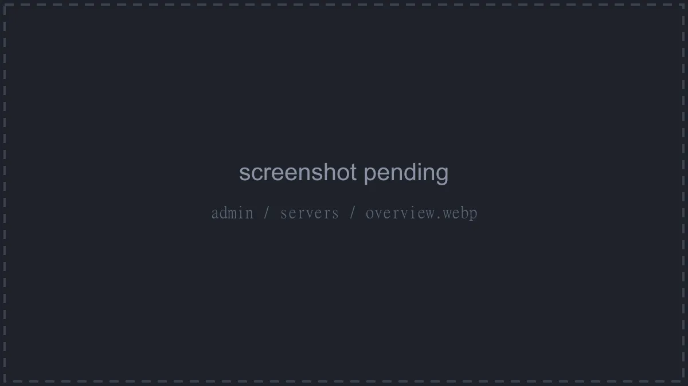

- **Owner**: user (with an **Admin** badge where applicable), language, and account creation date.
- **Node & Location**: node, location, SFTP address, and the node's own memory and disk limits.
- **Server Details**: UUID, external ID, primary allocation, nest, egg, Docker image, timezone, auto-kill setting, and creation date.
- **Resource Limits**: CPU, memory, disk, and swap tiles. `0` shows as **Unlimited** (swap: `-1` is **Unlimited**, `0` is **Disabled**).
- **Feature Limits**: the allocation, database, backup, and schedule caps.

### General

The **Update Server** form: the same cards as [creating a server](#creating-a-server) minus node, allocations, and variables (those have their own tabs). Two differences: the Docker image is a free-text field with a separate **Predefined Docker Images** dropdown above it, so you can set an image the egg doesn't list, and the install-time switches (Start on Completion, Skip Installer) are gone.

Changing the egg re-prefills the image and startup command. A suspended server shows a "This server is suspended." alert here.

Changing the **Owner** hands the server to another user.

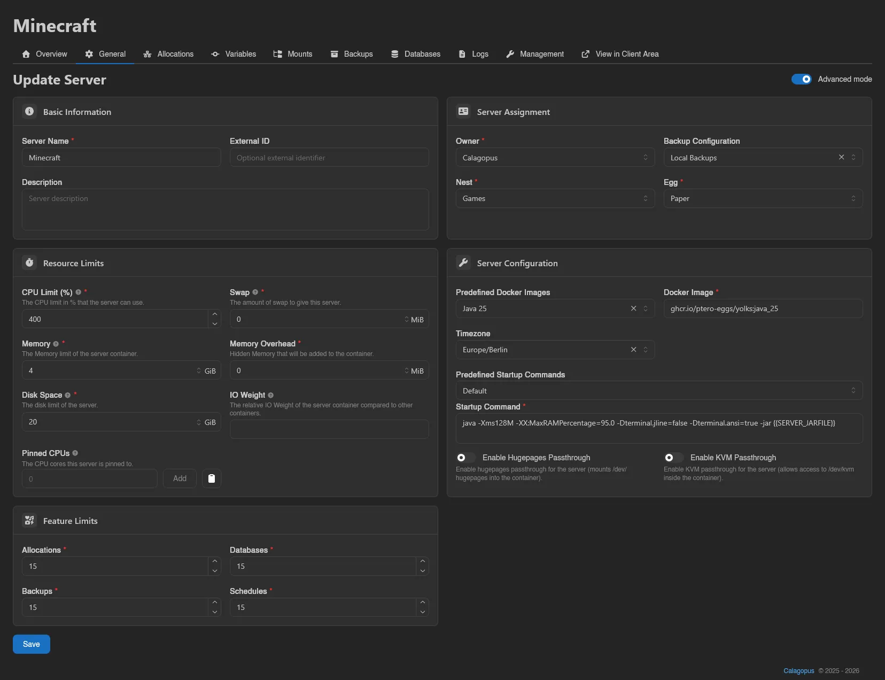

### Allocations

The server's allocations: primary marker, IP, IP Alias, Port, Notes, and Created. Notes are edited inline in the table and save automatically. **Add** opens a modal to attach free allocations from the server's node (multi-select). Right-click a row for **Set Primary** / **Unset Primary** and **Remove**. The owner-facing equivalent is the [Network](../server/network.md) page.

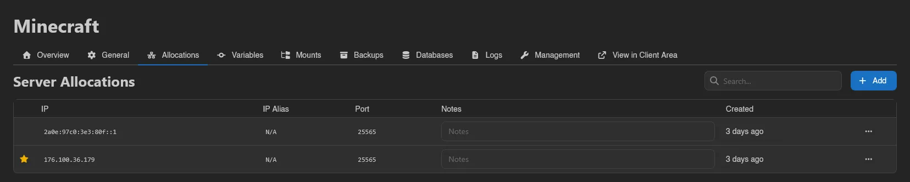

### Variables

The same variable grid as the client [Startup](../server/startup.md) page, but every variable is editable regardless of its user-editable flag; variables users can't touch just carry a **Read-Only** badge here. Edit values and hit **Save** (Ctrl+S also works).

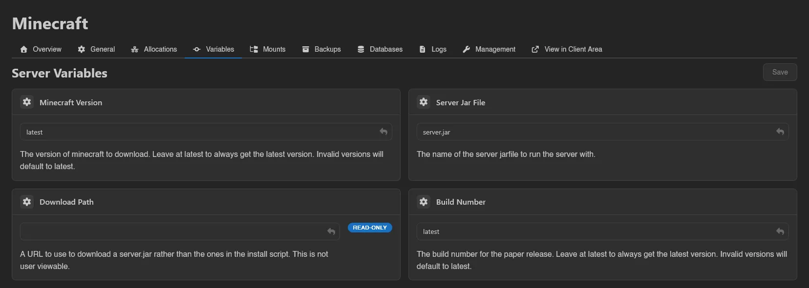

### Mounts

Mounts attached to this server: ID, Name, Source, Target, and Added. **Add** attaches one of the mounts available to this server from the admin **Mounts** area; right-click for **Remove**. The owner sees and toggles these on their [Mounts](../server/mounts.md) page.

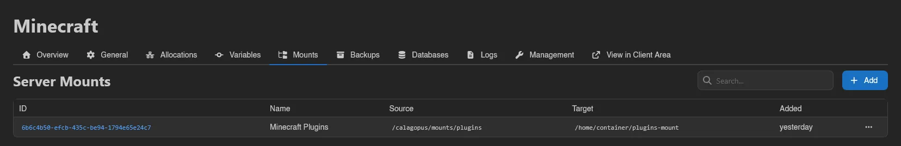

### Backups

All backups of this server: Name, Node, Checksum, Size, Files, and Created, with failed backups flagged. A warning icon appears when a backup lives on a different node than the server; those are not viewable from the client API. The **Only show partially detached backups** switch filters to exactly those.

Right-click a completed backup for **Download** (with a format submenu for streaming backups), **Restore**, **Export to Files**, **View Metadata** (raw JSON), and **Delete**. The owner-facing side is the [Backups](../server/backups.md) page.

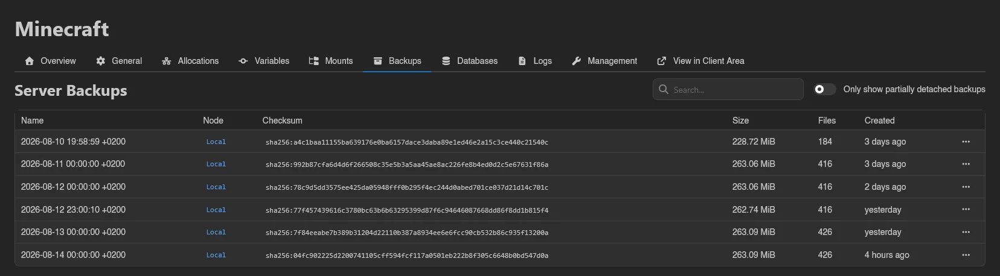

### Databases

Two tables. **Classic Databases** lists databases on [database hosts](../../../additional/database-hosts/index.md) (name, host, type, address, username, size, created; right-click to **Delete**). **Managed Databases** lists instances provisioned through the [Database Agent](../../../db-agent/index.md), shown when you have `database-agent-hosts.read`. The client view is the [Databases](../server/databases.md) page.

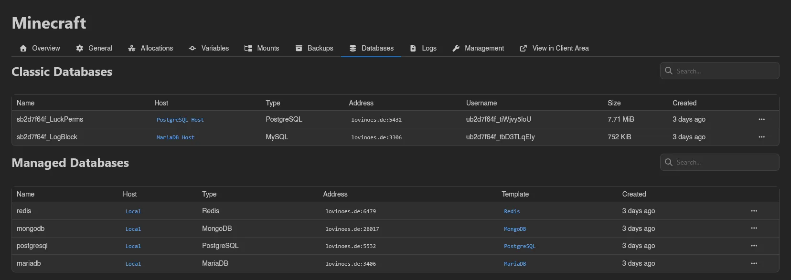

### Logs

Fetch the server's recent **Console** or **Install** logs: pick the **Log Type**, how many **Lines** (default 1000), and hit **Load Logs**. Output opens in a read-only viewer with ANSI colors stripped. Handy for diagnosing a failed install without leaving the admin area.

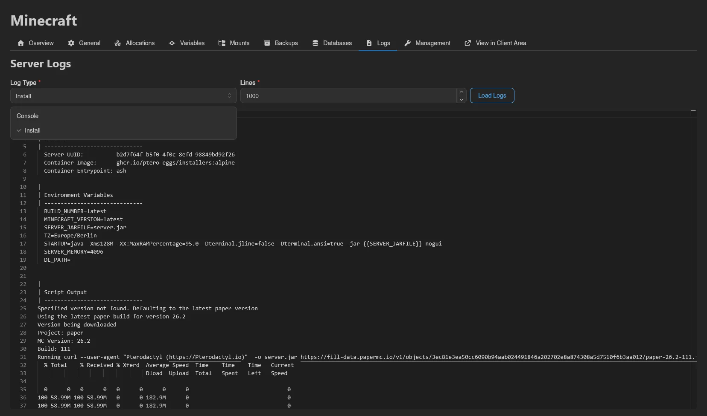

### Management

Action cards, each gated by its own permission and confirmed in a modal.

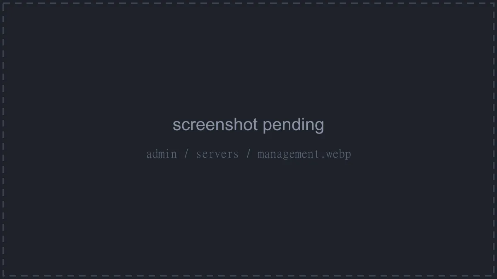

#### Transfer

Moves the server and its data to another node (requires `servers.transfer` and `nodes.read`). The modal asks for:

- **Node** (required; the current node is excluded, and the All-In-One node is not a valid target)
- **Primary Allocation** and **Additional Allocations** on the target node
- **Backups to transfer**, plus a **Delete source backups** switch to remove the transferred copies from the source node afterwards
- **Archive Format** (`.tar` or `.itaf`, plain or compressed as `.gz`, `.xz`, `.lz`, `.bz2`, `.lz4`, or `.zst`), **Compression Level** (**Best Speed**, **Good Speed**, **Good Compression**, or **Best Compression**; disabled for uncompressed `.tar` and `.itaf`), and **Multiplex Channels** (0 to 16 extra HTTP connections for split archives)

::: warning
Backups you don't select stay on the source node and become partially detached once the transfer completes. They remain visible on the [Backups](#backups) tab (filter with the partially detached switch), but not from the client API.
:::

Confirming shows "Server transfer started." and drops you into the server's client view. While the transfer runs, the server carries a **Transferring** badge on its [Overview](#overview).

#### Suspend / Unsuspend

Requires `servers.update`. The card shows **Suspend** or **Unsuspend** depending on the current state.

::: warning
Suspending stops any running processes and immediately blocks the user from accessing files or otherwise managing the server through the panel or API. The server cannot start again until you unsuspend it.
:::

#### Clear State

Requires `servers.update`. Resets the server status known by the panel, clearing "any known pending transfers and status failures". The confirmation warns to make sure it is safe before doing this, use it for servers stuck in a state like transferring or install failed, not as a routine action.

#### Delete

Requires `servers.delete`. The modal has a force switch ("Do you want to execute this deletion forcefully?"), a "Do you want to delete backups of this server?" switch, and requires typing the server's name to enable **Delete**.

::: danger
Deleting a server removes it and all of its data, and cannot be undone. "Force deletion skips the normal shutdown sequence. The server files on the node may not be fully cleaned up, leaving orphaned data behind.", so only force it when a normal delete fails (for example, the node is unreachable).
:::

### View in Client Area

The last sidebar item jumps to the server's regular [client view](../server/index.md), the same one the owner uses. The client view links back here with **View in Admin Area**, so you can hop between the two.
