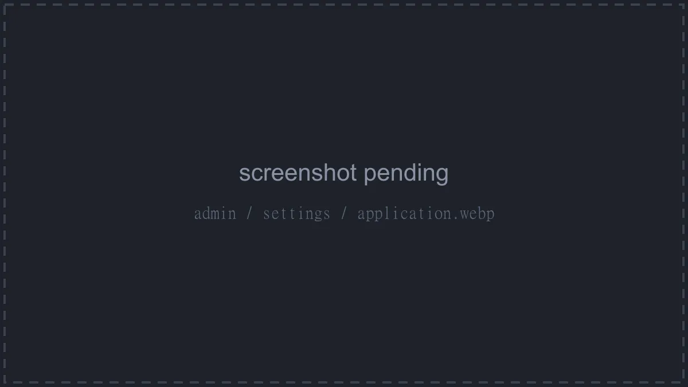
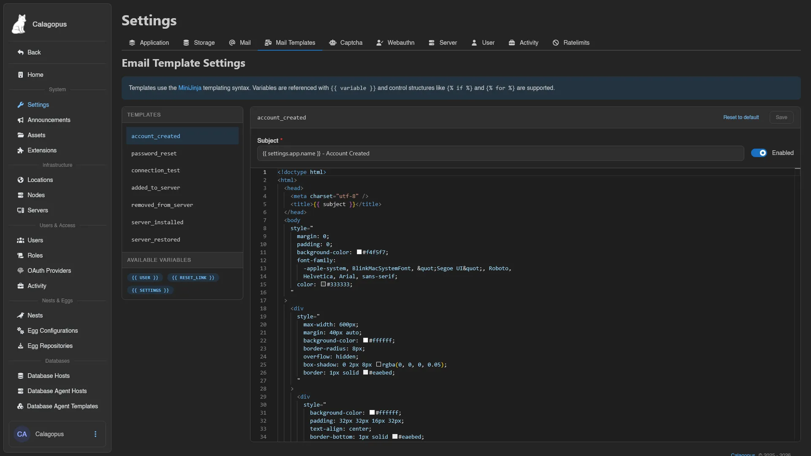

# Settings

Everything panel-wide that isn't its own admin page lives under `/admin/settings`, split into ten category tabs. Saving any category requires the `settings.update` permission.

::: info
The **Application** tab has an **Advanced mode** toggle in the top right. It reveals the fields marked *advanced* below, and the preference is remembered by your browser.
:::

## Application

| Field | Description |
| --- | --- |
| **Name** | The name of this panel installation |
| **Language** | The panel's default language |
| **Icon** | URL of the panel icon; suggests files uploaded under [Assets](./assets.md) |
| **Icon (Light Mode)** | Optional separate icon for light mode (*advanced*) |
| **Banner** | Optional banner image URL, also suggested from Assets |
| **Banner (Light Mode)** | Optional separate banner for light mode (*advanced*) |
| **URL** | The public URL of the panel |
| **Session Cookie** | Name of the session cookie (*advanced*) |
| **Session Duration (seconds)** | How long login sessions last (*advanced*) |
| **Two-Factor Authentication Requirement** | Who must enable 2FA: **Admins**, **All Users**, or **None** |
| **Enable Telemetry** | Allow Calagopus to collect limited and anonymous usage data to help improve the application |
| **Enable Registration** | Let anyone create an account on this panel |

**Preview Telemetry** (requires `stats.read`) shows exactly what data would be sent, so you can judge for yourself. Disabling telemetry asks for confirmation.

Enabling registration also asks for confirmation and points out that doing it without a [captcha](#captcha) configured may be a mistake.

## Storage

Where the panel stores uploaded files such as profile pictures and admin assets. Pick a **Driver**:

- **Filesystem**: a single **Path** on the panel's disk.
- **S3**: **Access Key**, **Secret Key**, **Bucket**, **Region**, **Public URL**, **Endpoint**, and a **Using path-style URLs** toggle. The `assets/`, `avatars/`, and `publicdata/` subdirectories must be publicly accessible over the **Public URL**; that's where admin assets, user avatars, and extension public data are served from.

::: warning
Changing the driver makes the panel look for existing assets in the new location. Move them over manually, or they'll turn up missing.
:::

## Mail

How the panel sends email. Pick a **Provider**:

| Provider | Fields |
| --- | --- |
| **None** | Outgoing email disabled |
| **SMTP** | **Host**, **Port**, **TLS Mode** (**None**, **STARTTLS**, or **Implicit TLS**), **Skip Certificate Validation**, **Username**, **Password**, **From Address**, **From Name** |
| **Sendmail Command** | **Command**, **From Address**, **From Name** |
| **Filesystem** | **Path**, **From Address**, **From Name**; writes messages to files under the path instead of sending them |

**Send Test Email** opens a small modal, prefilled with your own address, to verify the configuration actually delivers.

## Mail Templates

The emails the panel sends, editable per template. The tab requires `email-templates.read`; saving requires `email-templates.update`.

Pick a template from the **Templates** sidebar to edit its **Subject**, an **Enabled** toggle, and the HTML content in the editor. The **Available Variables** box lists everything you can reference in that template. Templates use the [MiniJinja](https://github.com/mitsuhiko/minijinja) syntax: variables as `{{ variable }}`, control structures like `` and ``.

**Reset to default** discards your custom template and restores the built-in one. This cannot be undone.

## Captcha

Captcha protection for the panel; set this up before you [enable registration](#application). Pick a **Provider**:

| Provider | Fields |
| --- | --- |
| **None** | No captcha |
| **Turnstile** | **Site Key**, **Secret Key** |
| **reCAPTCHA** | **Site Key**, **Secret Key**, and a **V3** toggle |
| **hCaptcha** | **Site Key**, **Secret Key** |
| **Friendly Captcha** | **Site Key**, **API Key** |

## Webauthn

The settings behind [Security Keys](../dashboard/security-keys.md).

| Field | Description |
| --- | --- |
| **Enable Security Keys** | Allow users to register and sign in with security keys. Existing keys are kept and remain visible, but can't be used to sign in while this is off |
| **Allow Usernameless Login** | Let users store passkeys on their device and pick one from a list instead of typing a username |
| **RP Id** | The WebAuthn relying party ID |
| **RP Origin** | The WebAuthn relying party origin |
| **Authentication Timeout (seconds)** | How long a sign-in prompt waits before giving up |
| **Registration Timeout (seconds)** | How long a registration prompt waits before giving up |

**Autofill** fills **RP Id** and **RP Origin** from the panel's own address. It refuses to run when the panel is served from a bare IP address, since WebAuthn doesn't work there.

::: warning
Changing the **RP Id** breaks all existing WebAuthn credentials and forces users to re-register their devices.
:::

## Server

Limits and behavior toggles that apply to all servers on the panel.

| Field | Description |
| --- | --- |
| **Max File Manager View Size** | Largest file the file manager will open |
| **Max Schedule Steps** | Maximum number of steps per schedule |
| **Max File Manager Content Search Size** | Largest file the file-content search will look inside |
| **Max File Manager Search Results** | Cap on results returned by a file search |
| **Max Subuser Count** | Maximum subusers per server |
| **Max Backup Groups per Server** | Maximum backup groups each server can have |
| **Max Databases per Database Instance** | Database cap per managed database instance |
| **Max Users per Database Instance** | User cap per managed database instance |
| **Allow Overwriting Custom Docker Image** | Users can pick a different Docker image from the Eggs list even when an admin has set a custom image |
| **Allow Viewing Installation Logs** | Users with console read permission can watch installation logs; otherwise they're admin-only |
| **Allow Acknowledging Installation Failure** | Users can acknowledge a failed install and try starting the server instead of waiting for an admin |
| **Allow Viewing Transfer Progress** | Users with console read permission can watch transfer progress logs; otherwise they're admin-only |
| **Container Prelude** | The terminal prelude used for some status-related messages in the server console |

The database instance limits apply to [managed databases](../../../db-agent/index.md) created through database agent hosts.

## User

Per-account limits for [Dashboard](../dashboard/index.md) features.

| Field | Description |
| --- | --- |
| **Max Server Groups** | Cap on [server groups](../dashboard/servers.md) per user |
| **Max API Keys** | Cap on [API keys](../dashboard/api-keys.md) per user |
| **Max Command Snippets** | Cap on [command snippets](../dashboard/command-snippets.md) per user |
| **Max Security Keys** | Cap on [security keys](../dashboard/security-keys.md) per user |
| **Max SSH Keys** | Cap on [SSH keys](../dashboard/ssh-keys.md) per user |
| **Allow Changing Language** | If enabled, users can change their language preferences |

Below the limits, **Client Route Order** is a collapsible section: enable it to reorder the pages of the user dashboard sidebar for everyone.

## Activity

Retention for the three activity logs and what gets logged.

**Admin Activity Retention Days**, **User Activity Retention Days**, and **Server Activity Retention Days** control how many days entries are kept in each log. The matching **Retention Count** fields optionally cap the number of entries kept as well.

| Field | Description |
| --- | --- |
| **Log Server Admin Activity** | Log admin activity on servers where the admin isn't an owner or subuser |
| **Log Server Schedule Activity** | Log activity done by server schedules |

## Ratelimits

Per-endpoint API rate limits. Each endpoint card has two values: **Hits**, the maximum number of requests allowed per window, and **Window**, the window duration in seconds.

Endpoints covered: `auth/register`, `auth/login`, `auth/login/checkpoint`, `auth/login/security-key`, `auth/password/forgot`, `auth/password/reset`, `client`, `client/servers/backups/create`, `client/servers/files/pull`, `client/servers/files/pull/query`, `remote`, and `remote/sftp/auth`.
