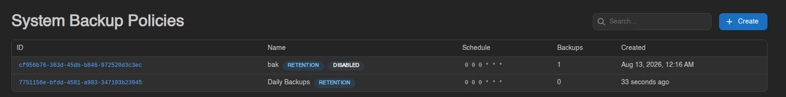
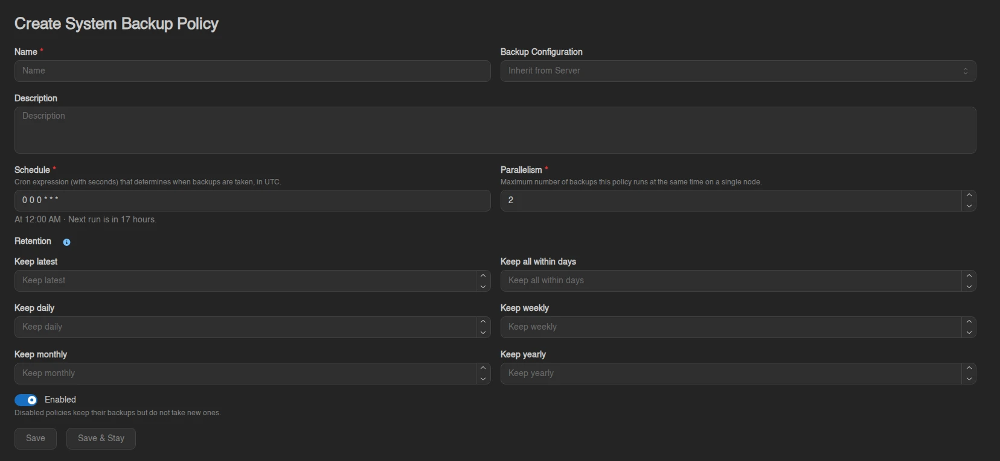
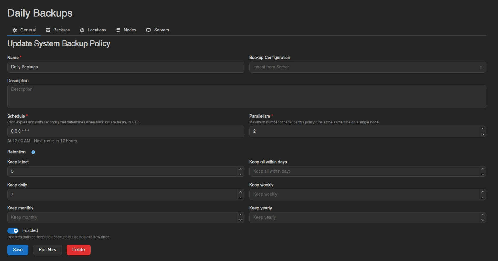
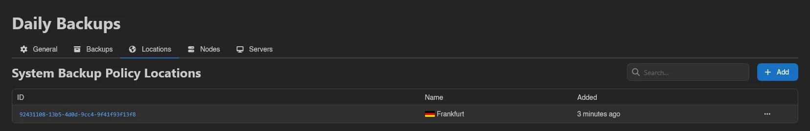
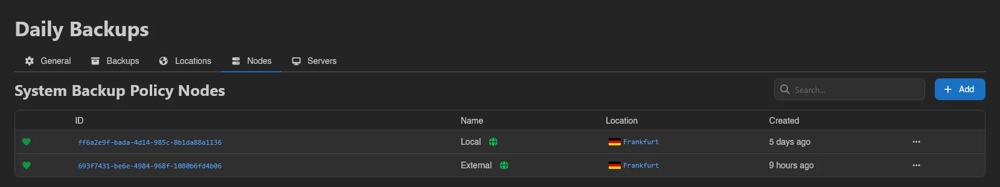
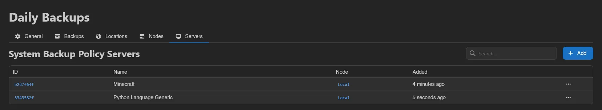
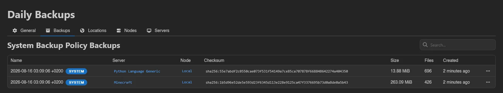

# System Backup Policies

System backup policies (**Storage** > **System Backup Policies**) take server backups automatically on a schedule, without users or per-server [schedules](../server/schedules.md) being involved. A policy covers a set of servers, runs on a cron schedule, and cleans up after itself with retention rules.

The list shows each policy's ID, Name, **Schedule** (the cron expression), **Backups** (how many it has taken), and Created, with a **Disabled** badge on disabled policies and a **Run pending** badge while a run is due. Use the search box to filter.

## Creating a Policy

Click **Create** in the top right.

| Field | Description |
| ----- | ----------- |
| **Name** / **Description** | Display name and optional free text. |
| **Backup Configuration** | Which [backup configuration](./backup-configurations.md) the policy's backups are written to. Defaults to **Inherit from Server**, the same resolution a manual backup would use. |
| **Schedule** | "Cron expression (with seconds) that determines when backups are taken, in UTC." |
| **Keep count** | "Maximum number of successful backups to keep per server. Leave empty for no limit." |
| **Keep days** | "Delete backups older than this many days. Leave empty for no limit." |
| **Parallelism** | "Maximum number of backups this policy runs at the same time on a single node." |
| **Enabled** | "Disabled policies keep their backups but do not take new ones." |

An existing policy also offers **Run Now** (after a **Confirm Manual Run** dialog; every covered server without a backup from this run yet gets backed up, and covered servers are processed oldest-attempt first) and **Delete**.

## Which Servers Are Covered

The **Locations**, **Nodes**, and **Servers** tabs scope the policy; each has an **Add** button and right-click **Remove**. A server is covered when it matches any of the three: it sits in an assigned location, runs on an assigned node, or is assigned directly.

Covered is not the same as backed up on every run: servers that are mid-transfer or in a status like installing or restoring are skipped for that run, and nodes in maintenance mode are skipped entirely. Due-ness is tracked per server (the cron having fired since that server's last policy backup), so skipped or newly added servers catch up on the next tick.

## Backups

The **Backups** tab lists every backup the policy has taken, searchable: Name, Server, Node, Checksum, Size, Files, and Created, each row tagged with a **SYSTEM** badge and carrying a download action. Policy backups do not count towards each server's backup limit and are not rotated by [backup groups](../server/backups.md#backup-groups); the policy's own **Keep count** and **Keep days** rules manage them instead.

## Deleting a Policy

Deleting asks whether to also delete the policy's backups (**Do you want to delete backups created by this policy?**):

- Switch on: "All backups created by this policy will be permanently deleted from their storage backends."
- Switch off: "Backups created by this policy will become regular server backups. They will count towards each server backup limit and follow standard rotation."

::: info
The buttons on these pages follow the `system-backup-policies.*` admin permission keys (`create`, `read`, `update`, `delete`, `backups`). See the [Permissions Reference](../dashboard/permissions.md).
:::
