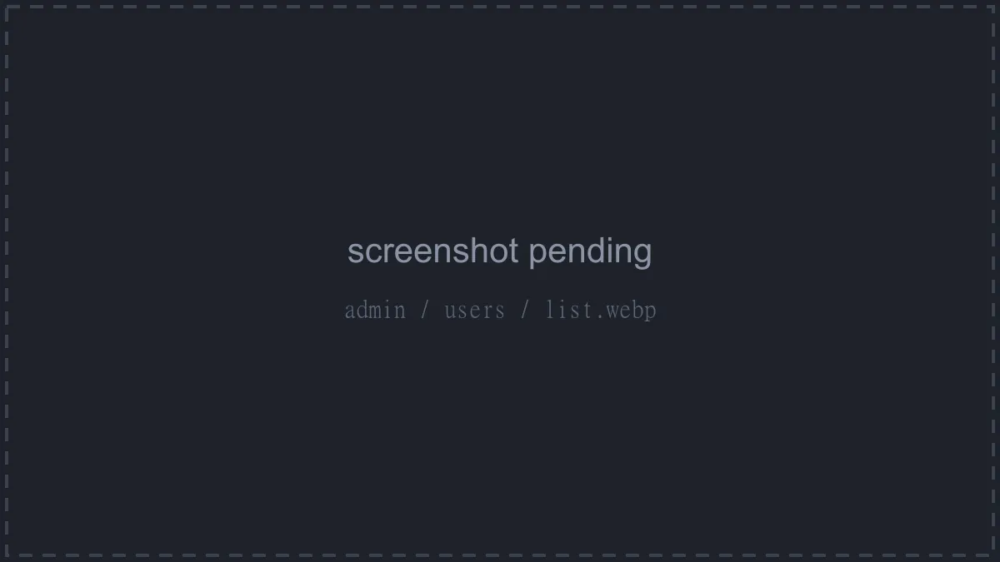
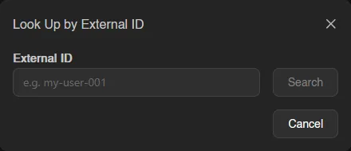
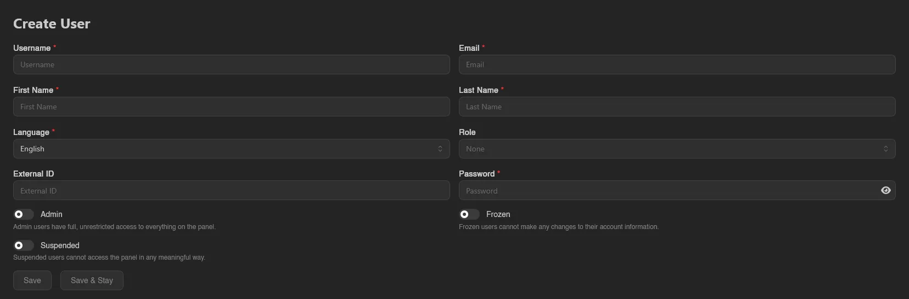
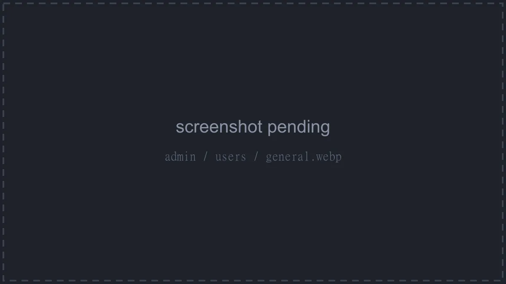
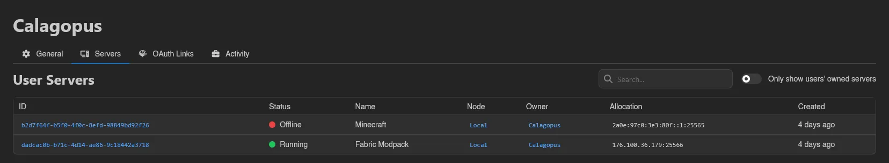
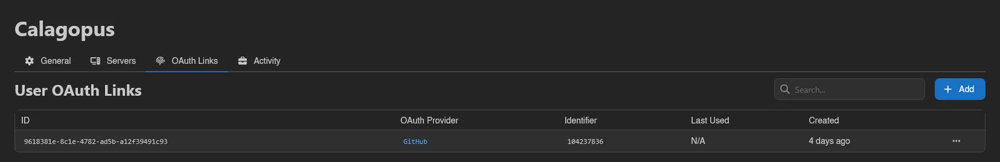
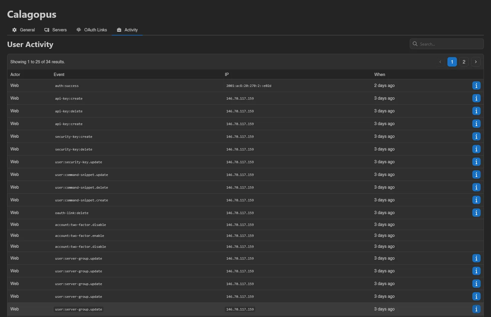
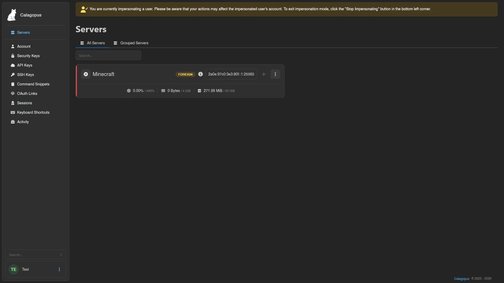
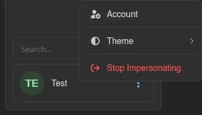

# Users

**Users** under **Users & Access** lists every account on the panel. Each row shows the user's avatar, ID, Username, Role, and Created date; the ID opens the [user view](#user-view) and the role links to its page under [Roles](./roles.md).

Two icons next to the username tell you the account's state at a glance: a crown marks admins, and a lock shows whether two-factor authentication is enabled (green closed lock) or not (red open lock).

Next to **Create** (requires `users.create`) sits **Find by External ID** (requires `users.read`): enter the external identifier, for example one set by your billing system, hit **Search**, and a **User Found** card shows the matching username, email, and role with a **View User** button. If nothing matches, you get "No user found with that external ID."

## Creating a User

Click **Create** (or go to `/admin/users/new`) and fill in the form:

| Field | Notes |
| --- | --- |
| **Username** | Required. |
| **Email** | Required. |
| **First Name** / **Last Name** | Required. |
| **Language** | Required. The user's panel language. |
| **Role** | Optional; only shown to root admins. See [Roles](./roles.md). |
| **External ID** | Optional identifier for linking external systems. |
| **Password** | Required when creating. When updating, leave it empty to keep the current one. |
| **Admin** | Only shown to root admins. "Admin users have full, unrestricted access to everything on the panel." |
| **Frozen** | "Frozen users cannot make any changes to their account information." |
| **Suspended** | "Suspended users cannot access the panel in any meaningful way." |

Finish with **Save** (returns to the list) or **Save & Stay**.

::: info
Role-based admins are limited here: only root admins (accounts with the **Admin** toggle) can assign roles, grant **Admin**, or change another user's email and password, and a role-based admin cannot save changes to a root admin at all.
:::

## User View

Clicking a user opens their view. Tabs appear based on your [admin permissions](../dashboard/permissions.md#admin-permissions):

| Tab | Requires |
| --- | --- |
| General | - |
| Servers | `servers.read` |
| OAuth Links | `users.oauth-links` |
| Activity | `users.activity` |

### General

The **Update User** form, the same fields as [creating a user](#creating-a-user), followed by a row of admin actions:

| Button | Requires | What it does |
| --- | --- | --- |
| **Disable Two Factor** | `users.disable-two-factor` | Removes the user's two-factor authentication after a confirmation. Only enabled when the user actually has 2FA on. |
| **Send Password Reset Email** | `users.email` | Emails the user a password reset link after a confirmation. |
| **Impersonate** | `users.impersonate` | Switches your session to this user, see [below](#impersonation). |
| **Delete** | `users.delete` | Deletes the user after a confirmation. |

### Servers

Every server the user has access to, with the same columns as the admin [Servers](./servers.md) list. The **Only show users' owned servers** switch narrows the list to servers they own, hiding ones where they're only a [subuser](../server/subusers.md).

### OAuth Links

The user's connections to [OAuth providers](./oauth-providers.md): ID, OAuth Provider, Identifier, Last Used, and Created. **Add** (shown with `oauth-providers.read`, since it lists providers; the write itself falls under this tab's `users.oauth-links`) opens a modal where you pick the provider and enter the user's **Identifier** at that provider; right-click a row to **Remove** a link. The user-facing side of this list is their [OAuth Links](../dashboard/oauth-links.md) page.

### Activity

The user's account audit log, the same one they see on their own [Activity](../dashboard/activity.md) page: source (**Web** or **API**), Event, IP, and When, with an info button for entries carrying extra metadata. For the panel-wide admin log, see [Activity](./activity.md).

## Impersonation

**Impersonate** on the General tab logs you in as the user and drops you on their dashboard, useful for reproducing exactly what they see. A banner stays at the top the whole time: "You are currently impersonating a user. Please be aware that your actions may affect the impersonated user's account." While impersonating, the sidebar account menu shows **Stop Impersonating** in place of **Logout**; use it to return to your own session.

Everything you do while impersonating is written to the activity logs with an "Impersonated by ..." marker next to the actor, so the audit trail always shows who really acted.

::: warning
You cannot impersonate yourself, and nobody can impersonate a root admin. Role-based admins can only impersonate users whose role permissions are a subset of their own.
:::
