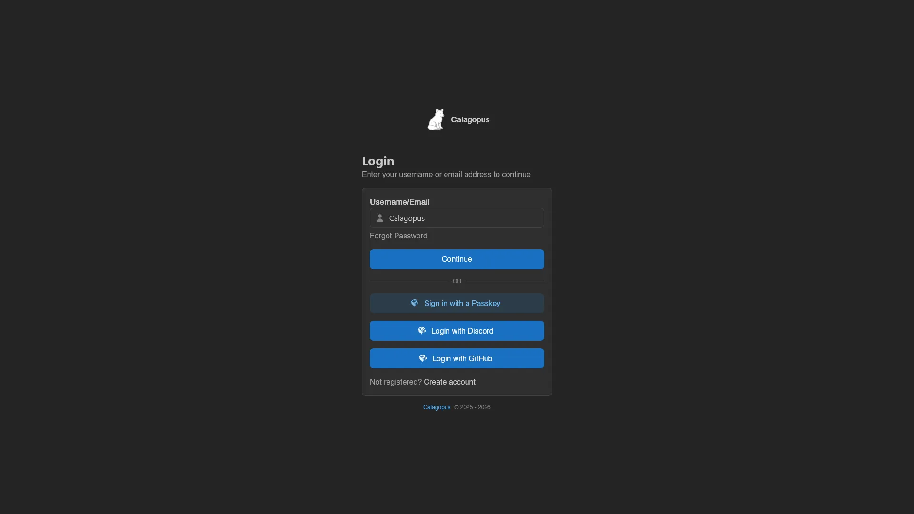
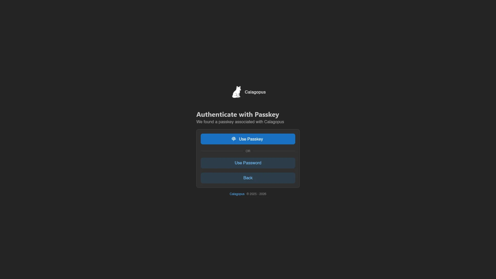
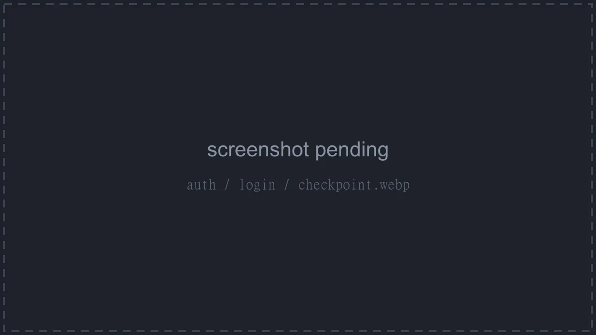

# Login

Logging in at `/auth/login` is a two-step flow: the panel first asks who you are, then how you want to prove it.

## Step 1: Username or Email

Enter your identifier into **Username/Email** ("Your username or email address") and hit **Continue**. The **Forgot Password** link underneath jumps to [password reset](./password-reset.md).

Below the **OR** separator are the alternate ways in:

- **Sign in with a Passkey**, for [passkeys stored on your device](#sign-in-with-a-passkey). Only shown when the admin has both security keys and usernameless login enabled.
- One **Login with `<name>`** button per enabled [OAuth provider](#oauth-login). With more than three providers they collapse into a single **OAuth Login** button instead, which leads to `/auth/login/oauth`, a page listing them all.

If registration is enabled, a "Not registered? **Create account**" link points to [Register](./register.md).

## Step 2: Passkey or Password

If your account has [security keys](../dashboard/security-keys.md) registered, **Continue** takes you to **Authenticate with Passkey** first ("We found a passkey associated with `<username>`"). **Use Passkey** triggers the browser's passkey prompt and logs you in on success; **Use Password** and **Back** below the separator let you fall back to the normal flow.

Otherwise (or after **Use Password**) you land on **Enter Password** ("Please enter your password for `<username>`"). Type your password, it has a visibility toggle, and hit **Sign In**. **Forgot Password** and **Back** sit below the separator here too.

## Sign in with a Passkey

**Sign in with a Passkey** on the first step skips the username entirely: the browser lists the passkeys stored on your device and you pick one. This only works for keys registered with the usernameless option; for any other key the panel tells you to enter your username first, after which it works through the normal flow. Passkeys require HTTPS and a valid domain. See [Security Keys](../dashboard/security-keys.md) for registering them.

## OAuth Login

Each **Login with `<name>`** button sends you to the external provider to approve the login. Back on the panel:

- An account already [linked](../dashboard/oauth-links.md) to that provider is logged straight in.
- If that account has 2FA enabled, the [two-factor checkpoint](#two-factor-checkpoint) comes first, unless the admin has set **Bypass 2FA on Login** for the provider.
- With no linked account, the panel registers a new one from the provider's profile and logs you in. If the provider is set to **Only allow Login**, or an account with the same username or email already exists, you're sent back to the login page with an error instead.

::: info
For admins: providers, their **Bypass 2FA on Login** and **Only allow Login** flags, and automatic role mappings live under [OAuth Providers](../admin/oauth-providers.md).
:::

## Two-Factor Checkpoint

Accounts with [two-factor authentication](../dashboard/account.md) get one more step after the password, at `/auth/login/checkpoint`: the **Two-Factor Authentication** page greets you with your avatar and username and asks you to "Enter the 6-digit code from your authenticator app". Fill the six boxes and hit **Verify Code**. Each code works only once; if your device's clock is off, the page warns you, since TOTP codes depend on correct time.

Lost the authenticator? **Use Recovery Code** switches the form to a **Recovery Code** field. Recovery codes are ten characters and single-use, each one is deleted the moment it's accepted. **Use TOTP** switches back.

::: info
For admins: **Two-Factor Authentication Requirement** in [Settings > Application](../admin/settings.md#application) decides who has to set up 2FA at all. Login attempts are [rate limited](../admin/settings.md#ratelimits) per IP, and when a [captcha](../admin/settings.md#captcha) is configured it appears below the card and must be solved before **Sign In** works.
:::
