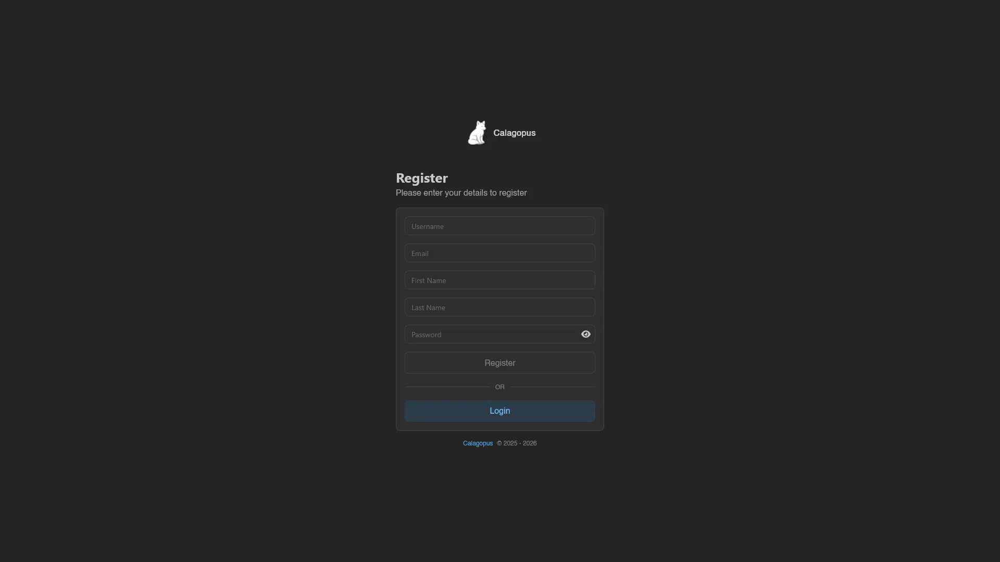

# Register

When registration is enabled, the **Create account** link on the [login page](./login.md) leads to `/auth/register` ("Please enter your details to register"). The page itself stays reachable with registration off, only the link is hidden, and submitting then fails with "registration is disabled".

The form asks for **Username**, **Email**, **First Name**, **Last Name**, and **Password** (with a visibility toggle). Usernames are 3 to 15 characters of letters, numbers, and underscores; passwords need at least 8 characters. Hit **Register** to create the account, or **Login** below the separator to go back.

Registering logs you in immediately. There is no email verification step; your session starts the moment the account is created. If the username or email is already taken, you get an error instead. The first account ever registered on a fresh panel automatically becomes a root admin.

When a captcha is configured, it renders below the card and **Register** stays disabled until it's solved.

::: info
For admins: the **Enable Registration** toggle lives in [Settings > Application](../admin/settings.md#application), and turning it on without a [captcha](../admin/settings.md#captcha) configured is asking for bot signups. The `auth/register` endpoint is [rate limited](../admin/settings.md#ratelimits) per IP.

Note that [OAuth login](../admin/oauth-providers.md) also creates accounts from the provider's profile, regardless of this toggle, unless the provider is set to **Only allow Login**.
:::
