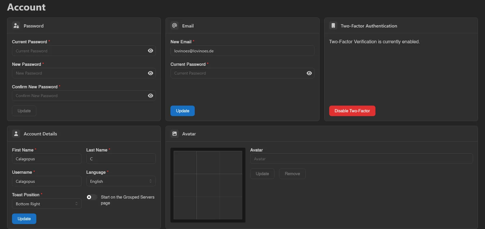
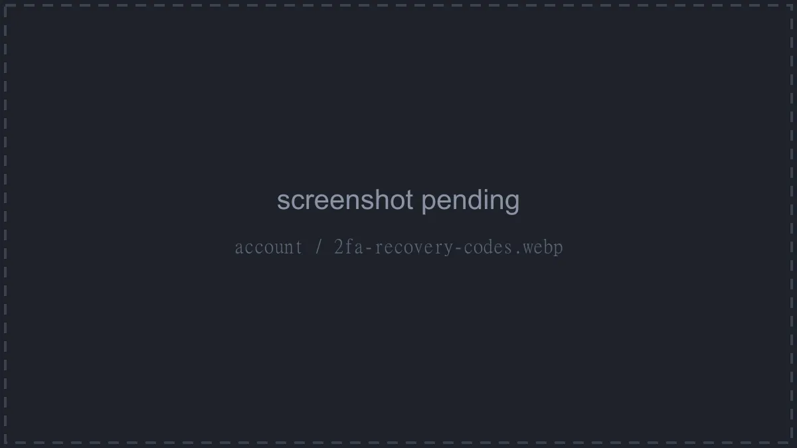
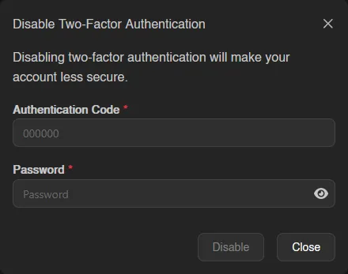
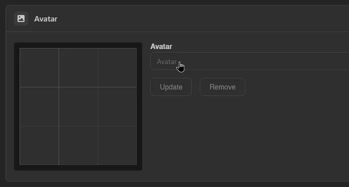
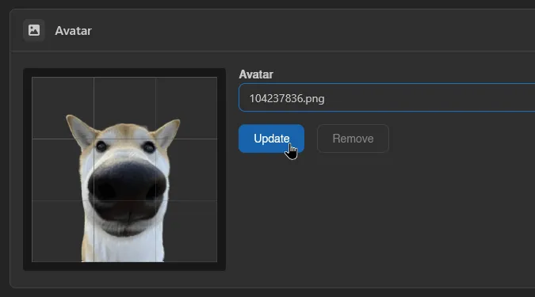

# Account

The Account page covers everything about your own user profile: password, email, two-factor authentication, display details, and avatar.

## Password

Enter your current password, then your new password twice, and hit **Update**. You always have to confirm your current password first, even if you're already logged in.

## Email

Same idea: enter your new email and your current password, then **Update**.

## Two-Factor Authentication

Standard TOTP-based 2FA, the same kind used by most apps. Scan the QR code (or enter the code shown below it) in your authenticator app, then enter the 6-digit code it generates along with your current password to enable it.

Right after enabling, a **Recovery Codes** dialog appears: "Below are your recovery codes. Store these in a safe place. If you lose access to your authentication device, you can use these codes to regain access to your account." You get ten codes; click the code block to copy them all. Each code works exactly once at the [login checkpoint](../auth/login.md#two-factor-checkpoint), and this dialog is the only time they're shown, so store them somewhere safe before closing it.

Once enabled, the card reads "Two-Factor Verification is currently enabled." with a **Disable Two-Factor** button and a line showing when 2FA was last used. Disabling asks for a valid authentication code and your password again.

If your role or the panel requires 2FA and you haven't set it up, an alert at the top of the page says so; a frozen account shows an alert explaining that account details cannot be changed.

## Account Details

Your first name, last name, username, panel language, and toast position (where notifications pop up on screen). There's also a toggle for whether the panel should open to the **Grouped Servers** view instead of **All Servers**, off by default. See [Servers](./servers.md) for the difference.

## Avatar

Click the empty **Avatar** field to upload an image. If it doesn't crop the way you want, drag the position handles on the preview grid to adjust it before saving.

Once you have an avatar set, upload a new file and hit **Update** to replace it, or **Remove** to delete it.

