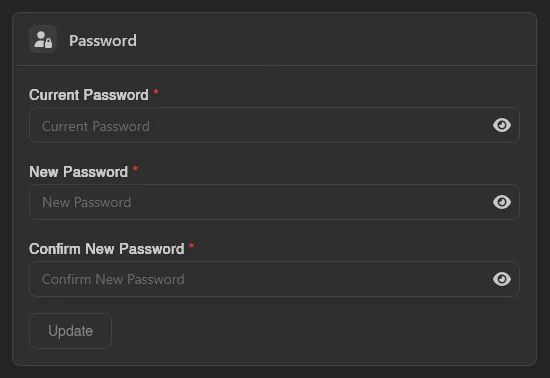
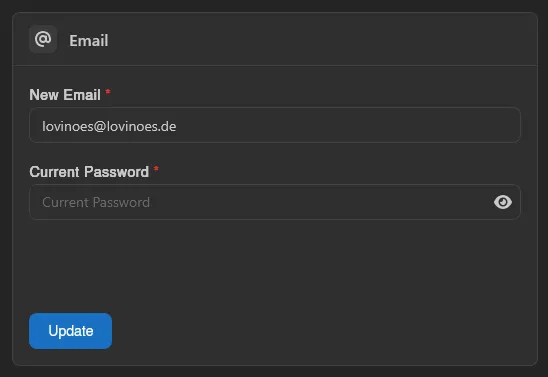
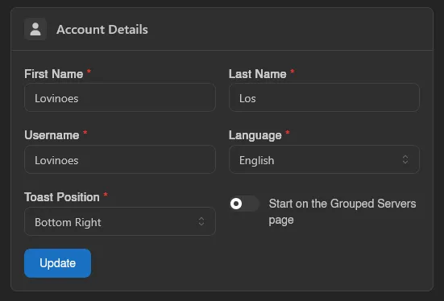

# Account

The Account page covers everything about your own user profile: password, email, two-factor authentication, display details, and avatar.

## Password

Enter your current password, then your new password twice, and hit **Update**. You always have to confirm your current password first, even if you're already logged in.

## Email

Same idea: enter your new email and your current password, then **Update**.

## Two-Factor Authentication

Standard TOTP-based 2FA, the same kind used by most apps. Scan the QR code (or enter the code shown below it) in your authenticator app, then enter the 6-digit code it generates along with your current password to enable it.

To disable it, you'll need a valid authentication code and your password again.

## Account Details

Your first name, last name, username, panel language, and toast position (where notifications pop up on screen). There's also a toggle for whether the panel should open to the **Grouped Servers** view instead of **All Servers**, off by default. See [Servers](./servers.md) for the difference.

## Avatar

Click the empty **Avatar** field to upload an image. If it doesn't crop the way you want, drag the position handles on the preview grid to adjust it before saving.

Once you have an avatar set, upload a new file and hit **Update** to replace it, or **Remove** to delete it.

