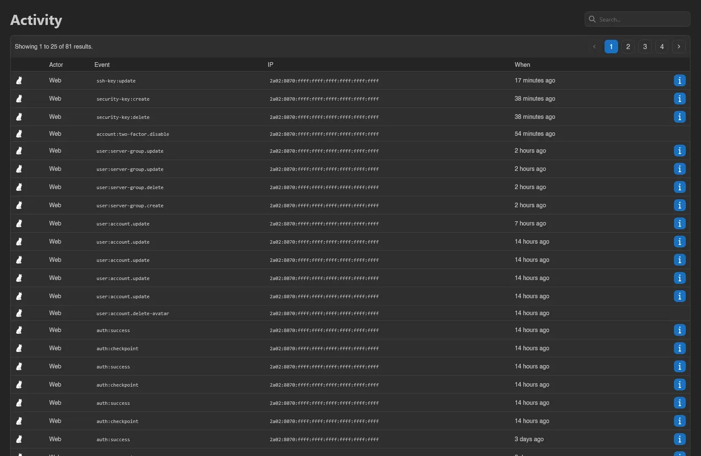

# Activity

Activity is a log of everything that's happened on your account: the **Actor** column (**Web** for actions in the panel, **API** for [API keys](./api-keys.md), with an "Impersonated by `<username>`" marker where an admin acted as you), the event, the IP address it came from, and when it happened. Like most tables in the panel, it's paginated and searchable. Per-server logs live on each server's own [Activity page](../server/activity.md).

Click the info button on a row to see the full details for that event.

