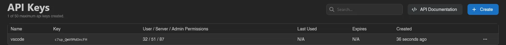
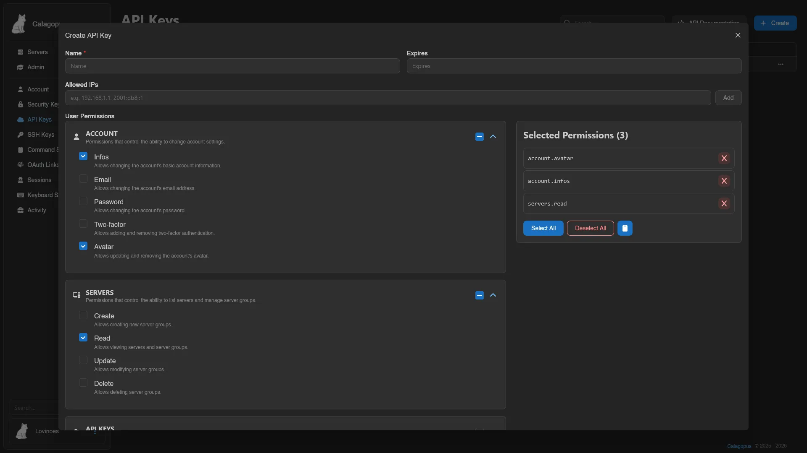
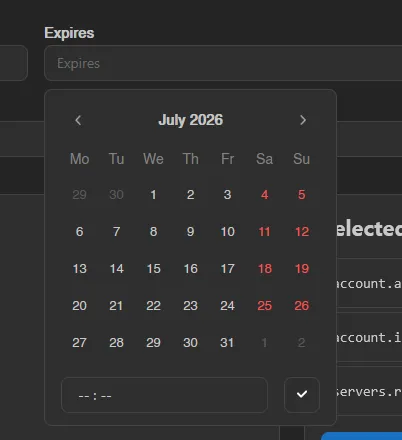
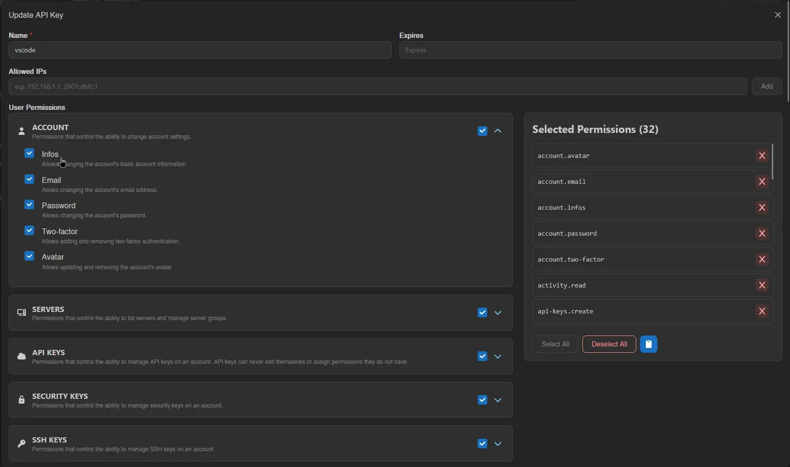

# API Keys

API keys are personal access tokens for the [API](https://demo.calagopus.com/api). Each key gets its own set of permissions, so you can hand out a key scoped to exactly what it needs rather than your full account access.

The list shows each key's name, its key value, how many user/server/admin permissions it has, and its last used, expiry, and created timestamps.

## Creating a Key

Click **Create** in the top right. Give it a name, optionally an expiry date, and optionally a list of IPs it's allowed to be used from (leave empty to allow any IP).

Expiry uses a calendar picker with an optional time:

Below that are the permission categories: **User**, **Server**, and **Admin** (the last only shown if your own account has admin permissions). Check individual permissions, or toggle an entire category at once. Everything you've selected shows up on the right under **Selected Permissions**, where you can also copy the full list or clear it with **Deselect All**. See the [Permissions Reference](./permissions.md) for what every permission does.

Once you're happy with the selection, scroll down and hit **Save**, or **Close** to back out without creating anything.

## Editing, Recreating, and Removing

Right-click a key (or open the menu at the end of its row) for **Edit**, **Recreate**, or **Remove**.

**Edit** opens the same form as creating one, letting you change the name, expiry, allowed IPs, and permissions.

**Recreate** issues a new key value with the same name and permissions, immediately invalidating the old value. Use this if a key may have leaked. **Remove** deletes the key outright.

::: info
A key can never edit itself or grant permissions it doesn't already have, even with `api-keys.update`. The maximum number of API keys per account is set by the instance administrator under [Settings > User](../admin/settings.md#user).
:::
