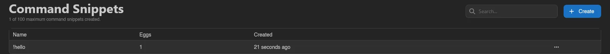
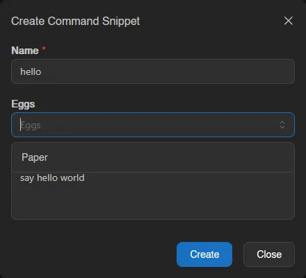
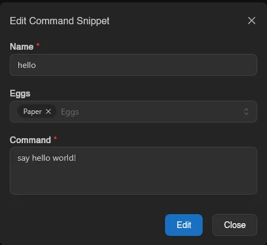
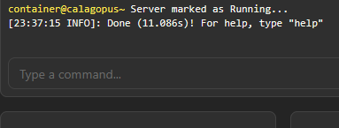

# Command Snippets

Command snippets are shortcuts for commands you type often into a server console. The list is empty by default and shows each snippet's name (with the `!` prefix you'll type), how many eggs it applies to, and when it was created.

## Creating a Snippet

Click **Create** and give it a short name, since that name is what you'll actually type in the console. Optionally pick one or more eggs to restrict the snippet to servers using them; leave it empty to make the snippet available on every server.

Then enter the command it should paste. For example, a snippet named `hello` with the command `say hello world!`:

Typing `!hello` in the console and pressing enter pastes `say hello world!` in its place, so you don't have to type the full command every time. Typing just `!` shows all your snippets as autocomplete suggestions; see [Sending Commands](../server/console.md#sending-commands).

Right-click an existing snippet (or open the menu at the end of its row) to edit, duplicate (the copy's name prefills as "`<name>` (copy)"), or delete it.

::: info
The maximum number of command snippets per account is set by the instance administrator under [Settings > User](../admin/settings.md#user).
:::
