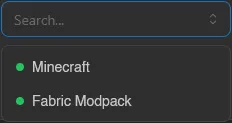
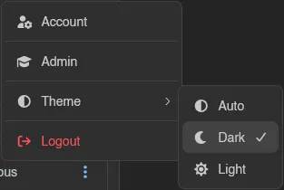

# Dashboard

The Dashboard is what every user lands on after logging in. It covers your own account (password, email, two-factor, avatar), your servers, and account-level self-service like API keys, SSH keys, and security keys. It's separate from the **Admin** area, which is only visible to users with admin permissions and covers instance-wide management like nodes, locations, and other users.

| Page | Description |
| --- | --- |
| [Servers](./servers.md) | Your server list, server groups, and bulk power actions |
| [Account](./account.md) | Password, email, two-factor authentication, and avatar |
| [Security Keys](./security-keys.md) | Passkeys and hardware security keys for login |
| [API Keys](./api-keys.md) | Personal access tokens for the API, with granular permissions |
| [SSH Keys](./ssh-keys.md) | Public keys used for SFTP and SSH access to Wings |
| [Command Snippets](./command-snippets.md) | Shortcuts for commands you use often in the server console |
| [OAuth Links](./oauth-links.md) | Linking third-party accounts for faster login |
| [Sessions](./sessions.md) | Devices currently logged into your account |
| [Keyboard Shortcuts](./keyboard-shortcuts.md) | Rebindable shortcuts for navigating the panel |
| [Activity](./activity.md) | A log of everything that's happened on your account |

## Navigating the Dashboard

The sidebar lists every page above, plus **Servers** and **Admin** (if you have admin permissions) at the top. At the bottom, the profile box doubles as a search box: if you have more than a handful of servers, click into it to search and jump straight to one.

The three dots next to your name open a small menu to jump to your **Account** page, switch to the **Admin** area (admins only), pick a **Theme**, or log out. **Auto** follows your browser's theme, **Dark** and **Light** force one; the panel starts on **Dark** until you pick.

