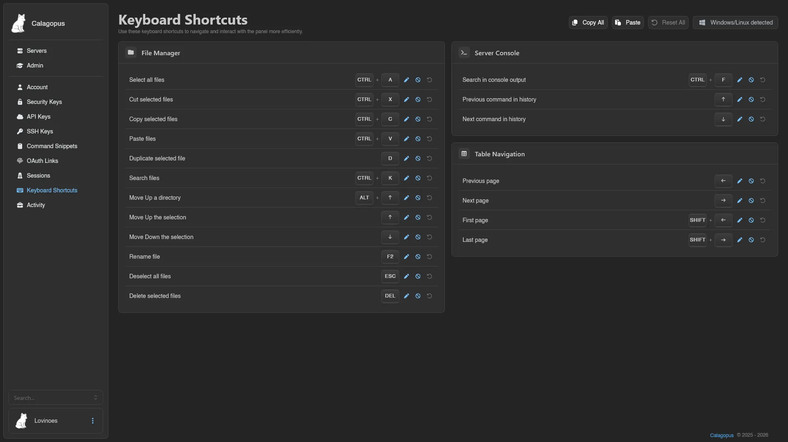
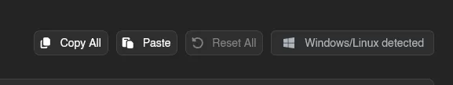

# Keyboard Shortcuts

Keyboard shortcuts let you navigate and interact with the panel without reaching for the mouse, grouped by where they apply: general, the file manager, the server console, and table navigation.



The panel detects whether you're on Windows/Linux or macOS and shows the matching modifier keys automatically.

## Default Bindings

| General | Binding |
| --- | --- |
| Undo the last action | `Ctrl+Z` |

| File Manager | Binding |
| --- | --- |
| Select all files | `Ctrl+A` |
| Cut selected files | `Ctrl+X` |
| Copy selected files | `Ctrl+C` |
| Paste files | `Ctrl+V` |
| Duplicate selected file | `D` |
| Search files | `Ctrl+K` |
| Move Up a directory | `Alt+↑` |
| Move Up the selection | `↑` |
| Move Down the selection | `↓` |
| Rename file | `F2` |
| Deselect all files | `Esc` |
| Delete selected files | `Del` |

| Server Console | Binding |
| --- | --- |
| Search in console output | `Ctrl+F` |
| Previous command in history | `↑` |
| Next command in history | `↓` |

| Table Navigation | Binding |
| --- | --- |
| Previous page | `←` |
| Next page | `→` |
| First page | `Shift+←` |
| Last page | `Shift+→` |

(`Ctrl` shows as `Cmd` on macOS.)

## Rebinding, Disabling, and Resetting

Each shortcut has three buttons next to it. The pencil rebinds: click it and press the new key combination, which is captured as soon as you press it; `Esc` aborts the recording. The circle-slash disables the shortcut (and flips to a play icon that re-enables it), and the reset button restores the shipped default. Anything that differs from its default carries a **Modified** badge.

## Copy, Paste, and Reset All

The toolbar at the top shows which layout was detected ("Windows/Linux detected" or "macOS detected") next to three actions:



- **Copy All** copies every current binding as text, in a format you can edit directly and paste back in to apply changes. It's also the easiest way to carry your keybinds over to another Calagopus panel: copy from one, paste into the other.
- **Paste** applies a previously copied (and optionally edited) set of bindings.
- **Reset All** restores every shortcut to its default at once.

```txt
# Calagopus keyboard shortcuts
#
# Edit the value after "=" then paste this back to apply your changes.
#   - a key combination such as  Ctrl+Shift+K  or  Mod+S  (Mod = Ctrl/Cmd)
#   - "disabled" turns the shortcut off
#   - "default" restores the shipped binding
# Lines starting with "#" and unknown ids are ignored.

[files] # File Manager
# Select all files
files.selectAll         = Mod+A
# Cut selected files
files.cut               = Mod+X
# Copy selected files
files.copy              = Mod+C
# Paste files
files.paste             = Mod+V
# Duplicate selected file
files.duplicate         = D
# Search files
files.search            = Mod+K
# Move Up a directory
files.moveUpDirectory   = Alt+ArrowUp
# Move Up the selection
files.moveUpSelection   = ArrowUp
# Move Down the selection
files.moveDownSelection = ArrowDown
# Rename file
files.rename            = F2
# Deselect all files
files.deselectAll       = Escape
# Delete selected files
files.delete            = Delete

[general] # General
# Undo the last action
general.undo            = Mod+Z

[console] # Server Console
# Search in console output
console.search          = Mod+F
# Previous command in history
console.previousCommand = ArrowUp
# Next command in history
console.nextCommand     = ArrowDown

[table] # Table Navigation
# Previous page
table.previousPage      = ArrowLeft
# Next page
table.nextPage          = ArrowRight
# First page
table.firstPage         = Shift+ArrowLeft
# Last page
table.lastPage          = Shift+ArrowRight
```
