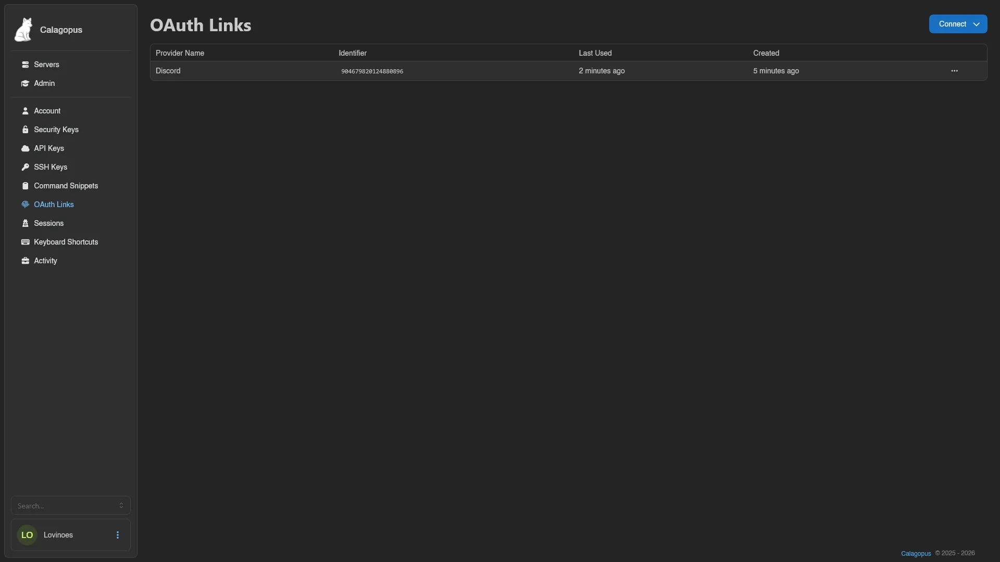

# OAuth Links

OAuth links let you log in with a third-party account instead of typing your username and password. The list shows the provider name, identifier, and last used and created timestamps for each linked account.

## Linking an Account

This only works once an administrator has configured at least one OAuth provider on the instance. If they have, click **Connect** in the top right and pick a provider.

You're sent to that provider to authorize the connection; accepting links it to your Calagopus account. Any OIDC-compliant provider works. Our docs cover setup for [Discord, Google, GitHub, and generic OIDC providers](../../../additional/setting-up-oauth/index.md) like Authentik or Pocket ID.

## Removing a Link

Right-click a linked account (or open the menu at the end of its row) and select **Remove**. It's disabled when the provider isn't set as user-manageable by the administrator.

